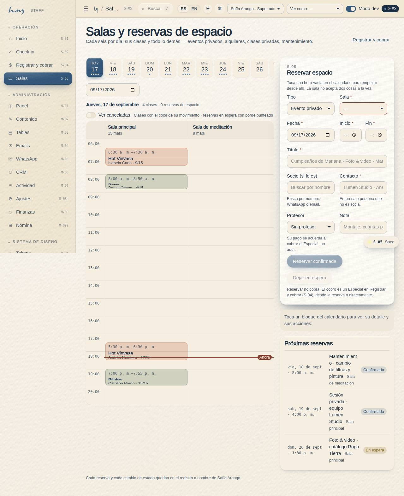
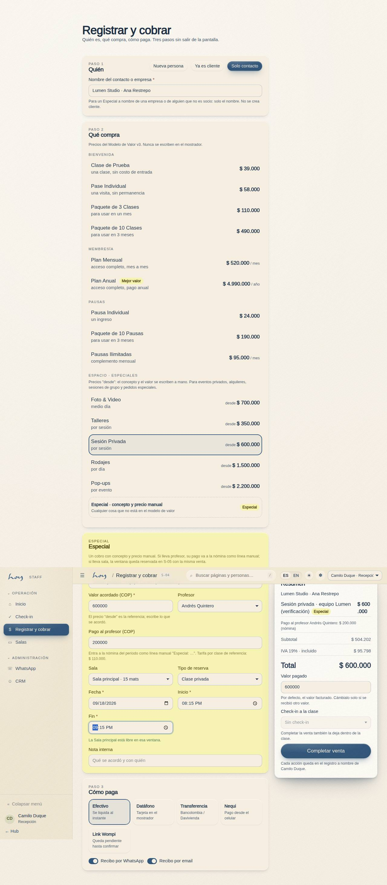

# Espacio — alquiler B2B

La quinta línea de ingreso. El estudio es un espacio bonito que está vacío muchas horas al día: eso se
vende. No es un plan de cliente y **no pasa por checkout**: son precios "desde" y terminan en una
conversación.

{{pricing:espacio}}

## 1. Qué se alquila y qué no
| Sí | No |
|---|---|
| Talleres de terceros, con maestro propio o nuestro | Nada que desplace una clase del horario sin aprobación del owner |
| Sesiones privadas (una persona o un grupo cerrado) | Eventos con alcohol o con más gente de la que caben mats |
| Foto y video, medio día | Uso del wordmark o de la marca sin aprobación (`19`) |
| Rodajes, por día | Subarriendo: quien alquila no revende el espacio |
| Pop-ups y activaciones de marca | Horas pico, salvo excepción del owner |

## 2. Cómo se cotiza
1. Llega por WhatsApp, Instagram o el formulario del sitio (W-06 Contacto). Recepción no cotiza:
   pasa el contacto a coordinación el mismo día.
2. Coordinación pregunta cinco cosas: **qué** es, **cuántas personas**, **qué día y hora**, **qué
   necesita del espacio** (sonido, luz, calor, sillas) y **si va a haber cámaras**.
3. Se cotiza sobre el precio "desde" de la familia Espacio, más lo que cueste lo extra (personal en
   sala, limpieza profunda, horas fuera de horario).
4. La cotización se manda por escrito y se guarda como nota en M-06 sobre la empresa o la persona, con
   el monto y las condiciones. Nada se acuerda solo por voz.

{{tenant:hours}}

> DECISIÓN PENDIENTE: qué horas cuentan como "fuera de pico" para alquiler y si un alquiler puede desplazar una clase publicada (y con cuánto aviso).

## 3. Cómo se agenda
1. El bloque se crea en **S-05 · Salas y reservas de espacio** (`/staff/rooms`): tipo (evento privado,
   alquiler, clase privada, mantenimiento o bloqueo), sala, fecha, hora de inicio y fin, título, contacto o
   socio, profesor si lo lleva, nota. La sala queda ocupada y nadie programa una clase encima.
2. **La sala no acepta dos cosas a la vez.** El formulario compara la ventana con las clases publicadas y
   con las demás reservas de esa sala y, si algo se cruza aunque sea un minuto, lo lista y no deja
   reservar. Se cambia la hora o la sala; mover una clase publicada es decisión del owner (§2).
3. Si el alquiler es un taller abierto al público, va como **evento** (C-23) con su precio y cupo
   propios: ahí sí hay checkout.
4. Recepción ve el bloque en el calendario de S-05 junto a las clases del día, con el nombre del contacto;
   el profesor lo ve en su inicio de S-03 bajo **Especiales**.

## 4. Anticipo y cobro
1. El alquiler se confirma con anticipo; sin anticipo la fecha no se bloquea.
2. El saldo se cobra antes del uso, no después. Medios: los mismos de S-04 (`10`), normalmente link de
   Wompi o transferencia.
3. Para empresa: se toma NIT y razón social **antes** de emitir, porque la factura no se rehace (`15`).

> DECISIÓN PENDIENTE: porcentaje de anticipo, política de cancelación del alquiler (¿cuánto se devuelve y hasta cuándo?) y si se pide depósito por daños.

## 5. El día del alquiler
1. Montaje según lo acordado, no según el estándar de clase (`07`). Lo que se mueva, se anota.
2. Alguien del equipo está presente todo el tiempo: el espacio no se entrega con llave a un tercero.
3. Reglas que se dicen al entrar: dónde están las salidas, qué no se mueve, que no se pisa la sala con
   zapatos de calle y a qué hora hay que salir.
4. Si hay cámaras: no se graba a socios que no vinieron a eso. Si coincide con una clase, se avisa a
   los asistentes antes de entrar.

## 6. Cierre y daños
1. Revisión conjunta al final: piso, espejos, props, baños, equipo de sonido y luz.
2. Lo que falte o se haya roto se fotografía en el momento y se anota en la nota de M-06 del cliente.
3. Limpieza profunda antes de la siguiente clase; si el alquiler termina tarde, la primera clase del
   día siguiente se revisa temprano.
4. Coordinación cierra el caso en M-06 y finanzas concilia el cobro (`14`).

## 7. Especiales — el cobro manual
Un **Especial** es la venta cuyo concepto y precio se escriben a mano en recepción. Existe para lo que el
modelo de valor no cubre con un botón: un cumpleaños con profe, una sesión para un equipo, un alquiler con
extras, un pedido raro. Es la respuesta operativa a la pregunta de si hay un producto de sesión grupal para
celebraciones (ROADMAP §E 34): la mecánica ya está; el producto comercial, si se estandariza, lo decide Lore.

1. **Reservar** (opcional, S-05): la sala y la ventana, como en §3. Puede quedar **en espera** mientras no
   haya anticipo — se dibuja con borde punteado — o **confirmada**.
2. **Cobrar** (S-04 Registrar y cobrar): en **Qué compra**, la familia **Espacio · Especiales** lista los
   precios "desde" (Sesión Privada, Talleres, Foto & Video, Rodajes, Pop-ups) y un renglón **Especial ·
   concepto y precio manual**. Elegir uno abre la tarjeta **Especial**: concepto (viene prellenado del
   "desde"), valor acordado, profesor y su pago, sala y ventana, nota. Si la reserva ya existe en S-05,
   el botón **Cobrar** de la reserva abre S-04 con todo cargado y, al completar, la confirma y la enlaza.
3. **Quién**: socio existente, persona nueva o **Solo contacto** (empresa o persona que no es socia: solo el
   nombre, no se crea cliente). El IVA, el **Valor pagado** y la **Observación** funcionan igual que en
   cualquier venta (`10`).
4. **Completar venta** escribe el pago y la factura, la fila en `special_charges` y, si lleva sala, la
   reserva confirmada en `space_bookings` — todo en una sola venta y todo en M-07 a nombre de quien cobró.
5. **El pago al profesor** se acuerda aquí, no en la nómina: el valor escrito en "Pago al profesor" entra
   al borrador del periodo como línea **"Especial: <concepto>"** (`16`). Sin profesor o sin valor, no hay
   línea.

**Estados de la reserva:** en espera → confirmada → realizada; cancelada en cualquier momento libera la
sala y, si tenía profesor, saca su línea del borrador de nómina. Una reserva realizada no se edita.

{{table:special_charges}}

## 8. Qué mirar cada mes
| Indicador | Dónde |
|---|---|
| Horas alquiladas | calendario de S-05 + notas de M-06 |
| Especiales cobrados y su pago a profesores | `special_charges` (M-03) + líneas "Especial" en M-09b |
| Ingreso de la familia Espacio | M-09 Finanzas |
| Incidencias o daños por alquiler | M-07 + notas de M-06 |
| Cotizaciones enviadas vs. cerradas | notas de M-06 |

