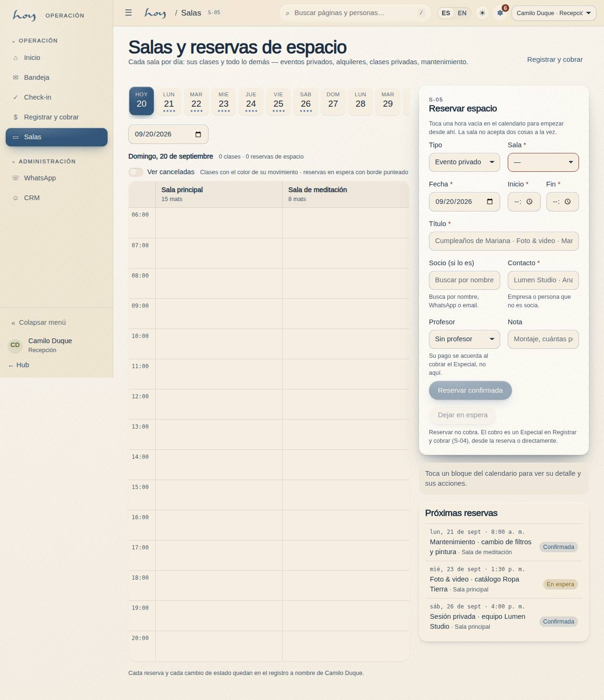
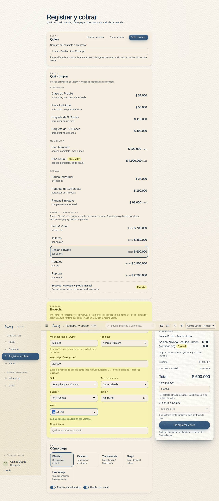

# Espacio — alquiler B2B

El estudio es un espacio bonito que está vacío muchas horas al día, y eso también se vende. El alquiler no es
un plan de cliente y **no se paga en línea**: son precios "desde" que terminan en una conversación.

{{audience:12-espacio-b2b}}

Estos son los precios de referencia:

{{pricing:espacio}}

## 1. Qué se alquila y qué no
{{editable:owner}}

| Sí | No |
|---|---|
| Talleres de otras personas, con su maestro o con uno nuestro | Nada que quite una clase del horario sin aprobación del owner |
| Sesiones privadas (una persona o un grupo cerrado) | Eventos con alcohol o con más gente de la que cabe en los tapetes |
| Foto y video, por medio día | Usar el logo o la marca sin aprobación (ver [Medios](19-medios-y-artwork.md)) |
| Rodajes, por día | Subarrendar: quien alquila no revende el espacio |
| Pop-ups y activaciones de marca | Horas pico, salvo que el owner haga una excepción |

Si una **empresa** pide un programa de bienestar para su equipo, eso es la línea de Experiencias Corporativas,
que todavía está en preparación (ver [Modelo de valor](03-modelo-de-valor.md)). Una sesión puntual para un
equipo sí se puede cobrar hoy como Especial.

## 2. Cómo se cotiza
1. El pedido llega por WhatsApp, Instagram o el formulario de contacto del sitio. Recepción no cotiza: pasa el
   contacto a coordinación el mismo día.
2. Coordinación pregunta cinco cosas: **qué** es, **cuántas personas**, **qué día y a qué hora**, **qué
   necesita** del espacio (sonido, luz, calor, sillas) y **si habrá cámaras**.
3. Se cotiza sobre el precio "desde", más lo extra: personal en la sala, limpieza profunda, horas fuera del
   horario.
4. La cotización se manda por escrito y se guarda como nota en la ficha de la persona o la empresa, con el
   monto y las condiciones. Nada se acuerda solo de palabra.

**Qué decir cuando llega un pedido:** "¡Qué bueno! Te paso con coordinación, que te escribe hoy con la
propuesta."

Este es el horario del estudio:

{{tenant:hours}}

> DECISIÓN PENDIENTE: qué horas cuentan como "fuera de pico" para alquilar, y si un alquiler puede mover una clase ya publicada (y con cuánto aviso).

## 3. Cómo se reserva la sala
1. Crea el bloque en **Salas**: tipo (evento privado, alquiler, clase privada, mantenimiento o bloqueo), sala,
   fecha, hora de inicio y fin, título, contacto, maestro si lo hay y una nota.
2. **La sala no acepta dos cosas a la vez.** Si el horario se cruza con una clase publicada o con otra reserva,
   aunque sea un minuto, la pantalla te lo muestra y no deja reservar. Cambia la hora o la sala.
3. Si es un taller abierto al público, se publica como **evento**, con su precio y su cupo: ese sí se paga en
   línea.
4. Recepción ve el bloque en el calendario junto a las clases del día. El maestro lo ve en su app, en
   "Especiales".

> EN HOYOS: S-05 Salas y reservas de espacio → Nueva reserva → tipo, sala, ventana → Guardar.

## 4. Anticipo y cobro
{{editable:owner}}

1. El alquiler se confirma con anticipo (ver la regla de abajo).
2. El saldo se cobra antes del uso, no después. Los medios son los mismos del mostrador; lo normal es link de
   Wompi o transferencia.
3. Si es una empresa, pide el NIT y la razón social **antes** de facturar. La factura no se puede rehacer
   (ver [Facturación](15-facturacion-y-dian.md)).

Los términos del anticipo:

{{studio:b2b_deposit_note}}

> DECISIÓN PENDIENTE: el porcentaje de anticipo, cuánto se devuelve si se cancela el alquiler y hasta cuándo, y si se pide un depósito por daños.

## 5. El día del alquiler
{{editable:coordinator}}

1. Monta la sala como se acordó, no como una clase. Anota lo que se mueva.
2. Alguien del equipo está presente todo el tiempo. Nunca se entregan las llaves a un tercero.
3. Al entrar, di las reglas: dónde están las salidas, qué no se mueve, que no se entra a la sala con zapatos de
   calle y a qué hora hay que salir.
4. Si hay cámaras, no se graba a socios que no vinieron a eso. Si coincide con una clase, se avisa a los
   alumnos antes de entrar.

## 6. Cierre y daños
1. Revisa todo con quien alquiló: piso, espejos, accesorios, baños, sonido y luz.
2. Lo que falte o se haya roto se fotografía en el momento y se anota en su ficha.
3. Limpieza profunda antes de la siguiente clase. Si el alquiler termina tarde, la primera clase del día
   siguiente se revisa temprano.
4. Coordinación cierra el caso y finanzas concilia el cobro (ver [Pagos y caja](14-pagos-y-caja.md)).

## 7. Especiales: el cobro a mano
Un **Especial** es una venta con concepto y precio escritos a mano. Sirve para lo que no tiene botón: un
cumpleaños con maestro, una sesión para un equipo, un alquiler con extras, un pedido raro.

1. **Reservar la sala** (si hace falta): como en la sección 3. Puede quedar **en espera** mientras no haya
   anticipo (se ve con borde punteado) o **confirmada**.
2. **Cobrar:** en Registrar y cobrar, elige **Espacio · Especiales**. Elige un precio "desde" o "Especial ·
   concepto y precio manual". Llena: concepto, valor acordado, maestro y su pago, sala y horario, nota. Si la
   reserva ya existe, el botón **Cobrar** de la reserva abre el cobro con todo lleno.
3. **Quién paga:** un socio, una persona nueva o **solo contacto** (una empresa o alguien que no es socio: solo
   el nombre). El IVA y las observaciones funcionan como en cualquier venta.
4. **Completar la venta** guarda el pago, la factura y la reserva confirmada, todo junto y con tu nombre.
5. **El pago al maestro** se acuerda aquí, no en la nómina. El valor que escribas entra al pago del periodo
   como una línea "Especial: <concepto>" (ver [Nómina](16-nomina-y-payouts.md)).

**Estados de la reserva:** en espera → confirmada → realizada. Si se cancela, la sala queda libre y la línea
del maestro sale del pago. Una reserva realizada ya no se edita.

Así queda guardado cada Especial:

{{table:special_charges}}

> EN HOYOS: S-04 Registrar y cobrar → Qué compra → Espacio · Especiales → tarjeta Especial → Completar venta.

## 8. Qué mirar cada mes
{{for:super_admin,admin,coordinator,finance}}
| Qué | Dónde lo ves |
|---|---|
| Horas alquiladas | el calendario de Salas y las notas de cada cliente |
| Especiales cobrados y lo que se pagó a los maestros | la tabla de Especiales y las líneas "Especial" del pago de maestros |
| Ingreso de la línea Espacio | Finanzas |
| Daños o incidentes en alquileres | el registro de actividad y las notas |
| Cotizaciones enviadas y cerradas | las notas de cada cliente |
{{/for}}

