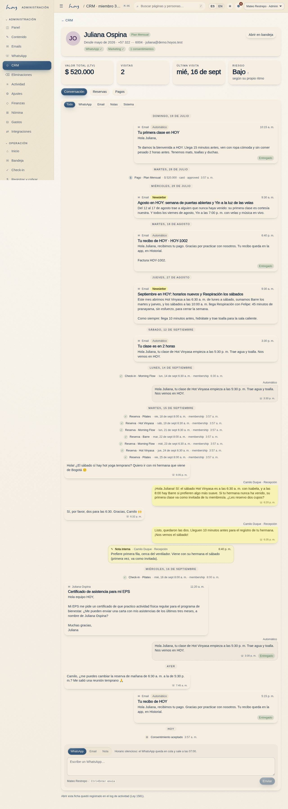
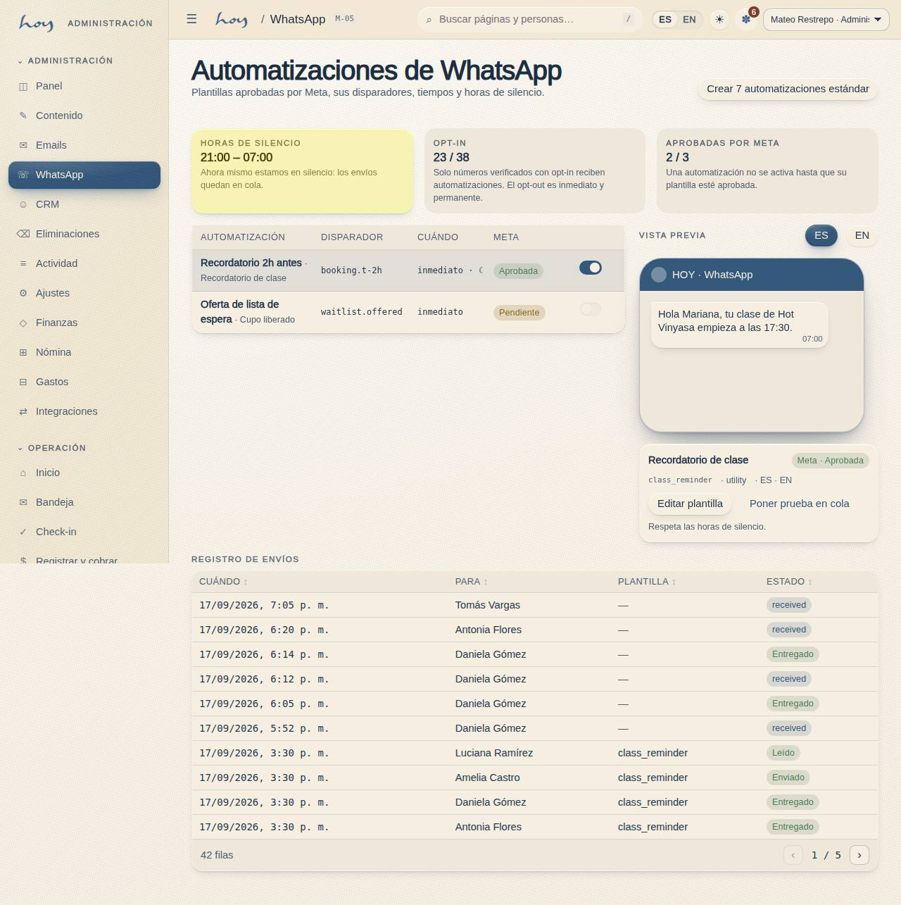
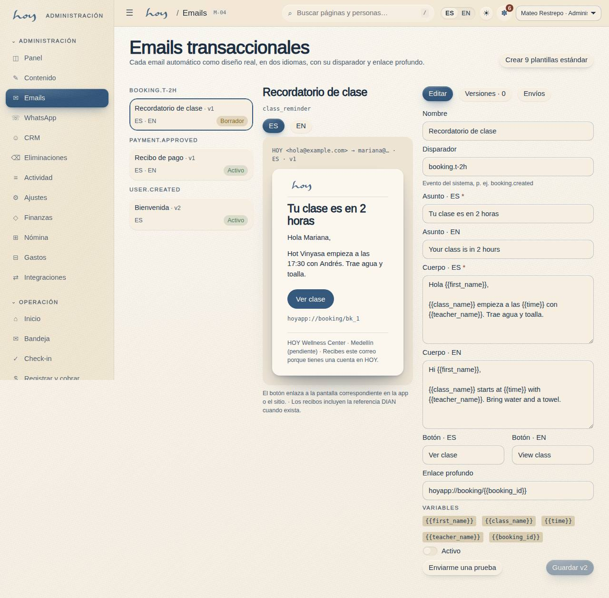
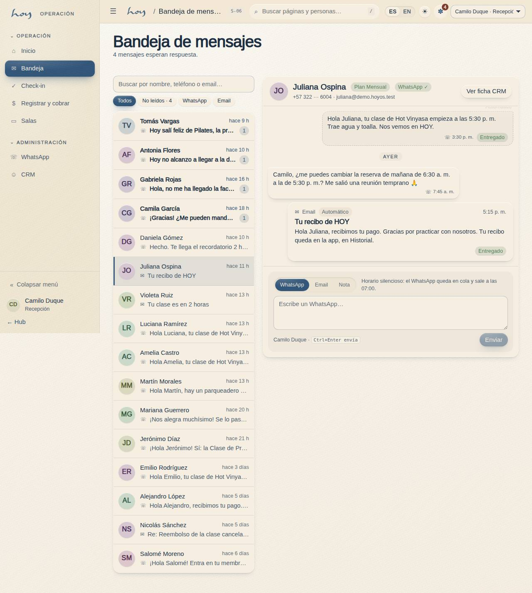
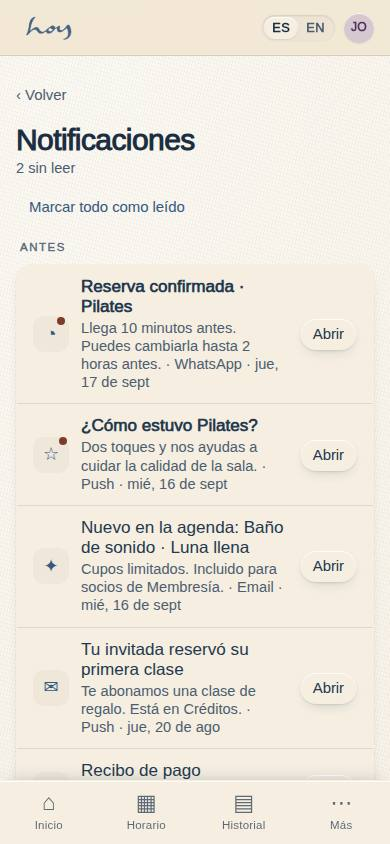

# CRM, WhatsApp y correo

WhatsApp es el canal principal. Todo lo que el estudio envía o recibe —automático o a mano, WhatsApp o
correo— y toda nota que el equipo escribe sobre una persona queda en **una sola conversación** por
persona. Esa conversación se lee desde dos lugares: la ficha del socio en **M-06 CRM** y la **Bandeja de
mensajes S-06** de recepción. Son la misma información; cambia quién la mira y para qué.

## 1. El socio 360 y su conversación
1. **M-06** es el expediente: cabecera con contacto, plan y contacto de emergencia; tiles de valor, visitas
   y riesgo; y tres pestañas: **Conversación**, **Reservas** y **Pagos**.
2. La pestaña **Conversación** se abre primero. Es un hilo como el de WhatsApp, del mensaje más antiguo
   arriba al más reciente abajo, con separadores por día:
   - lo que **la persona escribió** (WhatsApp o correo) va a la izquierda;
   - lo que **el estudio envió** va a la derecha: en amarillo si lo escribió alguien del equipo, con su
     nombre y rol debajo; punteado en gris si lo mandó una automatización (recordatorio de clase, recibo);
   - los **correos** son tarjetas con asunto y una insignia que dice de dónde salieron: **Newsletter**,
     **Automático** o **Manual** (correspondencia real);
   - las **notas internas** son la tarjeta amarilla punteada con el lápiz. La persona nunca las recibe ni
     las ve; las lee el equipo, el owner y, si alguien lo pide por habeas data, la persona (`23`);
   - los **eventos del sistema** —reserva, check-in, pago, consentimiento— aparecen como una línea gris
     centrada entre los mensajes, para saber qué pasó entre un mensaje y otro.
3. Los chips de arriba filtran el hilo: **Todo · WhatsApp · Email · Notas · Sistema**. "Sistema" muestra
   solo los eventos y esconde la caja de escribir.
4. Un mensaje entrante que nadie del equipo ha leído lleva un **anillo azul**. Abrir la pestaña lo marca
   como leído para todo el equipo; ese es el "ya lo vimos" que apaga la campana y el contador de S-01.
5. Segmentos de la lista: "Activo", "En riesgo", "Nuevo". El segmento "En riesgo" se revisa los miércoles
   (`05`).
6. Recepción y coordinación ven y escriben la conversación; finanzas la ve pero no escribe, y no ve notas
   de salud (`24`). Abrir una ficha queda en el registro de actividad (Ley 1581).

## 2. Reglas del canal
| Regla | Detalle |
|---|---|
| Un número | El WhatsApp Business del estudio; nunca desde teléfonos personales |
| Opt-in | Solo reciben automatizaciones los números con opt-in (se toma en A-03 o S-04) |
| Opt-out | "Baja" o "no más mensajes" se respeta de inmediato y para siempre; se registra como nota en la conversación |
| Horas silenciosas | No se envía nada no urgente; lo automático y lo manual por WhatsApp hacen cola hasta la mañana |
| Excepciones | Clase cancelada por el estudio y cupo liberado de lista de espera salen siempre |
| Respuesta | En horario de recepción, menos de 15 min; fuera de horario, a primera hora |
| Correo | Confirmaciones, recibos con referencia DIAN, cancelaciones, newsletters; respaldo de WhatsApp, no reemplazo |

Las horas silenciosas vigentes:

{{policy:quiet_hours}}

> DECISIÓN PENDIENTE: horario oficial de atención por WhatsApp y texto legal del opt-in.

## 3. Plantillas automáticas (M-05 / M-04)
| Plantilla | Disparador | Momento |
|---|---|---|
| Reserva confirmada | reserva creada | inmediato |
| Recordatorio de clase | T−2 h | respeta horas silenciosas |
| Clase cancelada | cancelación del estudio | inmediato, siempre |
| Lista de espera liberada | cupo liberado | inmediato, siempre; ventana de reclamo para tomarlo |
| Recibo / factura | pago liquidado | inmediato |
| Membresía por vencer / aviso de cobro | según el aviso de cobro de M-08 | 8:00 AM |
| Pedir feedback | clase asistida | mismo día |
| Feliz cumpleaños | fecha | 8:00 AM |
| Invitación de invitado | socio invita | inmediato |
| Pago fallido | rechazo de pasarela | inmediato |

Cada plantilla necesita aprobación de Meta por idioma; su estado se ve en M-05. Todo envío automático
también aparece en la conversación de la persona, punteado en gris, para que recepción sepa qué le llegó
antes de responder.

**Pasos en HoyOS:** M-05 → automatización → vista previa → estado Meta → Registro de envíos. M-04 →
plantilla → Enviar prueba.

## 4. Escribir desde la ficha o desde la bandeja
La caja de abajo de la conversación es la misma en M-06 y en S-06. Tiene tres pestañas:

| Pestaña | Qué hace | Cuándo la usas |
|---|---|---|
| **WhatsApp** | Envía desde el número del estudio; queda a la derecha con tu nombre | La respuesta normal |
| **Email** | Pide asunto y texto; queda como tarjeta "Manual" | Certificados, facturas, algo que la persona necesita guardar |
| **Nota** | Se guarda en amarillo; la persona nunca la ve | Preferencias, lesiones, acuerdos, el resumen de una llamada |

1. Estructura del mensaje: nombre + dato en la primera línea; acción en la segunda; máximo un 🌿.
2. Ejemplos:
   - "Hola, <nombre>. La de las 7:00 está llena; te dejo en lista de espera y te aviso si se libera un cupo 🌿"
   - "Hola, <nombre>. Recibimos tu transferencia, tu Paquete de 3 ya está activo. Te esperamos."
   - "Hola, <nombre>. Tu membresía se renueva el <fecha>. Si quieres pausarla, dime y lo hacemos."
3. **Horas silenciosas**: si escribes un WhatsApp de noche, la caja te avisa que queda **en cola** y sale a la
   hora en que terminan las horas silenciosas. El correo sale siempre; nadie lo oye vibrar.
4. **Número sin verificar**: la pestaña WhatsApp se bloquea y dice por qué. Confirma el número con la
   persona (S-04 o C-19) o escríbele por correo.
5. **Quién puede escribir**: recepción, coordinación y admin. Finanzas lee la conversación pero la caja le
   aparece deshabilitada. Cada envío y cada nota quedan en el registro de actividad con tu nombre, sin el
   texto: el texto vive en la conversación.
6. Nunca se envían fotos de comprobantes, datos de salud ni información de otra persona (`23`).
7. Toda conversación relevante por teléfono o en persona se resume en una **Nota** en el hilo, no en la
   memoria.
8. `Ctrl+Enter` envía.

## 5. Bandeja de mensajes (S-06)
Recepción no vive dentro de una ficha: vive en la **Bandeja** (`/staff/inbox`), la primera entrada del
menú de staff después de Inicio.

1. **Quién escribió.** La columna izquierda es una fila por persona: avatar, nombre, el último mensaje, hace
   cuánto y el canal. Los hilos con mensajes **sin leer van primero** y llevan el contador azul. Arriba hay
   buscador (nombre, teléfono o correo) y filtros **Todos · No leídos · WhatsApp · Email**.
2. **La campana.** En la barra superior de cualquier pantalla de staff o admin, la campana muestra cuántos
   mensajes entrantes nadie ha leído. Al tocarla se abre un panel con las cinco conversaciones más recientes
   con pendientes; cada fila abre su hilo en la bandeja, y "Ver bandeja" abre la lista completa. Si dice
   "Todo leído", no hay nada que responder.
3. **Desde Inicio (S-01).** La tarjeta "Mensajes recientes" lista las últimas cinco conversaciones (sin leer
   primero), el tile "Mensajes sin leer" dice cuántos y en cuántas conversaciones, y la acción rápida "Abrir
   bandeja de mensajes" te lleva a la bandeja.
4. **Responder.** Toca la persona: a la derecha aparece su cabecera (plan, WhatsApp verificado o no, teléfono
   enmascarado, correo), el hilo completo y la caja de §4. Puedes tener varias conversaciones abiertas una tras
   otra sin salir de la pantalla: la lista se queda a la izquierda.
5. **Qué marca un mensaje como leído.** Abrir el hilo, en la bandeja o en la ficha. Es un "ya lo vimos" del
   equipo, no de cada persona: si tu compañera abrió el hilo, para ti también está leído. El registro guarda
   quién lo abrió y cuándo.
6. **Ver ficha CRM.** El botón de la cabecera abre la ficha completa de la persona en M-06 —reservas, pagos,
   riesgo— cuando necesitas más que la conversación. Desde la ficha, "Abrir en bandeja" hace el camino inverso.
7. Un mensaje del equipo que no es de un cliente (por ejemplo, un maestro pidiendo sustitución) **no** aparece
   en la bandeja: lo ve coordinación en M-05.

## 6. Qué es real y qué es simulado
Hoy todo —lo que escribes, lo que "llega", las notas, el leído— se guarda en la tabla de mensajes del
sistema y se ve al instante en la ficha, la bandeja, la campana e Inicio. Lo que **no** pasa todavía es la
entrega real: el WhatsApp no sale del número del estudio ni entra desde el teléfono de la persona, y el
correo no se envía ni se recibe. Los mensajes entrantes que ves son de demostración.

Cuando el dev conecte la **WhatsApp Cloud API** y el correo entrante, los mensajes de las personas
entrarán a la misma tabla por un *webhook* y los estados (enviado, entregado, leído, fallido) se actualizarán
solos; la ficha, la bandeja y la campana no cambian. El estado de cada integración está en M-10 (`26`).

{{table:message_log}}

## 7. Tono
1. Humana, cercana, directa, presente. La tabla de sí y no está en `20`. Tuteo siempre.
2. Las quejas se responden primero con lo que sí hacemos; la regla se explica después, sin culpar.

## 8. Lo que el socio controla
El socio decide qué le llega y por dónde, en **C-24 Notificaciones** y **C-19 Perfil**. Si alguien
apagó un canal, no se rodea escribiéndole por otro.

{{table:notification_prefs}}
