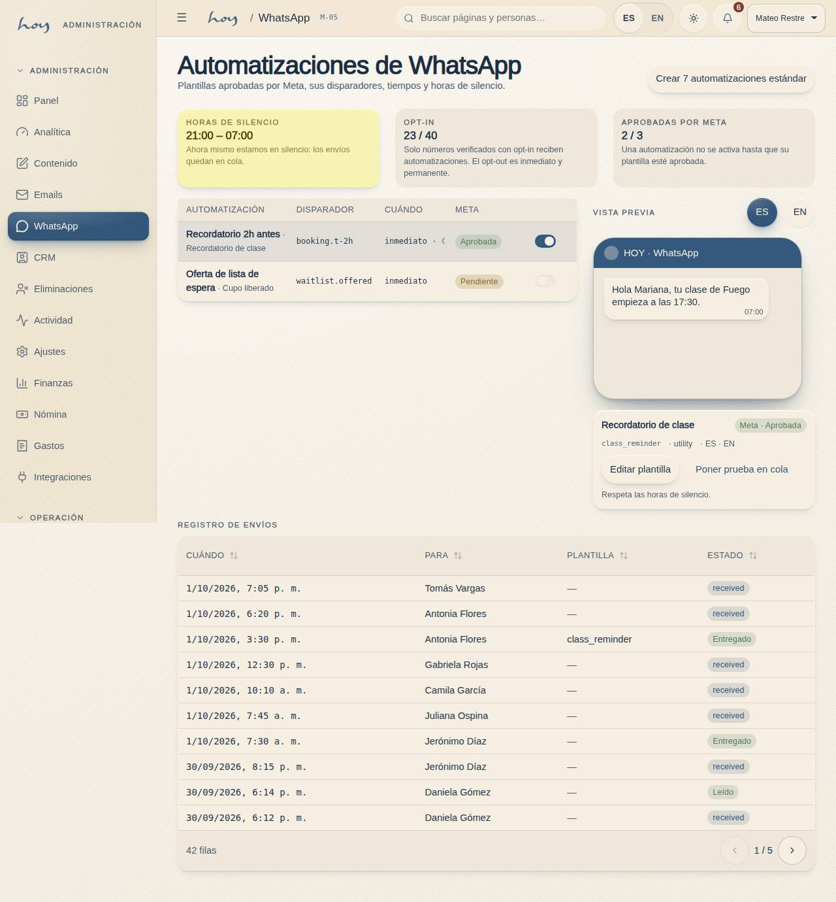
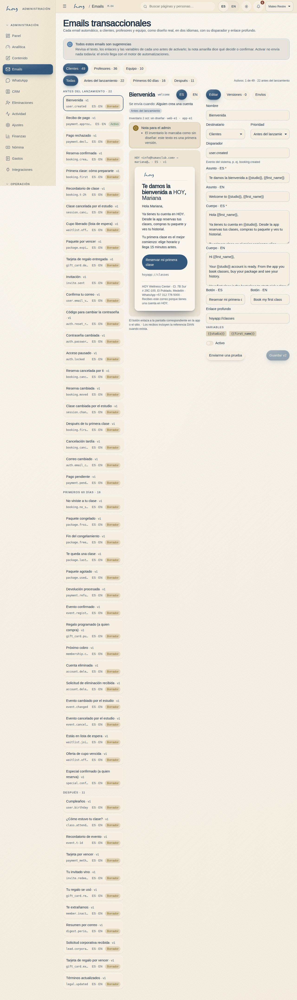
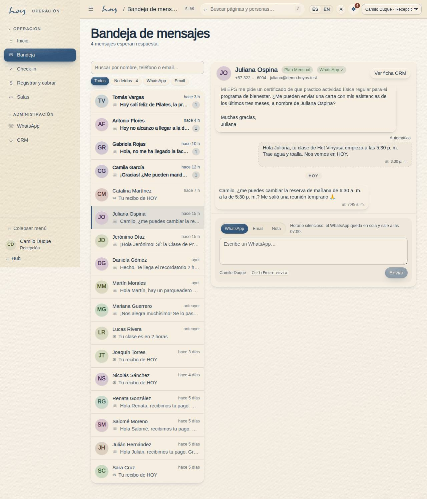
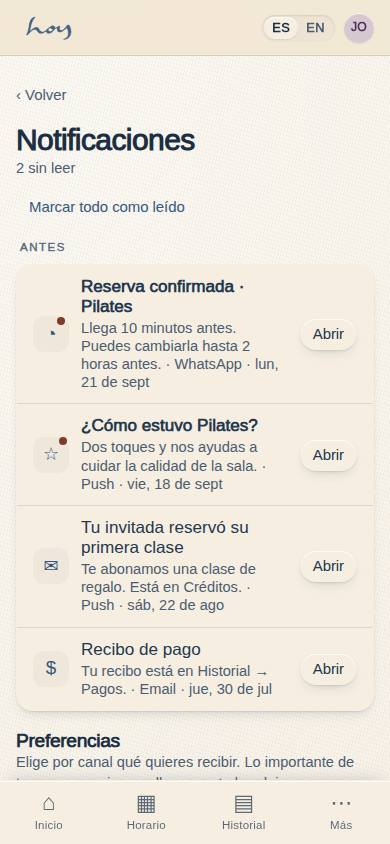

# CRM, WhatsApp y correo

WhatsApp es nuestro canal principal. Todo lo que el estudio envía o recibe —automático o a mano, por WhatsApp o
por correo— y toda nota del equipo sobre una persona queda en **una sola conversación** por persona.

Esa conversación la ves en dos lugares: en la **ficha del socio** (el CRM) y en la **Bandeja** de recepción.
Es la misma información; cambia para qué la miras.

{{audience:13-crm-y-whatsapp}}

## 1. La ficha del socio y su conversación
1. La ficha tiene arriba los datos de contacto, el plan y el contacto de emergencia; después, indicadores de
   visitas y riesgo; y tres pestañas: **Conversación**, **Reservas** y **Pagos**.
2. La **Conversación** se abre primero. Se lee como un chat de WhatsApp, del mensaje más viejo arriba al más
   nuevo abajo:
   - a la izquierda, lo que **escribió la persona**;
   - a la derecha, lo que **envió el estudio**: en amarillo si lo escribió alguien del equipo (con su nombre);
     punteado en gris si fue un mensaje automático (recordatorio, recibo);
   - los **correos** son tarjetas con asunto y una etiqueta: Newsletter, Automático o Manual;
   - las **notas internas** son tarjetas amarillas punteadas con un lápiz. La persona nunca las recibe;
   - las **acciones** (reserva, llegada, pago, permiso de datos) aparecen como una línea gris en el centro.
3. Arriba puedes filtrar: **Todo · WhatsApp · Email · Notas · Sistema**.
4. Un mensaje que nadie del equipo ha leído tiene un **anillo azul**. Al abrir la conversación queda leído para
   todo el equipo.
5. Los socios se agrupan en "Activo", "En riesgo" y "Nuevo". Coordinación revisa "En riesgo" los miércoles.

{{for:finance}}
Tú puedes leer la conversación y los pagos, pero no escribir, y no ves las notas de salud.
{{/for}}

> EN HOYOS: M-06 CRM → socio → pestaña Conversación.

## 2. Las reglas del canal
| Regla | Qué significa |
|---|---|
| Un solo número | Se escribe desde el WhatsApp del estudio, nunca desde un teléfono personal |
| Permiso | Solo reciben mensajes automáticos quienes dieron su permiso al registrarse |
| Baja | "Baja" o "no más mensajes" se respeta de inmediato y para siempre; se deja nota |
| Horas silenciosas | No se envía nada que no sea urgente; lo que escribas queda en cola hasta la mañana |
| Siempre salen | Una clase cancelada por el estudio y un cupo liberado de la lista de espera |
| Tiempo de respuesta | En horario de recepción, lo antes posible (ver abajo); fuera de horario, a primera hora |
| Correo | Confirmaciones, recibos, cancelaciones y newsletters. Acompaña a WhatsApp, no lo reemplaza |

Cuánto tardamos, como máximo, en responder en horario de recepción:

{{studio:whatsapp_response_minutes}}

Estas son las horas silenciosas vigentes, y lo que significan en la práctica:

{{policy:quiet_hours}}

{{studio:quiet_hours_note}}

> DECISIÓN PENDIENTE: el horario oficial de atención por WhatsApp y el texto legal con el que la persona da su permiso para recibir mensajes.

## 3. Los mensajes automáticos
| Mensaje | Cuándo sale |
|---|---|
| Reserva confirmada | al reservar |
| Recordatorio de clase | 2 horas antes, respetando las horas silenciosas |
| Clase cancelada | de inmediato, siempre |
| Cupo liberado en lista de espera | de inmediato, siempre, con tiempo para tomarlo |
| Recibo | al pagar |
| Aviso de cobro o membresía por vencer | los días antes que fija la política, a las 8:00 |
| Pedir opinión | el mismo día de la clase |
| Feliz cumpleaños | ese día, a las 8:00 |
| Invitación a un invitado | cuando el socio invita |
| Pago fallido | cuando el pago se rechaza |

Cada plantilla necesita la aprobación de Meta en cada idioma. Todo mensaje automático aparece también en la
conversación de la persona, así sabes qué le llegó antes de responder.

> EN HOYOS: M-05 WhatsApp → mensaje → vista previa → estado de Meta → Registro. M-04 Correos → plantilla → Enviar prueba.

## 4. Cómo escribir
{{editable:coordinator}}

La caja para escribir está debajo de la conversación, en la ficha y en la Bandeja. Tiene tres pestañas:

| Pestaña | Para qué |
|---|---|
| **WhatsApp** | La respuesta normal. Sale del número del estudio con tu nombre |
| **Email** | Lo que la persona necesita guardar: certificados, facturas |
| **Nota** | Lo que el equipo debe saber: preferencias, lesiones, acuerdos, el resumen de una llamada. La persona nunca la ve |

1. Primera línea: el nombre y el dato. Segunda línea: la acción. Máximo un 🌿.
2. Ejemplos:
   - "Hola, Camila. La de las 7:00 está llena; te dejo en lista de espera y te aviso si se libera un cupo 🌿"
   - "Hola, Andrés. Recibimos tu transferencia, tu Paquete de 3 ya está activo. Te esperamos."
   - "Hola, Mariana. Tu membresía se renueva el 3 de octubre. Si quieres pausarla, dime y lo hacemos."
3. Si escribes un WhatsApp de noche, la caja te avisa que queda en cola y sale cuando terminan las horas
   silenciosas. El correo sale siempre.
4. Si el número no está verificado, la pestaña WhatsApp se bloquea y te dice por qué. Confirma el número con la
   persona o escríbele por correo.
5. Nunca envíes fotos de comprobantes, datos de salud ni información de otra persona (ver
   [Datos personales](23-habeas-data.md)).
6. Si hablaste con la persona por teléfono o en persona, resume lo importante en una **Nota**.
7. Atajo: `Ctrl+Enter` envía.

## 5. La Bandeja de recepción
Recepción trabaja en la **Bandeja**: es lo primero del menú después del Inicio.

1. **Quién escribió.** A la izquierda hay una fila por persona: nombre, último mensaje, hace cuánto y el canal.
   Las que tienen mensajes sin leer van primero, con un contador azul. Puedes buscar por nombre, teléfono o
   correo y filtrar: Todos · No leídos · WhatsApp · Email.
2. **La campana.** Arriba, en cualquier pantalla del equipo, la campana dice cuántos mensajes nadie ha leído.
   Al tocarla ves las cinco conversaciones más recientes con pendientes. Si dice "Todo leído", no hay nada por
   responder.
3. **Desde el Inicio.** La tarjeta "Mensajes recientes" muestra las últimas cinco conversaciones y un botón
   para abrir la Bandeja.
4. **Responder.** Toca a la persona: a la derecha ves sus datos, toda la conversación y la caja para escribir.
   La lista se queda a la izquierda para pasar a la siguiente.
5. **Leído.** Abrir la conversación la marca como leída para todo el equipo. Queda guardado quién la abrió.
6. **Ver la ficha.** El botón de arriba abre la ficha completa (reservas, pagos, riesgo) cuando necesitas más
   que la conversación.
7. Un mensaje de alguien del equipo (por ejemplo, un maestro pidiendo reemplazo) no llega a la Bandeja: lo ve
   coordinación.

> EN HOYOS: S-06 Bandeja → persona → responder. "Ver ficha CRM" abre M-06; "Abrir en bandeja" vuelve.

## 6. Qué funciona de verdad hoy
1. Todo lo que escribes, las notas y el "leído" se guardan de verdad y se ven al instante en la ficha, la
   Bandeja, la campana y el Inicio.
2. Lo que **todavía no** pasa es el envío real: el WhatsApp no sale del número del estudio y el correo no se
   envía. Los mensajes que "llegan" son de demostración.
3. Cuando se conecte WhatsApp, los mensajes reales entrarán a la misma conversación. Nada de lo que aprendiste
   aquí cambia (ver [Integraciones](26-integraciones.md)).

Así guarda el sistema cada mensaje:

{{table:message_log}}

## 7. Tono
1. Humana, cercana, directa, presente. Siempre de tú. Ejemplos de sí y de no:
   [Voz y tono](20-voz-y-tono.md).
2. A una queja respondes primero con lo que sí podemos hacer. La regla se explica después, sin culpar.

## 8. Lo que decide el socio
El socio elige qué le llega y por dónde, en su app (Notificaciones y Perfil). Si apagó un canal, no le escribas
por otro para rodearlo.

Así guarda el sistema esas preferencias:

{{table:notification_prefs}}
