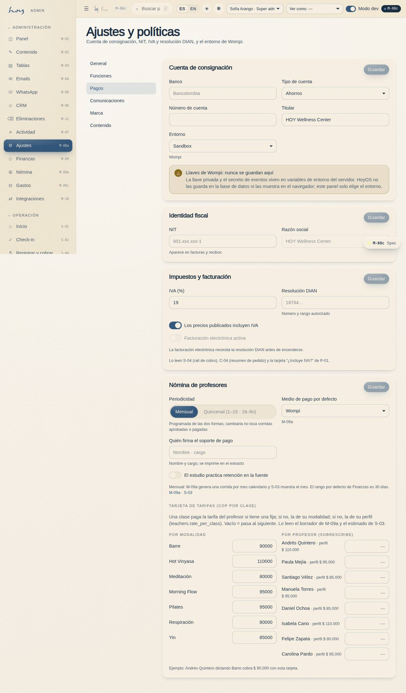
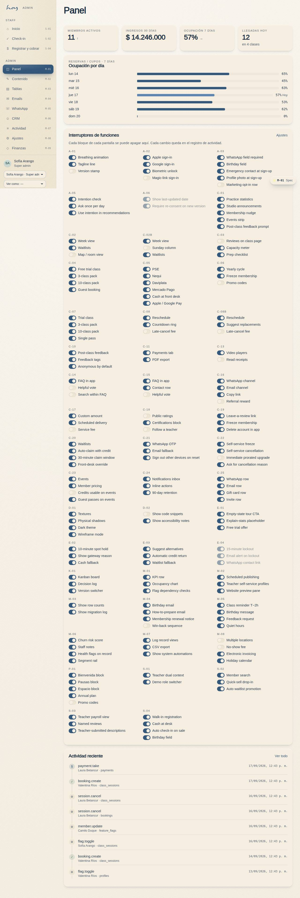
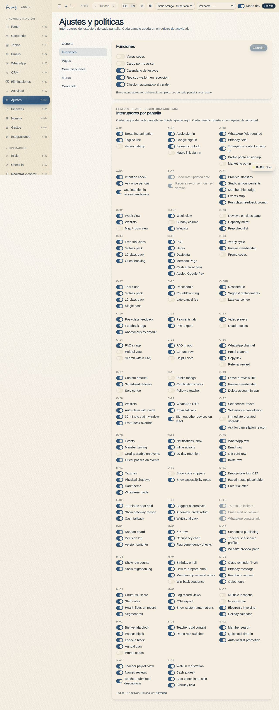
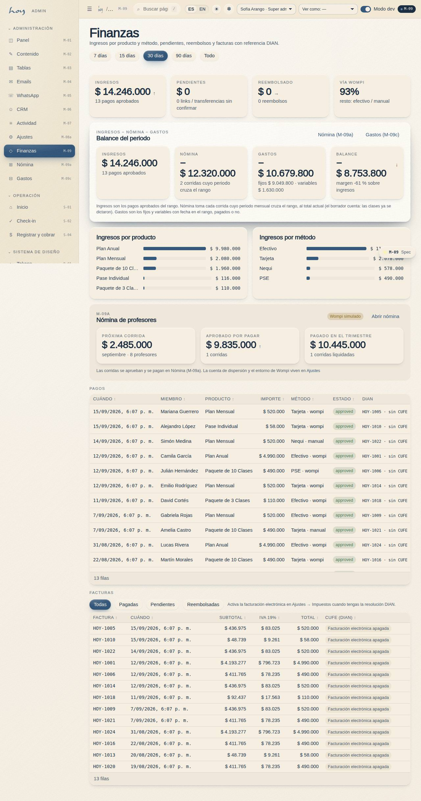

# Pagos y caja

El dinero entra por cuatro caminos y sale por dos. Este capítulo es el circuito completo, del mostrador
al banco.

## 1. Los medios de pago
| Medio | Cuándo liquida | Quién confirma |
|---|---|---|
| Efectivo | inmediato | recepción, al recibir |
| Datáfono | cuando la pasarela confirma | finanzas, contra el panel de Wompi |
| Link de Wompi | cuando la pasarela confirma | automático; finanzas revisa |
| Transferencia / Nequi | cuando finanzas ve el abono | finanzas, en M-06 → Pagos |
| Bono de regalo | inmediato (descuenta saldo) | sistema |

Una orden pendiente **no es una venta**. Hasta que liquida no cuenta en los ingresos del mes.

{{table:payments}}

## 2. Cierre de caja (recepción, cada día)
1. Tras la última clase, cuenta efectivo; compara con "Registró pago en efectivo" del día en **M-07**
   filtrado por tu nombre.
2. Lista transferencias pendientes con comprobante y envíalas a finanzas.
3. Guarda el efectivo en la caja fuerte, firma la planilla, apaga equipos y cierra con la checklist de `07`.

**Pasos en HoyOS:** M-07 Registro de actividad → filtro fecha hoy + origen recepción → Exportar CSV.

## 3. Conciliación diaria (finanzas)
1. Finanzas recibe de recepción la planilla de cierre y las transferencias pendientes.
2. Cruza tres fuentes: efectivo contado, **M-07** filtrado por "Registró pago en efectivo", y el panel
   de Wompi para links y datáfono.
3. Confirma transferencias con comprobante en **M-06 → Pagos** (la orden pasa de pendiente a liquidada).
4. Diferencia > $10.000: nota en M-07 exportado y aviso al owner el mismo día.

**Pasos en HoyOS:** M-07 → filtro fecha + acción "pago" → Exportar CSV. M-06 → socio → Pagos → confirmar.

## 4. Wompi
1. Los abonos (payouts) llegan según el ciclo del contrato con Wompi; regístralos contra las ventas por
   fecha de transacción, no de abono.
2. Comisiones y retenciones se contabilizan como gasto separado.
3. La cuenta de destino y el ambiente (sandbox / producción) están en **M-08c Pagos**. Las llaves nunca
   se guardan ahí: la pantalla lo dice.

> DECISIÓN PENDIENTE: ciclo de abonos contratado con Wompi y cuenta bancaria destino.

## 5. Reembolsos
| Caso | Qué se hace | Aprueba |
|---|---|---|
| Clase cancelada por el estudio | Crédito vuelve automático (E-03) | nadie, es automático |
| Cobro duplicado o error | Reembolso al mismo medio desde Wompi; registro en M-06 Pagos | Finanzas |
| Cortesía por queja | Crédito, no dinero | Coordinación |
| Membresía anual, retiro | Prorrateo según términos (A-06) | Owner |

Todo reembolso queda en M-07 con actor y valores antes/después.

## 6. Panel y KPIs
**M-01 Panel admin** abre con los KPIs y la gráfica de ocupación. Lo que miramos cada semana:

| KPI | Cómo se lee | Alerta |
|---|---|---|
| Ocupación | asistentes / (mats × clases dictadas) | < 60 % sostenido |
| Ingresos del mes | ventas liquidadas, COP | vs. mismo mes anterior |
| Socios activos y en riesgo | segmentos de M-06 | "En riesgo" crece 2 semanas seguidas |
| No-show y cancelación tardía | por clase y por franja | > 10 % |

{{kpi:occupancy}}

{{kpi:noshow}}

Los switches de features (M-08b) guardan cada cambio con actor, valor anterior y hora. Las páginas
legales y de emergencia no se pueden apagar.

## 7. Reportes
1. Semanal (lunes): ocupación por clase y franja, ventas por producto, no-shows.
2. Mensual (día 5): ingresos, nómina, gastos y balance del mes (M-09), abonos Wompi conciliados,
   segmento "En riesgo", motivos de cancelación de membresía.

**Pasos en HoyOS:** M-01 KPIs → M-07 exportar CSV → M-06 segmentos → M-09 Finanzas.

## 8. Gastos y balance
El dinero sale por dos caminos: la nómina de profesores (capítulo `16`) y los gastos del estudio. Los
gastos viven en **M-09c Gastos** (`/admin/finance/expenses`) y restan en la tarjeta **Balance del
periodo** de **M-09 Finanzas**. Los registra **finanzas**; administración también puede. Recepción y
coordinación no los ven: son internos del estudio.

**Fijos y variables.** Un gasto **fijo** es recurrente y conocido — arriendo, servicios públicos,
internet, aseo, software, póliza — y nace de una **plantilla** con su cadencia (**mensual** o
**quincenal**, la quincena colombiana: vence el día ancla y quince días después) y su día de
vencimiento. Un gasto **variable** se registra a mano cuando ocurre: mats nuevos, una reparación, la
pauta del mes, los honorarios del contador.

1. **Plantillas.** Al abrir el estudio, finanzas crea una plantilla por cada costo fijo (concepto,
   categoría, valor por vencimiento, cadencia, día, proveedor). Si un costo deja de existir se
   **desactiva**, no se borra: el historial conserva su origen.
2. **Generar el periodo.** El primer día hábil de cada mes (o de cada quincena), en M-09c elige el
   periodo y pulsa **Generar gastos fijos del periodo**. Crea una fila por plantilla y vencimiento,
   en estado *por pagar*. Se puede repetir sin miedo: un vencimiento que ya tiene su fila se salta,
   nunca se duplica, y un gasto ya pagado nunca se toca.
3. **Marcar pagado.** Cuando el pago sale del banco o de la caja, marca la fila como pagada: queda la
   fecha y el actor en el registro de actividad (M-07, acción `expense.pay`).
4. **Registrar un variable.** Concepto, categoría, valor, fecha, si ya está pagado, método (efectivo,
   transferencia o tarjeta), proveedor y nota. Un gasto en efectivo entra en el cierre de caja de la
   sección 2.
5. **Corregir.** Solo un gasto sin pagar se puede eliminar. Un gasto pagado con error se corrige con
   una fila nueva y una nota, nunca editando la historia.

**Cómo leer el Balance.** En M-09, con el mismo filtro de periodo (7, 15, 30, 90 días o Todo), la
tarjeta muestra cuatro números: **Ingresos** (pagos aprobados del rango) − **Nómina** (cada corrida
cuyo periodo mensual cruza el rango, al total actual: el borrador cuenta porque las clases ya se
dictaron) − **Gastos** (fijos y variables con fecha en el rango, pagados o no) = **Balance**, con el
margen sobre ingresos. Un balance negativo en 7 o 15 días es normal cuando el arriendo cae en la
ventana; el número que importa es el de 30 días y el del mes cerrado. Los enlaces de la tarjeta
llevan a la nómina (M-09a) y a los gastos (M-09c).

{{table:expenses}}

{{stats}}
