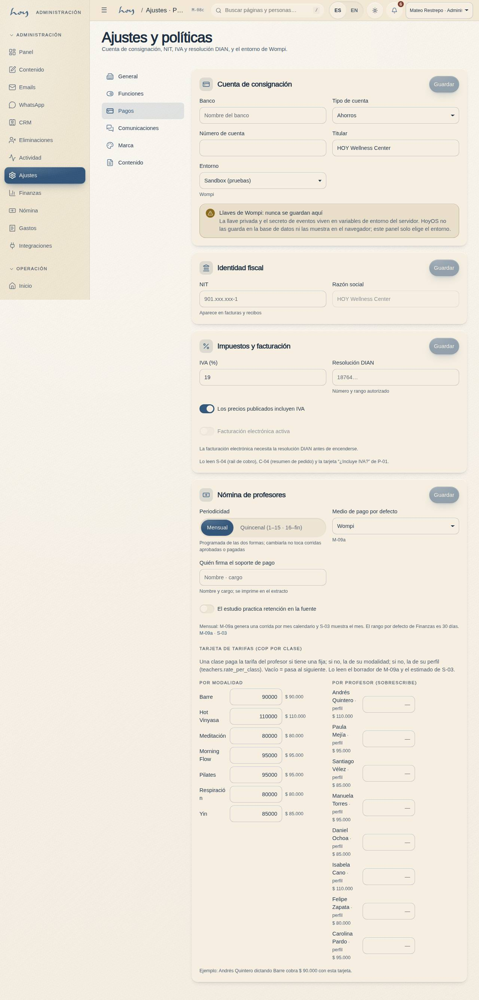
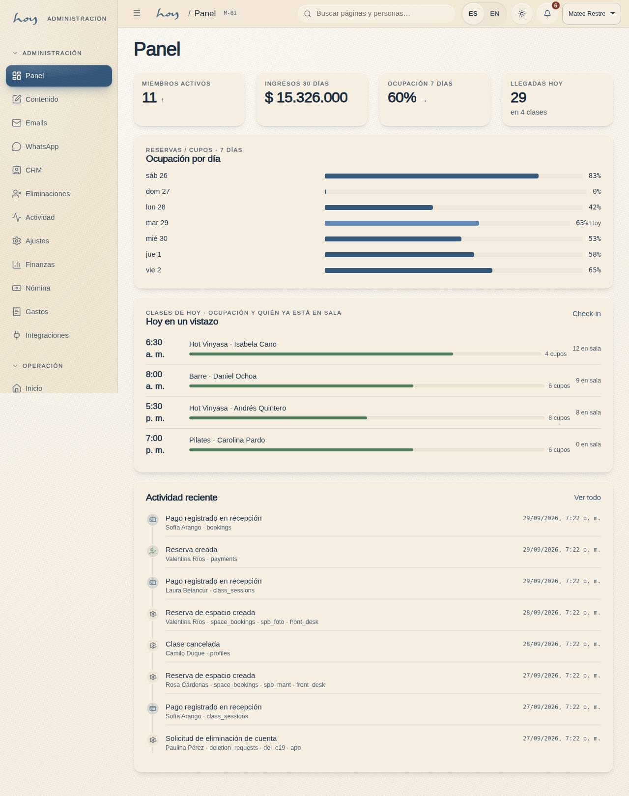
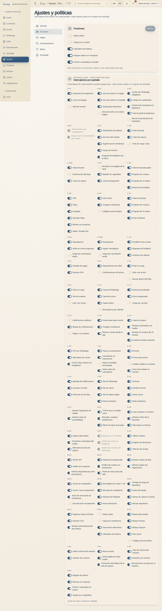
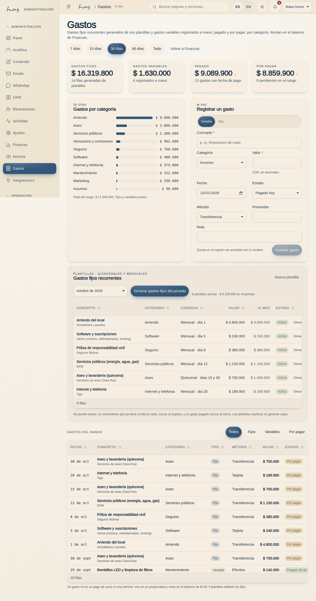
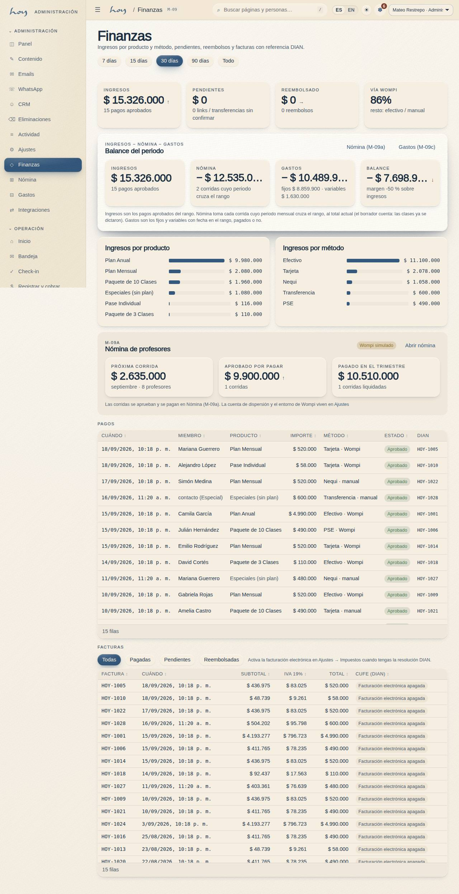

# Pagos y caja

El dinero entra por varios caminos y sale por dos. Este capítulo recorre el circuito completo, del mostrador
al banco.

{{audience:14-pagos-y-caja}}

## 1. Los medios de pago
| Medio | Cuándo queda pagado | Quién lo confirma |
|---|---|---|
| Efectivo | de inmediato | recepción, al recibirlo |
| Datáfono | cuando Wompi lo confirma | finanzas, en el panel de Wompi |
| Link de Wompi (tarjeta en la web) | cuando Wompi lo confirma | automático; finanzas lo revisa |
| PSE | cuando Wompi lo confirma | automático; finanzas lo revisa |
| QR de Wompi | cuando Wompi lo confirma | automático; finanzas lo revisa |
| Transferencia | cuando finanzas ve el dinero en la cuenta | finanzas, en los pagos de la persona |

En la web se paga con tarjeta, PSE o el QR de Wompi; en recepción hay además efectivo, datáfono y
transferencia. **No se recibe Nequi ni Daviplata.** Una tarjeta de regalo no es un medio de pago: se redime en
recepción por la clase o el paquete que regala (ver [Paquetes congelados y regalos](11-pausas-y-regalos.md)).

Una venta pendiente **no es una venta**. Hasta que queda pagada, no cuenta en los ingresos del mes.

Así guarda el sistema cada pago:

{{table:payments}}

## 2. Cierre de caja (recepción, todos los días)
{{editable:coordinator}}

1. Después de la última clase, cuenta el efectivo.
2. Compáralo con los pagos en efectivo del día que registraste tú.
3. Haz la lista de transferencias pendientes, con su comprobante, y envíasela a finanzas.
4. Guarda el efectivo en la caja fuerte, firma la planilla, apaga los equipos y cierra con el checklist de
   [Sala, calor y mantenimiento](07-sala-calor-y-mantenimiento.md).

> EN HOYOS: M-07 Registro de actividad → fecha de hoy + tu nombre → "Registró pago en efectivo" → Exportar CSV.

## 3. Conciliación diaria (finanzas)
1. Recibes de recepción la planilla de cierre y las transferencias pendientes.
2. Cruzas tres cosas: el efectivo contado, los pagos en efectivo del registro de actividad y el panel de Wompi
   (links y datáfono).
3. Confirmas cada transferencia con su comprobante. La venta pasa de pendiente a pagada.
4. Si la diferencia pasa del límite de abajo, déjalo anotado y avisa al owner el mismo día.

La diferencia de caja que se le avisa al owner:

{{studio:cash_difference_threshold}}

> EN HOYOS: M-07 → fecha + acción "pago" → Exportar CSV. M-06 → socio → Pagos → Confirmar.

## 4. Wompi
1. Wompi deposita el dinero según el ciclo del contrato. Regístralo contra las ventas por la fecha de la venta,
   no por la fecha del depósito.
2. Las comisiones y retenciones se anotan como un gasto aparte.
3. La cuenta de destino y el ambiente (pruebas o producción) están en Ajustes → Pagos. Las llaves secretas
   nunca se guardan ahí; la pantalla lo recuerda.

> DECISIÓN PENDIENTE: cada cuánto deposita Wompi según el contrato y a qué cuenta bancaria.

## 5. Reembolsos
| Caso | Qué se hace | Quién aprueba |
|---|---|---|
| El estudio canceló la clase | La clase vuelve sola al paquete | nadie, es automático |
| Cobro doble o error | Se devuelve al mismo medio desde Wompi y se anota en los pagos de la persona | finanzas |
| Cortesía por una queja | Una clase, no dinero | coordinación |
| Pide devolver el paquete de 12 clases | No es reembolsable; se ofrece congelarlo una vez | nadie: es la regla |
| No vino por enfermedad | Se le reprograma la clase | coordinación |

Todo reembolso queda registrado con quién lo hizo y los valores de antes y después.

## 6. El panel y los indicadores
El **Panel** abre con los indicadores y la gráfica de ocupación. Esto miramos cada semana:

| Indicador | Cómo se lee | Cuándo preocuparse |
|---|---|---|
| Ocupación | personas que vinieron / (tapetes × clases dadas) | menos del 60 % varias semanas seguidas |
| Ingresos del mes | ventas pagadas | comparado con el mismo mes anterior |
| Socios activos y en riesgo | los grupos del CRM | "En riesgo" crece dos semanas seguidas |
| No-show y cancelación tardía | por clase y por franja | más del 10 % |

La ocupación y los no-show de ahora mismo:

{{kpi:occupancy}}

{{kpi:noshow}}

Las funciones del sistema se encienden y apagan en Ajustes → Funciones, y cada cambio queda con quién lo hizo y
cuándo. Las páginas legales y el flujo de emergencia no se pueden apagar.

## 7. Reportes
{{editable:owner}}

1. **Cada lunes:** ocupación por clase y franja, ventas por producto, no-shows.
2. **Cada mes (día 5):** ingresos, nómina, gastos y balance del mes; depósitos de Wompi conciliados; socios "En
   riesgo"; paquetes por vencer.

> EN HOYOS: M-01 Panel → M-07 Exportar CSV → M-06 grupos → M-09 Finanzas.

## 8. Gastos y balance
El dinero sale por dos caminos: el pago de los maestros (ver [Nómina](16-nomina-y-payouts.md)) y los gastos del
estudio. Los gastos los registra **finanzas** (admin también puede). Recepción y coordinación no los ven.

**Fijos y variables.** Un gasto **fijo** se repite y se conoce: arriendo, servicios, internet, aseo, software,
seguro. Sale de una **plantilla** con su frecuencia (mensual o quincenal) y su día de pago. Un gasto
**variable** se anota a mano cuando pasa: tapetes nuevos, una reparación, la publicidad del mes, el contador.

1. **Plantillas.** Al abrir el estudio, crea una plantilla por cada gasto fijo: concepto, categoría, valor,
   frecuencia, día y proveedor. Si un gasto deja de existir, **desactívalo**; no lo borres.
2. **Generar el periodo.** El primer día hábil de cada mes (o quincena), elige el periodo y pulsa **Generar
   gastos fijos del periodo**. Crea una fila por gasto, "por pagar". Puedes pulsarlo otra vez sin miedo: no se
   duplica nada y lo ya pagado no se toca.
3. **Marcar pagado.** Cuando el dinero sale, marca la fila como pagada. Queda la fecha y tu nombre.
4. **Anotar un variable.** Concepto, categoría, valor, fecha, si ya se pagó, cómo (efectivo, transferencia o
   tarjeta), proveedor y nota. Un gasto en efectivo entra en el cierre de caja.
5. **Corregir.** Solo se borra un gasto sin pagar. Un gasto pagado por error se corrige con una fila nueva y una
   nota, nunca editando lo que pasó.

**Cómo leer el balance.** En Finanzas eliges el periodo (7, 15, 30, 90 días o todo) y la tarjeta muestra:
**Ingresos − Nómina − Gastos = Balance**, con el margen. Un balance negativo en 7 o 15 días es normal si el
arriendo cae en esos días. Los números que importan son el de 30 días y el del mes cerrado.

Así guarda el sistema los gastos, y así está el estudio ahora mismo:

{{table:expenses}}

{{stats}}

> EN HOYOS: M-09c Gastos → Plantillas · Generar gastos fijos del periodo · Marcar pagado. M-09 Finanzas → Balance del periodo.
