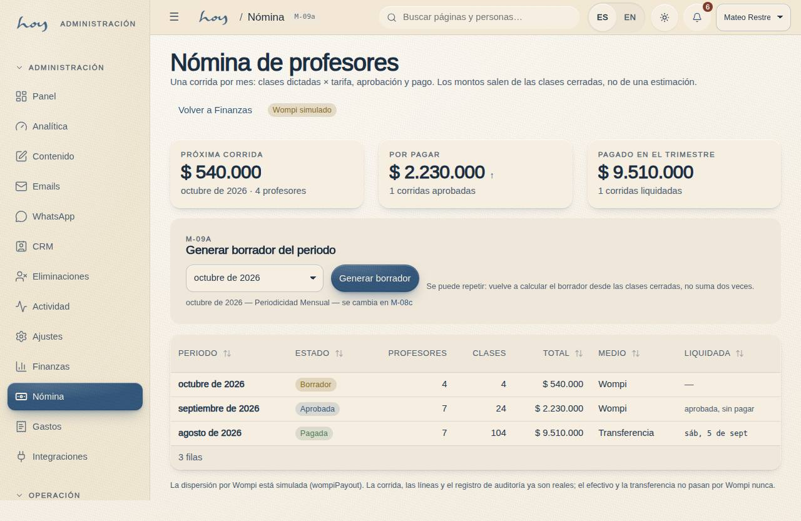
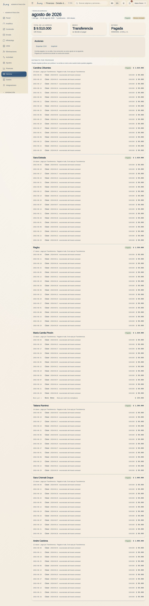

# Nómina de maestros y payouts

El maestro cobra por las clases que dio, y las clases que dio las dice la asistencia que él mismo cerró. Sin
asistencia cerrada, no hay pago.

{{audience:16-nomina-y-payouts}}

## 1. El camino del pago
1. **El maestro** cierra la asistencia de cada clase en su app.
2. **Finanzas** genera el borrador del periodo.
3. **Coordinación** revisa el detalle de cada maestro.
4. **El owner** aprueba.
5. **Finanzas** paga a cada maestro (Wompi, transferencia o efectivo).
6. **El maestro** ve su extracto en la app.

El borrador de finanzas y el estimado que ve el maestro salen de la misma cuenta, así que nunca pueden dar
números distintos.

> EN HOYOS: S-03 (asistencia) → M-09a Payouts (borrador) → M-09b detalle (revisión y aprobación) → S-03 Nómina (extracto).

## 2. Generar el borrador
1. En Finanzas → Payouts ves la lista de pagos por periodo: cuántos maestros, el total y el estado.
2. El botón genera el **borrador** del periodo: una línea por maestro, con clases dadas × tarifa.
3. Puedes generarlo otra vez sin miedo: el borrador se recalcula, nunca se paga dos veces. Un pago ya aprobado
   o pagado no se puede regenerar; la pantalla dice por qué.
4. El borrador también trae los **Especiales**: cada uno con maestro y valor, dentro del periodo, entra como
   una línea "Especial: <concepto>" (ver [Espacio](12-espacio-b2b.md)).
5. Nada se paga en borrador.

**Mensual o quincenal.** El owner elige en Ajustes → Pagos si se paga cada mes o cada quincena (1–15 y 16–fin
de mes). Las dos formas funcionan. Con quincenal, el mismo botón genera dos borradores, y ninguna clase se paga
dos veces. Esta es la frecuencia vigente:

{{policy:payroll_cadence}}

## 3. Revisar
1. Al abrir un pago ves el extracto de cada maestro: clases, tarifa, ajustes y total. Puedes exportarlo o
   imprimirlo.
2. Coordinación lo compara con el horario: cada clase pagada existió y la dio quien dice.
3. Lo que un maestro reclame se resuelve antes de aprobar, con la clase y la fecha.
4. Un reemplazo se le paga a quien dio la clase, no a quien estaba en el horario.
5. Una línea de Especial se compara con su reserva y su cobro. Si está mal, se corrige el Especial y se vuelve
   a generar el borrador; la línea no se edita a mano.

## 4. Aprobar y pagar
1. **El owner aprueba.** Desde ese momento el pago queda congelado: si algo cambia, se ajusta en el periodo
   siguiente.
2. Se paga por el medio que defina el estudio: **Wompi** (simulado hoy), **transferencia** o **efectivo**.
3. Se puede marcar pagado **maestro por maestro**. Cuando el último queda pagado, el pago se cierra solo.
4. Generar, aprobar, enviar y marcar pagado queda en el registro de actividad, con nombre y hora.

> DECISIÓN PENDIENTE: con qué medio se paga a los maestros (Wompi, transferencia o efectivo), si el estudio hace retención en la fuente y quién firma el soporte de pago.

## 5. El extracto del maestro
{{for:teacher}}
Esto es lo que ves en tu app, en Nómina.
{{/for}}

1. Antes de que finanzas genere el borrador, la app calcula el periodo en vivo (clases dadas × tarifa) y lo
   marca como **estimado**.
2. Cuando ya existe el borrador, la app muestra exactamente lo que finanzas va a pagar, con bonos, ajustes y
   Especiales, y en qué estado está: borrador, aprobado o pagado.
3. También muestra clase por clase, los pagos anteriores, el medio de pago, una vista para imprimir y un botón
   de WhatsApp a finanzas con el periodo y el total ya escritos.
4. El extracto resuelve cualquier duda: si no está ahí, no se pagó.

## 6. Las tarifas
Las tarifas están en Ajustes → Pagos, en la **tarjeta de tarifas**: una por disciplina (cuánto se paga por una
clase de hot yoga, de pilates, de barre…) y, si hace falta, una por maestro que manda sobre la de la disciplina.

1. Si el maestro tiene tarifa propia, se usa esa.
2. Si no, la de la disciplina.
3. Si no hay ninguna, la de su perfil.

Cambiar una tarifa mueve el estimado del maestro y el próximo borrador. Lo ya aprobado o pagado no cambia. En la
misma tarjeta se elige el medio de pago por defecto, quién firma el soporte y si el estudio hace retención.

Este es el medio de pago por defecto:

{{policy:payout_method}}

Así están guardados los maestros y su tarifa de respaldo:

{{table:teachers}}

> DECISIÓN PENDIENTE: las tarifas reales por disciplina (hoy son de ejemplo, entre 80.000 y 110.000 COP por clase) y la fecha de pago, que se llenan en Ajustes; y, del owner, el tipo de contrato de los maestros y si la asistencia cambia la tarifa.

## 7. Qué funciona de verdad hoy
1. Los borradores, las aprobaciones y las marcas de pagado son reales y quedan registrados. Lo que no es real
   todavía es el dinero: el envío por Wompi está simulado y las pantallas lo dicen (ver
   [Integraciones](26-integraciones.md)).
2. Pagar a los maestros no cambia los ingresos del mes: es dinero que sale, no que entra.
3. El maestro solo ve su extracto. No tiene un botón para cobrar.
4. Cuando Wompi esté conectado, la aprobación disparará el pago. El resto de este capítulo no cambia.
