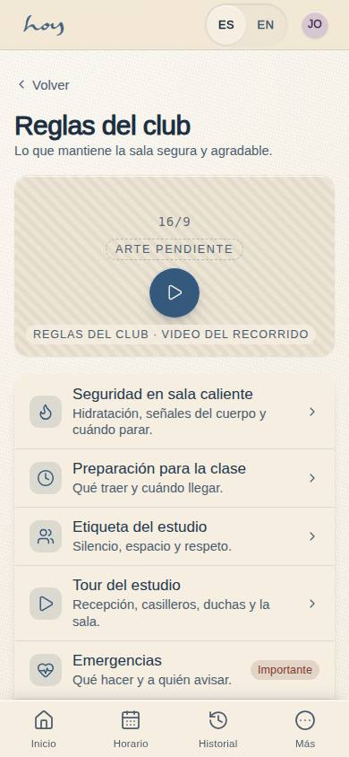
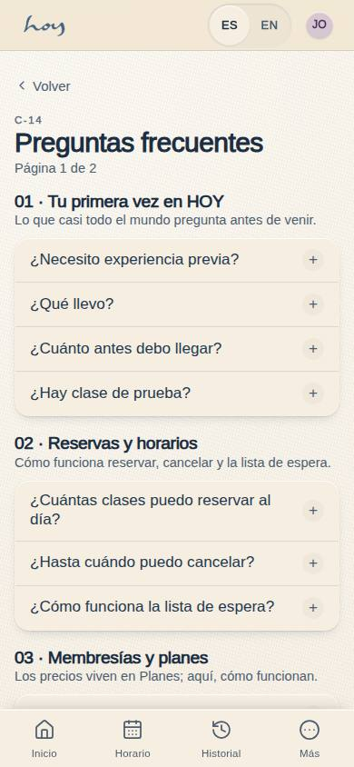

# Contenido en el CMS

Nada se escribe dos veces. Si un texto lo ve un cliente, vive en **Contenido** y de ahí sale al sitio, a la app
y al mostrador.

{{audience:17-cms-y-contenido}}

## 1. Qué se edita en Contenido
| Texto | Dónde se ve |
|---|---|
| Las clases y sus descripciones | horario de la app, detalle de la clase, sitio |
| Los perfiles de los maestros (bio, foto, especialidades) | app del socio, sitio, app de maestros |
| Disciplinas y movimientos | sitio, horario |
| Salas y capacidad | Contenido, Check-in |
| Reglas del club | app del socio |
| Preguntas frecuentes | app del socio |
| Los textos de "Sobre HOY" | sitio y el capítulo [01](01-quienes-somos-y-filosofia.md) de este manual |

Los precios **no** están en Contenido: están en el [modelo de valor](03-modelo-de-valor.md).

> EN HOYOS: M-02 Contenido → pestaña (Clases, Maestros, Modalidades, Salas) → editar → Publicar.

## 2. De borrador a publicado
1. Cada texto va en español y en inglés. **El español es obligatorio**; si falta el inglés, se muestra el
   español.
2. Cada texto pasa por tres estados: borrador → revisión → publicado. Lo que un maestro envía desde su app
   entra a revisión.
3. Coordinación aprueba o devuelve con un comentario, en el plazo de abajo. Una revisión atrasada es un texto
   viejo en el sitio.
4. Mientras no llegue la foto real, se marca como provisional (ver [Medios](19-medios-y-artwork.md)).

El plazo para revisar lo que envía un maestro:

{{studio:content_review_turnaround}}

## 3. Reglas del club y preguntas frecuentes
{{editable:owner}}

1. Las reglas del club son las que la persona acepta al entrar: puntualidad, tapetes, calor, higiene,
   cancelación. Cambiarlas cambia la experiencia, así que las aprueba el owner.
2. Las preguntas frecuentes se escriben con las palabras de la gente, no como las diría un abogado.
3. Si recepción responde tres veces lo mismo por WhatsApp, eso es una pregunta frecuente nueva.

Así están guardados los artículos y las preguntas frecuentes:

{{table:content_articles}}

{{table:faq_entries}}

## 4. Cambios de precio
1. Los propone finanzas y los aprueba el owner.
2. Nunca cambian una membresía que ya está activa.
3. El mostrador y el sitio cambian al mismo tiempo, porque leen el mismo precio.

## 5. Lo que falta hoy
1. Contenido edita clases, maestros, disciplinas y salas. Los artículos y las preguntas frecuentes se editan
   por ahora en Tablas, de forma genérica: falta su editor propio.
2. Todavía no hay biblioteca de fotos: la foto se pone como un enlace (ver [Medios](19-medios-y-artwork.md)).
3. No se puede programar una publicación: publicar es inmediato.

> EN HOYOS: M-03 Tablas → content_articles / faq_entries (mientras llega el editor).
