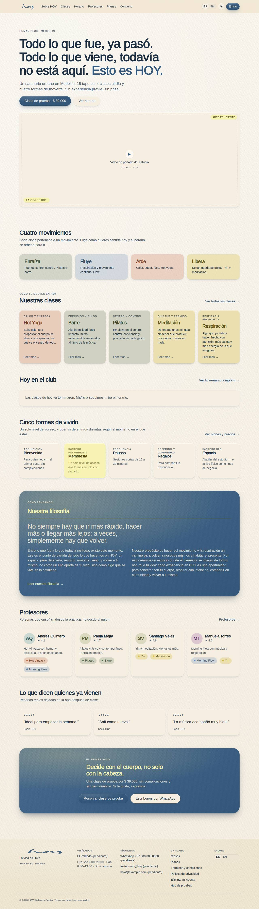
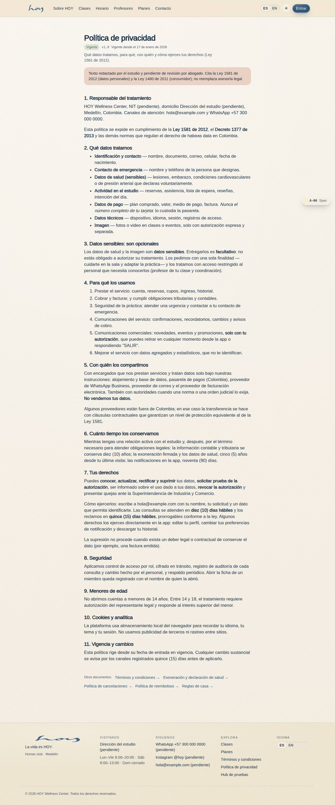

# Web y redes

El sitio es la primera cosa que alguien conoce de HOY. Su trabajo es uno: que la persona entienda qué
es esto y reserve una clase de prueba.

## 1. Las páginas del sitio
{{routes:public}}

## 2. Quién cambia qué
| Cambio | Quién | Dónde |
|---|---|---|
| Texto de una clase o de un maestro | Coordinación | M-02 (`17`) |
| Copia de "Sobre HOY" y filosofía | Owner aprueba, coordinación aplica | `01` → M-02 |
| Precios | Owner aprueba | modelo de valor (`03`) |
| Horario visible | Coordinación | M-02 → Horario (`05`) |
| Datos de contacto, horario, dirección | Admin | M-08a |
| Orden de las secciones de la portada | Admin / diseño | editor de layout, `/#/dev/layout/W-01` |

Los datos que el pie y la página de contacto leen del sistema:

{{tenant:contact}}

## 3. Del sitio a la app
1. Todo camino del sitio termina en reservar: "ver horario" y "ver planes" llevan a iniciar sesión con
   la intención guardada, así la persona no pierde el paso que estaba dando.
2. El sitio nunca cobra: el checkout vive en la app (C-04), con el IVA calculado y el medio de pago
   guardado.
3. Un enlace que se comparte en redes debe llegar a una página real del sitio, no a una captura.

## 4. Redes
1. Un solo tono, el del capítulo `20`: humana, cercana, directa, presente. Lo que no se diría en la
   puerta, no se publica.
2. No se publican caras de socios sin permiso escrito, ni datos de salud, ni nombres (`23`).
3. Las fotos salen de la biblioteca aprobada (`19`), no de la cámara de quien esté en el turno.
4. Lo que se promete en una publicación —un precio, una promoción, un horario— tiene que existir en el
   sistema antes de publicarse. Si no está en M-02 o en el modelo de valor, no se anuncia.
5. Un comentario público con una queja se responde en público con una línea y se sigue en privado; el
   caso se resume en M-06 (`13`).

> DECISIÓN PENDIENTE: quién publica en redes (rol y persona), con qué calendario, y quién aprueba una publicación que menciona precios o promociones.

## 5. Legal en el sitio
Términos y política de privacidad son páginas versionadas del sitio (A-06) y son lo que la persona
acepta al crear cuenta. Ver `22`.

