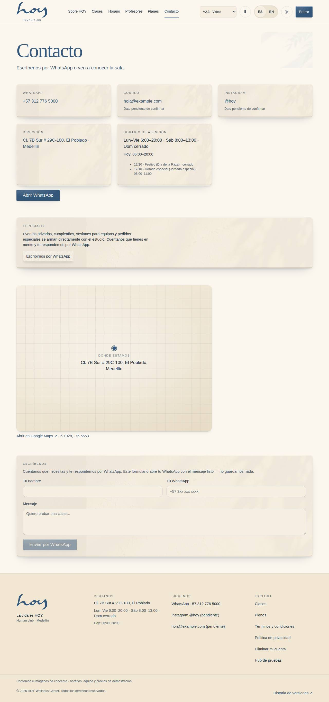

# Web y redes

El sitio es lo primero que alguien conoce de HOY. Tiene un solo trabajo: que la persona entienda qué es esto y
reserve una clase de prueba.

{{audience:18-web-y-redes}}

## 1. Las páginas del sitio
{{routes:public}}

## 2. El texto oficial del sitio
El texto de Sobre HOY, la filosofía y las clases sale de este documento. Si hay que cambiar el sitio, se cambia
primero aquí y después en el sitio, nunca al revés.

{{source:contenido-completo}}

1. Cada sección sigue el mismo orden: una línea pequeña en cursiva ("Quiénes somos"), el título ("Sobre HOY") y
   los párrafos.
2. El llamado a la acción es siempre el mismo: una clase de prueba, sin complicaciones, y después los planes.
3. El inglés se escribe a partir del español, con el mismo tono.

## 3. Quién cambia qué
| Cambio | Quién lo hace |
|---|---|
| Texto de una clase o de un maestro | coordinación, en Contenido ([17](17-cms-y-contenido.md)) |
| "Sobre HOY" y la filosofía | el owner aprueba y coordinación aplica |
| Precios | el owner aprueba ([03](03-modelo-de-valor.md)) |
| Horario visible | coordinación ([05](05-clases-y-horarios.md)) |
| Contacto, horario y dirección | admin, en Ajustes |
| El orden de las secciones de la portada | admin o diseño, en el editor de layout |

Estos son los datos de contacto que muestran el pie de página y la página de contacto:

{{tenant:contact}}

> EN HOYOS: M-02 Contenido · M-08a Ajustes → General · D-04 Editor de layout → W-01.

## 4. Del sitio a la app
1. Todo camino del sitio termina en reservar. "Ver horario" y "Ver planes" piden iniciar sesión y recuerdan lo
   que la persona quería hacer, así no pierde el paso.
2. El sitio nunca cobra. El pago se hace en la app, con el IVA calculado y el medio de pago guardado.
3. Un enlace que se comparte en redes lleva a una página real del sitio, no a una imagen.

## 5. Redes
{{editable:owner}}

1. Un solo tono, el de [Voz y tono](20-voz-y-tono.md). Lo que no se diría en la puerta, no se publica.
2. No se publican caras de socios sin permiso escrito, ni datos de salud, ni nombres (ver
   [Datos personales](23-habeas-data.md)).
3. Las fotos salen de las imágenes aprobadas (ver [Medios](19-medios-y-artwork.md)), no del teléfono de quien
   esté de turno.
4. Lo que se promete en una publicación —un precio, una promoción, un horario— tiene que existir en el sistema
   antes de publicarse.
5. Una queja pública se responde en público con una línea y se sigue por privado. El caso se resume en la ficha
   de la persona.

El calendario de publicaciones:

{{studio:social_calendar_note}}

{{for:marketing}}
Esta sección es tu base de trabajo. El kit de marketing (logos, plantillas y fotos aprobadas en un solo lugar)
llega pronto al hub.
{{/for}}

> DECISIÓN PENDIENTE: quién publica en redes (ahora que existe el rol de marketing, qué persona lo ocupa), con qué calendario, y quién aprueba una publicación que menciona precios o promociones.

## 6. Lo legal en el sitio
Los términos y la política de privacidad son páginas del sitio con versión y fecha. Son lo que la persona acepta
al crear su cuenta. Ver [Documentos legales](22-documentos-legales.md).

