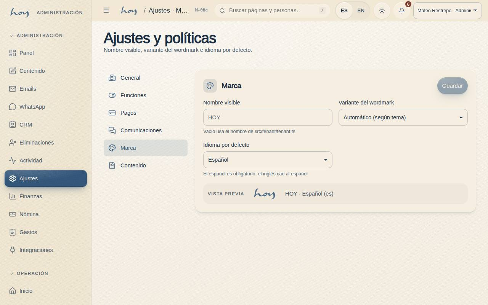
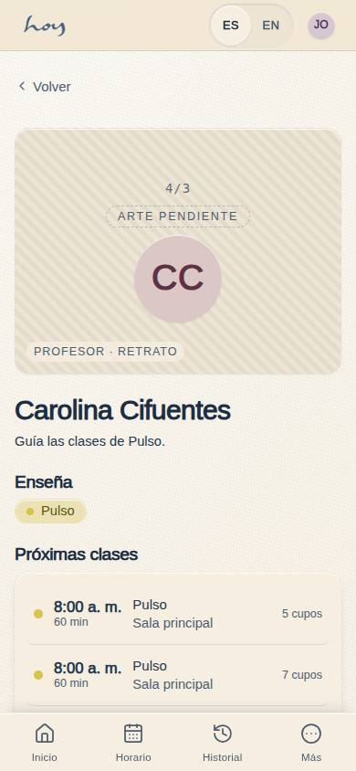
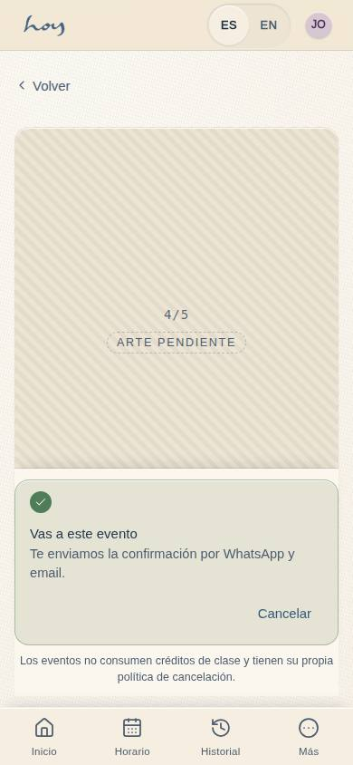

# Biblioteca de medios y artwork

Hoy el sistema tiene los espacios para las fotos, pero no las fotos. Este capítulo reúne las reglas de la marca,
los formatos que pide cada pantalla y la lista de lo que falta producir.

{{audience:19-medios-y-artwork}}

## 1. El manual de marca
Las reglas de logo, color y tipografía salen del manual de marca 2026. Ante cualquier duda, manda el documento.

{{source:manual-de-marca}}

## 2. El logo
El logo principal combina la palabra manuscrita **"hoy"** con **HUMAN CLUB** en mayúsculas espaciadas. Lo
manuscrito aporta personalidad, humanidad y movimiento; HUMAN CLUB aporta estructura y claridad.

1. **Tres versiones aprobadas:**
   - el sello circular: HUMAN CLUB en curva arriba y abajo de "hoy", en amarillo pálido sobre azul medio;
   - el bloque apilado: azul profundo sobre amarillo pálido;
   - la versión de un solo color: tono arena sobre crema.
2. **Proporciones fijas.** El ancho total mide 6 unidades; "hoy" mide 3 de alto y la línea HUMAN CLUB mide 1.
   Nunca se estira ni se aplasta.
3. **Área de protección.** Alrededor del logo, por los cuatro lados, se deja libre el alto de la letra H de
   HUMAN CLUB. Ahí no va texto, gráfico ni borde.
4. **Tamaño mínimo:** 30 mm impreso y 120 px en pantalla.
5. No se recolorea fuera de la paleta y no se pone sobre una foto con mucho ruido detrás.
6. En la app, el tema claro usa el logo azul y el tema oscuro, el crema. La versión por defecto se elige en
   Ajustes → Marca.

> DECISIÓN PENDIENTE: las reglas de uso del logo ya están en el manual de marca; falta decidir quién aprueba que un tercero lo use (rodajes, pop-ups, marcas aliadas) y si el material hecho en el estudio debe dar crédito a HOY.

> EN HOYOS: M-08e Ajustes → Marca → versión por defecto del logo.

## 3. Los colores
| Color | Código | Qué aporta |
|---|---|---|
| Azul profundo | #35597D | estructura, profundidad y contraste |
| Azul medio | #5F85B1 | frescura y dinamismo |
| Amarillo pálido | #F7F3B2 | luz, frescura y vitalidad |
| Crema | #F1E7D2 | una base neutra y suave; da amplitud |

Los tonos claros dan luz y ligereza; los azules dan profundidad y estabilidad. Los demás tonos que ves en la app
(tinta, arena, los colores de cada movimiento) son extensiones del sistema, no colores de marca.

## 4. Las tipografías
1. **Títulos y encabezados:** Inter (Regular, Medium, Semibold). El manual nombra Akzidenz-Grotesk como la
   principal; Inter es su versión libre para pantallas, y es la que usamos en el sitio y en la app.
2. **Textos:** DM Sans Regular.
3. **Énfasis:** DM Sans Italic, para destacar una palabra o una frase sin romper la armonía.

## 5. Reglas de la biblioteca
{{editable:coordinator}}

1. Una imagen publicada está **aprobada**: coordinación la revisó, el owner la aprobó si es de marca, y quien
   aparece firmó su permiso.
2. El nombre del archivo describe lo que se ve, en minúsculas, sin tildes ni espacios:
   `sala-caliente-manana-01.jpg`.
3. JPG para fotos, PNG solo para logos y gráficos con transparencia, SVG para íconos.
4. Se guarda el original en tamaño grande. El sistema no es el archivo de la sesión de fotos.
5. No se usan caras reconocibles de socios sin permiso escrito (ver [Datos personales](23-habeas-data.md)).
   Personas de espaldas, manos, detalles de la sala: siempre seguro.

## 6. Los formatos que pide cada pantalla
| Espacio | Proporción | Dónde se ve |
|---|---|---|
| Imagen principal de la portada | 16:9 | inicio del sitio |
| Foto de clase | 16:9 | detalle de la clase |
| Retrato de maestro | 4:3 | maestros en la app y el sitio |
| Foto de evento | 4:5 | eventos |
| Video del recorrido por el estudio | 16:9 | reglas del club |
| Mapa o fachada | 16:9 | contacto |
| Logo | PNG con transparencia | toda la app |

## 7. Lo que falta producir
{{editable:coordinator}}

| # | Pieza | Para | Estado |
|---|---|---|---|
| 1 | Imagen de portada: la sala con luz de mañana | inicio del sitio | pendiente |
| 2 | Una foto por disciplina (5) | clases en la app y el sitio | pendiente |
| 3 | Retrato de cada maestro activo | maestros | pendiente |
| 4 | Video corto del recorrido por el estudio | reglas del club | pendiente |
| 5 | Fachada y mapa | contacto | pendiente |
| 6 | Detalle de la sala caliente, sin personas | [02](02-nuestras-clases.md), redes | pendiente |
| 7 | Pausas: alguien 20 minutos, con ropa de oficina | [03](03-modelo-de-valor.md), [11](11-pausas-y-regalos.md) | pendiente |
| 8 | El espacio vacío, para el catálogo de alquiler | [12](12-espacio-b2b.md) | pendiente |
| 9 | El logo en las tres versiones, fondo claro y oscuro | app, sitio | listo |
| 10 | Plantilla del bono de regalo | regalar | pendiente |
| 11 | Fotos y videos cortos de guía para este manual | el equipo | pendiente |

> DECISIÓN PENDIENTE: de quién son los derechos de las fotos y videos que se toman en el estudio durante un alquiler o una sesión pagada por un tercero.

## 8. Lo que falta hoy
1. No hay biblioteca de fotos todavía. La foto se pone como un enlace y la app dibuja un espacio con la
   proporción correcta hasta que llegue.
2. El video del recorrido es un espacio reservado.
3. El mapa de contacto también: falta elegir el proveedor de mapas y confirmar la dirección.
