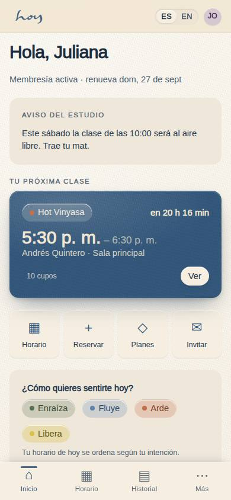
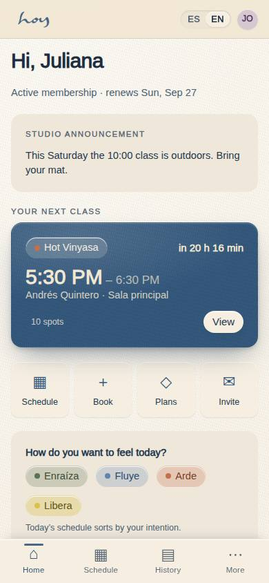

# Voz y tono

Cómo suena HOY es parte del producto, igual que la temperatura de la sala. Este capítulo aplica a todo:
puerta, WhatsApp, correo, sitio, redes y las pantallas del sistema.

## 1. Cuatro palabras
Si un mensaje no cumple las cuatro, se reescribe.

| Rasgo | Significa | Sí | No |
|---|---|---|---|
| Humana | Hablamos como personas, no como sistema | "Te devolvimos tu crédito." | "Su crédito ha sido reintegrado." |
| Cercana | Tuteamos siempre, por nombre | "Hola, Mariana." | "Estimado usuario." |
| Directa | Una idea por frase; el dato primero | "Tu clase de las 7:00 se canceló." | "Lamentamos informarte que…" |
| Presente | Hablamos de hoy y de lo que sigue | "Hay cupo a las 9:30, ¿te lo guardo?" | "En el futuro podría haber disponibilidad." |

## 2. Cómo saludamos y hablamos
1. En persona: contacto visual, nombre si lo sabemos, una pregunta útil. "Hola, Camila. ¿Vienes a la
   de las 7?"
2. En WhatsApp: primera línea con nombre y el dato; segunda línea con la acción. Un emoji máximo (🌿
   es el nuestro). Nada de mayúsculas sostenidas.
3. Siempre "tú". Nunca "usted", ni en quejas ni con personas mayores; si alguien pide "usted", se
   respeta con esa persona.
4. Sin jerga interna delante del cliente: decimos "crédito", "reserva", "membresía"; no decimos
   "entitlement", "order", "flag".
5. Español primero. Inglés cuando la persona lo prefiera, con el mismo tono.

## 3. Cómo decimos no
Los "no" se dicen completos y con la salida.

| Situación | Se dice |
|---|---|
| Clase llena | "Esa clase ya está llena. Te pongo en lista de espera y te avisamos por WhatsApp si se libera un cupo." |
| Canceló fuera de ventana | "Como faltan menos horas que la ventana, esta clase cuenta. ¿Te muevo a otra del día?" |
| Ya tomó su clase del día | "Hoy ya hiciste la tuya. ¿Te reservo la de mañana a la misma hora?" |
| Quiere un descuento que no existe | "No tenemos descuentos por fuera de los planes, pero el anual sale mucho mejor por mes. ¿Te lo muestro?" |
| Pide algo que la política no permite | "Eso no lo puedo hacer yo. Se lo paso a coordinación hoy mismo y te responden." |

## 4. Lo que nunca escribimos
1. No culpamos a la persona ("es que no cancelaste a tiempo").
2. No prometemos lo que la política no permite; el valor vigente está en M-08, no en la memoria.
3. No mandamos mensajes no urgentes en horas silenciosas.
4. No comentamos el cuerpo, el peso ni el nivel de nadie.
5. No usamos la palabra "cliente" hablando con la persona: es "socio", o mejor, su nombre.
6. No escribimos datos de salud, ni fotos de comprobantes, ni información de otra persona (`23`).

## 5. La voz en el sistema
Los textos de la app y del sitio están en ES y EN, con el español como fuente. Si una pantalla suena
mal, es un cambio de copia, no una queja: se reporta a coordinación con el código de pantalla y el
texto exacto.

## 6. El nombre
"HOY" se escribe en mayúsculas cuando es la marca; el wordmark es minúscula y es una imagen, no texto
(`19`). La frase que nos resume, y que puede cerrar un mensaje cuando cabe: **la vida es HOY.**
