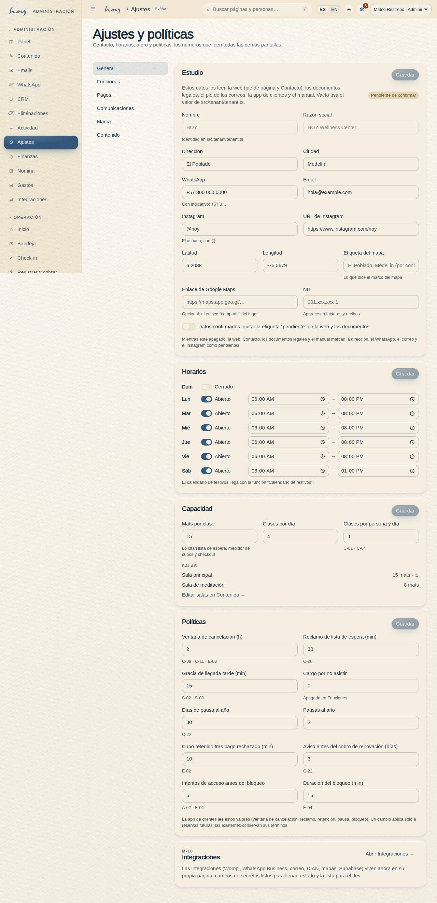

# Políticas vigentes

Una política de HOY es un número en una pantalla, no un párrafo en un documento. El bloque de abajo es
la verdad: si alguien lo cambia en **M-08a Ajustes y políticas**, este capítulo cambia solo.

{{policy}}

## 1. Qué significa cada valor
| Valor | Qué controla | Se nota en |
|---|---|---|
| Ventana de cancelación | hasta cuándo el crédito vuelve completo | C-08b, S-02, `04` |
| Reclamo de lista de espera | cuánto tiempo tiene el siguiente para tomar el cupo | C-20, `04` |
| Tolerancia de llegada | hasta cuándo se entra a una clase empezada | S-02, `06` |
| Cargo por inasistencia | si el no-show cuesta dinero además del crédito | S-02, `04` |
| Días de pausa por año | cuánto puede congelar una membresía | C-22, `11` |
| Pausas por año | cuántas veces puede congelar | C-22, `11` |
| Reserva sostenida durante el pago | cuánto se guarda el cupo mientras paga | C-04 |
| Aviso antes de cada cobro | con cuántos días se avisa la renovación | M-05, C-22 |
| Intentos y duración del bloqueo | protección de la cuenta al iniciar sesión | A-02, E-04 |
| Horas silenciosas | cuándo no se envía nada no urgente | M-05, `13` |
| IVA y si está incluido | cómo se parte el total en el recibo | S-04, `15` |

## 2. Quién aprueba un cambio
| Decisión | Propone | Aprueba | Dónde queda |
|---|---|---|---|
| Cambio de política (cancelación, reclamo, tolerancia, cargo) | Coordinación | Owner | M-08a + M-07 |
| Cambio de precio o plan | Admin / finanzas | Owner | modelo de valor + M-07 |
| Encender o apagar una feature | Admin | Owner | M-08b + M-07 |
| Datos fiscales y cuenta de payout | Finanzas | Owner | M-08c + M-07 |
| Remitente de WhatsApp y correo | Coordinación | Admin | M-08d + M-07 |

Cada guardado de M-08 queda auditado con actor, valor anterior y hora.

## 3. La regla del cambio
1. **Un cambio de política no afecta lo ya reservado.** Si alguien reservó con una ventana de 2 horas,
   esa reserva se rige por 2 horas aunque hoy sean 4.
2. Un cambio que endurece algo (menos tolerancia, más aviso) se anuncia antes de aplicarlo.
3. Un cambio que afloja algo se puede aplicar de inmediato.
4. Recepción no negocia una política en el mostrador. Si el caso lo merece, se da cortesía en crédito
   y se registra (`14`).

## 4. Lo que no se puede apagar
Las páginas legales (A-06) y el flujo de emergencia no tienen switch: existen siempre, en los dos
idiomas.

## 5. Decisiones que faltan
Varios de estos campos están en cero o en un valor provisional porque el estudio aún no los ha
definido. La lista completa vive en **Decisiones pendientes** (K-04) y se alimenta de los bloques
`DECISIÓN PENDIENTE` de todo este manual.
