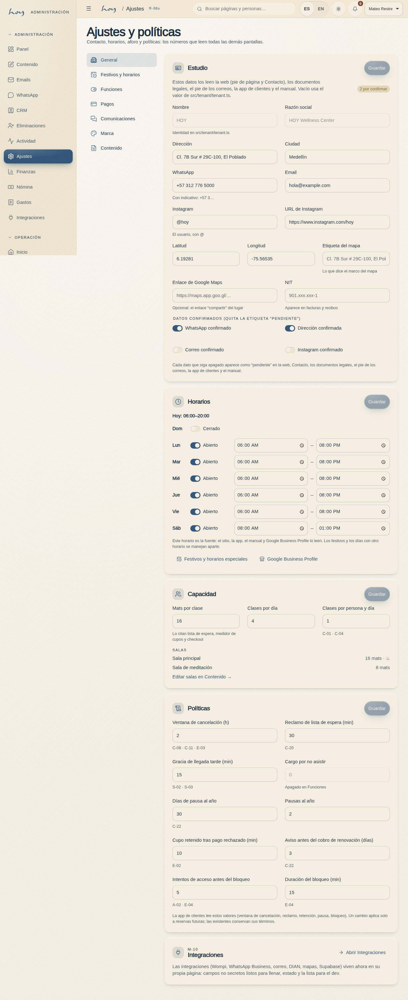

# Políticas vigentes

En HOY una política es un número en Ajustes, no un párrafo en un documento. El bloque de abajo es la verdad: si
alguien la cambia en Ajustes, este capítulo cambia solo.

{{audience:21-politicas}}

Estas son las políticas vigentes:

{{policy}}

> EN HOYOS: M-08a Ajustes y políticas → editar el valor → Guardar.

## 1. Qué controla cada una
| Política | Qué controla | Dónde se nota |
|---|---|---|
| Ventana de cancelación | hasta cuándo la clase vuelve al paquete | reservas, Check-in ([04](04-recepcion-y-check-in.md)) |
| Tiempo para tomar un cupo de la lista de espera | cuánto tiene la siguiente persona para aceptarlo | lista de espera ([04](04-recepcion-y-check-in.md)) |
| Tolerancia de llegada | hasta cuándo se puede entrar a una clase empezada | Check-in, maestros ([06](06-maestros.md)) |
| Cargo por inasistencia | si faltar sin avisar cuesta dinero además de la clase | Check-in ([04](04-recepcion-y-check-in.md)) |
| Días de congelamiento | cuánto tiempo se puede congelar el paquete de 12 clases | paquete ([11](11-pausas-y-regalos.md)) |
| Congelamientos por paquete | cuántas veces se puede congelar | paquete ([11](11-pausas-y-regalos.md)) |
| Cupo guardado mientras paga | cuánto se guarda el lugar mientras la persona paga | el pago en la app |
| Aviso antes de cada cobro | con cuántos días se avisa un cobro recurrente (hoy no hay ninguno) | mensajes automáticos |
| Intentos y bloqueo | protege la cuenta cuando alguien falla la contraseña | inicio de sesión |
| Horas silenciosas | cuándo no se envía nada que no sea urgente | WhatsApp ([13](13-crm-y-whatsapp.md)) |
| IVA y si va incluido | cómo se separa el total en el recibo | cobro, facturación ([15](15-facturacion-y-dian.md)) |

## 2. Quién aprueba un cambio
{{editable:owner}}

| Cambio | Lo propone | Lo aprueba |
|---|---|---|
| Una política (cancelación, lista de espera, tolerancia, cargo) | coordinación | owner |
| Un precio, un paquete o una clase privada | admin o finanzas | owner |
| Encender o apagar una función | admin | owner |
| Datos fiscales y cuenta de pagos | finanzas | owner |
| Número de WhatsApp y correo del estudio | coordinación | admin |

Cada cambio en Ajustes queda registrado: quién, el valor anterior y la hora.

## 3. La regla del cambio
1. **Un cambio no afecta lo ya reservado.** Si alguien reservó con una ventana de 12 horas, su reserva sigue con
   12 horas aunque mañana sean 24.
2. Si el cambio endurece algo (menos tolerancia, más aviso), se anuncia antes de aplicarlo.
3. Si el cambio afloja algo, se puede aplicar de inmediato.
4. En el mostrador no se negocia una política. Si el caso lo merece, se da una cortesía en clases y se deja
   registrada (ver [Pagos y caja](14-pagos-y-caja.md)).

## 4. Lo que no se puede apagar
Las páginas legales y el flujo de emergencia no tienen interruptor: existen siempre, en los dos idiomas.

## 5. Lo que falta definir
Algunos valores están en cero o son provisionales porque el estudio todavía no los ha decidido. La lista
completa está en Decisiones pendientes, y cada decisión está marcada en el capítulo al que pertenece.
