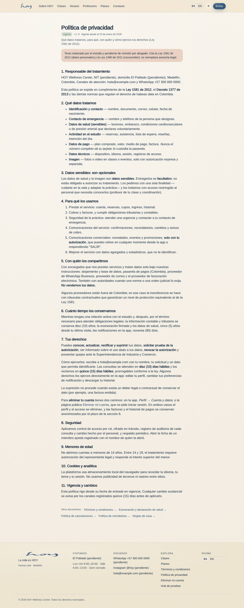

# Documentos legales

Los documentos legales tienen versión y fecha. Lo que vale en una discusión es la versión exacta que la persona
aceptó, no el texto de hoy.

{{audience:22-documentos-legales}}

## 1. Los documentos
| Documento | Qué es | Dónde se ve |
|---|---|---|
| Términos | las condiciones del servicio y de los planes | en el sitio, al crear la cuenta |
| Privacidad | cómo tratamos los datos personales ([23](23-habeas-data.md)) | en el sitio, al crear la cuenta |
| Exoneración | el riesgo de la práctica física | al registrarse en el mostrador |
| Políticas | reglas del estudio con efecto de contrato (cancelación, reembolsos, reglas de la casa) | reglas del club, sitio |

Estas son las versiones que existen hoy:

{{table:legal_documents}}

## 2. Versiones y aceptación
1. Cada documento tiene **versión, idioma y fecha de publicación**. Un documento publicado no se edita: se
   publica una versión nueva.
2. Lo que la persona aceptó queda guardado con la versión exacta, la hora y quién lo registró.
3. En el mostrador, la persona acepta en voz alta y tú lo marcas al registrarla (ver
   [Ventas y planes](10-ventas-y-planes.md)).

**Qué decir:** "Para registrarte necesito que aceptes los términos y la política de datos. Están en el sitio.
¿Aceptas?"

Así quedan guardadas las aceptaciones:

{{table:consents}}

## 3. Cuando cambia un documento
1. La versión nueva se publica en los dos idiomas el mismo día.
2. A quien ya tiene cuenta se le pide aceptar otra vez solo si el cambio afecta sus derechos o el precio. Si es
   un cambio de forma, no.
3. El aviso sale por WhatsApp o correo (ver [CRM, WhatsApp y correo](13-crm-y-whatsapp.md)), nunca en horas
   silenciosas.

> EN HOYOS: M-08f Ajustes → Contenido → versiones legales publicadas (interruptor por versión).

## 4. Contratos que no están en la app
Los contratos de alquiler ([12](12-espacio-b2b.md)), de maestros ([16](16-nomina-y-payouts.md)) y de
proveedores viven fuera del sistema. En el sistema queda la nota en la ficha con el monto, las condiciones y la
fecha.

## 5. Qué falta hoy
1. Los documentos existen, tienen enlace y versión, pero **el texto es provisional** hasta que el asesor legal
   entregue la redacción final.
2. En la app del socio, los enlaces legales llevan a las páginas del sitio.

> DECISIÓN PENDIENTE: el texto final de los términos, la privacidad y la exoneración (redactado por el asesor legal), qué versiones se publican y quién es el emisor legal que las firma.
