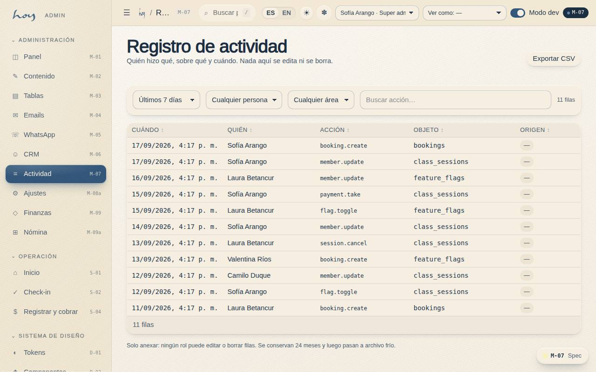
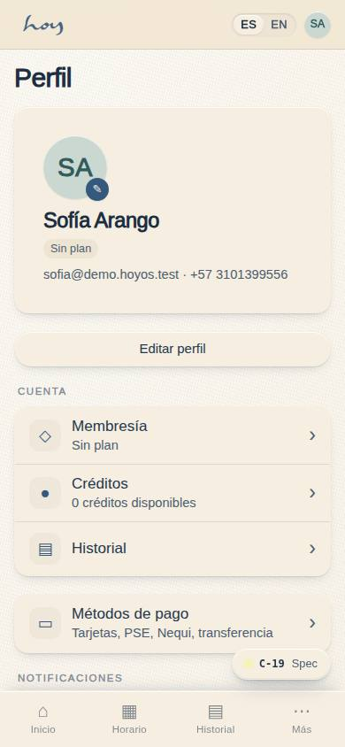

# Datos personales y habeas data

Ley 1581 de 2012 (Colombia). Esto no es un capítulo para abogados: es lo que cada persona del equipo
tiene que hacer y no hacer todos los días.

## 1. Las reglas del día a día
1. Al registrar (A-03 / S-04) la persona acepta la política de tratamiento de datos (A-06); queda con
   hora, versión y quién la registró (`22`).
2. Solo pedimos lo necesario: nombre, WhatsApp, correo, contacto de emergencia, cumpleaños,
   consentimiento.
3. **Datos de salud son sensibles**: se guardan como marcador y nota interna; nunca se leen en voz
   alta, nunca se envían por WhatsApp, nunca se comentan entre turnos.
4. Cada vista de un registro de socio queda en **M-07**; el acceso es auditable.
5. Nunca compartimos la sesión de HoyOS ni exportamos listas fuera del sistema sin autorización del
   owner.
6. Una foto es un dato personal: sin permiso escrito no se publica una cara (`19`).

**Pasos en HoyOS:** A-06 Legal (versión vigente) · M-06 → consentimientos · M-07 → filtro "lectura de
registro".

## 2. Quién puede ver qué
El sistema no confía en la buena voluntad: cada tabla tiene un contrato de acceso. Recepción ve la
cronología del socio pero no edita pagos; finanzas ve pagos pero no notas de salud.

{{roles}}

{{table:profiles}}

## 3. Derechos de la persona
| Derecho | Qué hacemos | Plazo |
|---|---|---|
| Consulta | se le muestra qué tenemos de ella | mismo día si es en persona |
| Corrección | se corrige en M-06 o lo hace ella en C-19 | inmediato |
| Supresión | recepción abre el caso, admin lo ejecuta | máximo 15 días hábiles |
| Revocar el consentimiento de marketing | se apaga el canal en C-24 / M-06 | inmediato |

Si alguien pide borrar sus datos: recepción abre el caso, admin lo ejecuta y responde en máximo 15 días
hábiles. **Lo financiero se conserva por obligación legal** (borrado lógico): la factura no se borra,
los datos personales asociados se anonimizan.

## 4. Cuando alguien pregunta
"¿Qué hacen con mis datos?" — respuesta corta y verdadera: "Guardamos tu nombre, tu WhatsApp, tu
correo y un contacto de emergencia para poder atenderte. Si nos dijiste algo de salud, queda como nota
interna y no sale de aquí. Puedes pedirnos ver, corregir o borrar todo eso cuando quieras."

## 5. Qué está simulado hoy
1. Los consentimientos se registran de verdad, con versión y hora.
2. El borrado lógico existe como concepto en el modelo de datos, pero el procedimiento de ejecución
   todavía es manual (admin, en M-03).
3. La autenticación real (Supabase) no está conectada: hoy el acceso es un selector de demo (`26`).

> DECISIÓN PENDIENTE: texto final de la política de datos (redactado por asesor legal) y quién es el responsable del tratamiento que se publica.
