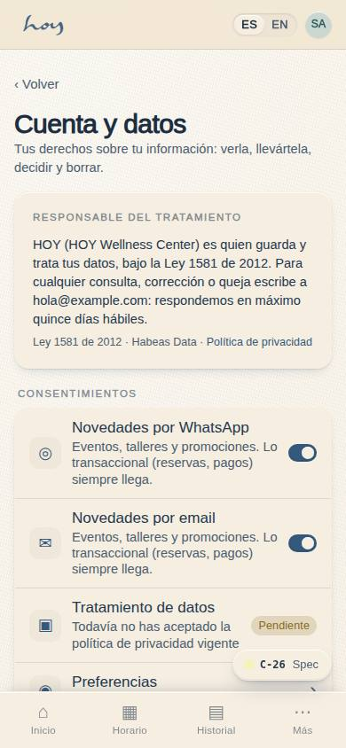
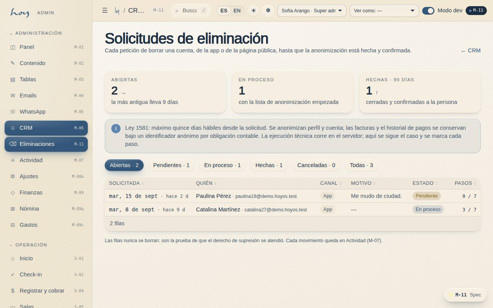

# Datos personales y habeas data

Ley 1581 de 2012 (Colombia). Esto no es un capítulo para abogados: es lo que cada persona del equipo
tiene que hacer y no hacer todos los días.

## 1. Las reglas del día a día
1. Al registrar (A-03 / S-04) la persona acepta la política de tratamiento de datos (A-06); queda con
   hora, versión y quién la registró (`22`).
2. Solo pedimos lo necesario: nombre, WhatsApp, correo, contacto de emergencia, cumpleaños,
   consentimiento.
3. **Datos de salud son sensibles**: se guardan como marcador y nota interna; nunca se leen en voz
   alta, nunca se envían por WhatsApp, nunca se comentan entre turnos.
4. Cada vista de un registro de socio queda en **M-07**; el acceso es auditable.
5. Nunca compartimos la sesión de HoyOS ni exportamos listas fuera del sistema sin autorización del
   owner.
6. Una foto es un dato personal: sin permiso escrito no se publica una cara (`19`).

**Pasos en HoyOS:** A-06 Legal (versión vigente) · M-06 → consentimientos · M-07 → filtro "lectura de
registro".

## 2. Quién puede ver qué
El sistema no confía en la buena voluntad: cada tabla tiene un contrato de acceso. Recepción ve la
cronología del socio pero no edita pagos; finanzas ve pagos pero no notas de salud.

{{roles}}

{{table:profiles}}

## 3. Derechos de la persona
| Derecho | Qué hacemos | Plazo |
|---|---|---|
| Consulta | se le muestra qué tenemos de ella; en la app puede **descargar sus datos** (C-26) | mismo día si es en persona |
| Corrección | se corrige en M-06 o lo hace ella en C-19 | inmediato |
| Supresión | la persona la pide sola (C-26 o la página pública W-09) o recepción abre el caso; admin lo ejecuta en **M-11** | máximo 15 días hábiles |
| Revocar el consentimiento de marketing | la persona apaga el canal en C-26 / C-24; el equipo en M-06 | inmediato |

**Lo financiero se conserva por obligación legal**: la factura y el historial de pagos no se borran,
se quedan ligados a un identificador anónimo por el plazo que fija la política de privacidad (A-06 §6).
El perfil y la cuenta de acceso sí se anonimizan. Eso es lo que la app le dice a la persona antes de
confirmar, en dos pasos, y es lo que le repetimos si pregunta.

## 4. Eliminar una cuenta: el flujo completo
Tres entradas, una sola cola, una sola tabla (`deletion_requests`). Nadie borra nada a mano en el
momento: la solicitud se registra, admin la sigue y la ejecución técnica corre en el servidor.

**a) La persona, desde la app (C-26 Cuenta y datos).** Perfil → Cuenta y datos → *Eliminar mi cuenta*.
Primer paso: qué se conserva y qué termina, motivo opcional y el interruptor "Entiendo". Segundo paso:
la confirmación. Queda una fila en estado **pendiente** y la persona la ve ahí mismo; puede cancelarla
mientras siga pendiente. En la misma pantalla están sus consentimientos de marketing, la versión de la
política de privacidad que aceptó, la descarga de sus datos y los seis documentos legales.

**b) Cualquiera, desde la web sin iniciar sesión (W-09).** Google Play exige una URL pública para
pedir la eliminación. La página explica lo mismo, pide correo o WhatsApp (uno basta) y crea la fila sin
usuario asociado. Está enlazada en el pie del sitio y en el punto 7 de la política de privacidad.

**c) Recepción, cuando la piden en persona.** Confirma la identidad, abre la fila en M-03 con canal
"recepción" (o pídele a admin que la abra) y anota quién la pidió. No prometas fecha: el plazo es el de
la tabla de arriba.

**d) Admin, en la cola (M-11 CRM → Eliminaciones).** Cada solicitud muestra quién, canal, motivo,
antigüedad y estado. Admin la pasa a **en proceso**, marca los siete pasos de la lista de anonimización
(perfil, cuenta de acceso, notificaciones y preferencias, mensajes, usuario de autenticación, pagos y
facturas conservados anónimos, confirmación enviada) y solo entonces puede marcarla **hecha**.
**Cancelada** cierra sin borrar. Las filas nunca se eliminan: son la prueba de que el derecho se atendió,
y cada movimiento queda en M-07.

{{table:deletion_requests}}

## 5. Cuando alguien pregunta
"¿Qué hacen con mis datos?" — respuesta corta y verdadera: "Guardamos tu nombre, tu WhatsApp, tu
correo y un contacto de emergencia para poder atenderte. Si nos dijiste algo de salud, queda como nota
interna y no sale de aquí. Puedes ver, descargar, corregir o borrar todo eso desde la app, en Perfil →
Cuenta y datos, o pedírnoslo y lo hacemos en máximo quince días hábiles."

"¿Y si borro la cuenta, desaparecen mis pagos?" — "Las facturas se conservan porque la ley nos obliga,
pero sin tu nombre: nadie del estudio podrá volver a asociarlas contigo."

## 6. Qué está simulado hoy
1. Los consentimientos se registran de verdad, con versión y hora; la solicitud de eliminación también,
   con su rastro en M-07.
2. La **ejecución** de la anonimización (perfil, cuenta, usuario de autenticación, notificaciones) es un
   trabajo del servidor que existirá con Supabase (`26`). Hasta entonces admin hace los pasos en M-03 y
   los marca en M-11; la lista de M-11 es la especificación de ese trabajo.
3. La autenticación real (Supabase) no está conectada: hoy el acceso es un selector de demo.
4. La lista completa de exigencias de App Store y Google Play, con su estado, está en
   `docs/app-store-compliance.md` (se lee en la app en Documentación).

> DECISIÓN PENDIENTE: texto final de la política de datos (redactado por asesor legal) y quién es el responsable del tratamiento que se publica.
