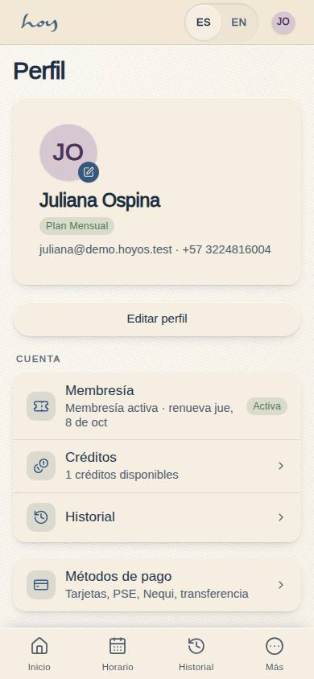
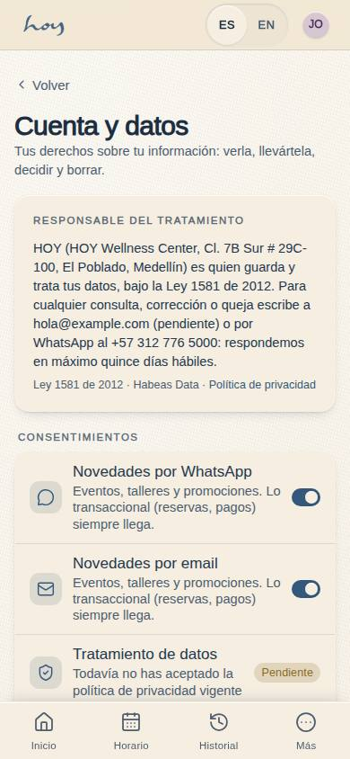
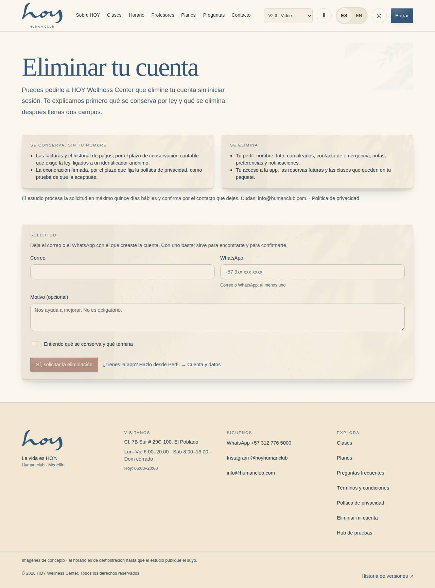
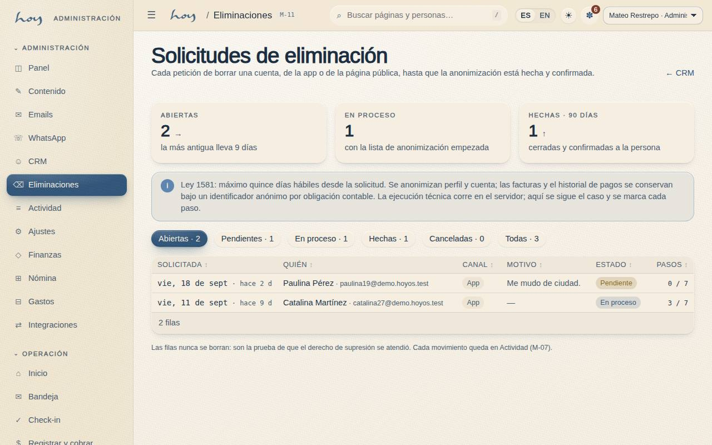

# Datos personales y habeas data

En Colombia los datos personales están protegidos por la Ley 1581 de 2012. Este capítulo no es para abogados:
es lo que cada persona del equipo hace y no hace todos los días.

{{audience:23-habeas-data}}

## 1. Las reglas de todos los días
1. Al registrarse, en la app o en el mostrador, la persona acepta la política de datos. Queda guardado con la
   hora, la versión y quién la registró (ver [Documentos legales](22-documentos-legales.md)).
2. Solo pedimos lo necesario: nombre, WhatsApp, correo, contacto de emergencia, cumpleaños y el permiso.
   Ya no guardamos una "intención del día": la app dejó de pedirla.
3. **Los datos de salud son sensibles.** Se guardan como una marca y una nota interna. Nunca se leen en voz alta,
   nunca se mandan por WhatsApp y nunca se comentan entre turnos.
4. Cada vez que alguien abre la ficha de un socio, queda registrado.
5. Nunca compartas tu sesión de HoyOS. Nunca saques listas de personas del sistema sin permiso del owner.
6. Una foto también es un dato personal: sin permiso escrito no se publica una cara (ver
   [Medios](19-medios-y-artwork.md)).

> DECISIÓN PENDIENTE: la política de privacidad publicada todavía menciona la "intención del día" entre los datos que recogemos, y la app ya no la pide. El owner y el asesor legal deben quitarla en la próxima versión del documento.

> EN HOYOS: A-06 Legal (versión vigente) · M-06 → permisos de la persona · M-07 → filtro "lectura de registro".

## 2. Quién ve qué
El sistema no depende de la buena voluntad: cada rol ve solo lo que necesita. Recepción ve la historia del socio
pero no edita pagos; finanzas ve pagos pero no notas de salud.

{{roles}}

Así se guarda el perfil de cada persona:

{{table:profiles}}

## 3. Los derechos de la persona
| Derecho | Qué hacemos | Plazo |
|---|---|---|
| Consultar | le mostramos qué tenemos; en la app puede **descargar sus datos** | el mismo día si es en persona |
| Corregir | lo corriges en su ficha, o lo hace ella en su perfil | de inmediato |
| Borrar | lo pide ella (en la app o en la página pública) o recepción abre el caso; admin lo hace | máximo 15 días hábiles |
| Dejar de recibir marketing | apaga el canal en su app, o lo haces tú en su ficha | de inmediato |

**Lo de dinero se conserva por ley.** Las facturas y el historial de pagos no se borran: quedan sin nombre, con
un identificador anónimo, por el tiempo que dice la política de privacidad. El perfil y la cuenta sí se
anonimizan. La app se lo explica a la persona antes de confirmar.

## 4. Borrar una cuenta, paso a paso
Hay tres formas de pedirlo y una sola lista donde admin lo sigue. Nadie borra nada a mano en el momento.

1. **Desde la app.** Perfil → Cuenta y datos → *Eliminar mi cuenta*. Primero la app explica qué se conserva y
   qué se borra, pide un motivo (opcional) y la casilla "Entiendo". Después pide confirmar. La solicitud queda
   **pendiente** y la persona puede cancelarla mientras siga así.
2. **Desde la web, sin iniciar sesión.** Una página pública explica lo mismo y pide correo o WhatsApp (basta uno).
   Está enlazada en el pie del sitio y en la política de privacidad.
3. **En persona.** Recepción confirma quién es, abre la solicitud (o le pide a admin que lo haga) y anota quién la
   pidió. No prometas una fecha: el plazo es el de la tabla de arriba.
4. **Admin la atiende.** En la lista de eliminaciones ve quién, por dónde, el motivo, hace cuánto y el estado. La
   pasa a **en proceso**, marca los siete pasos de anonimización y solo entonces la marca **hecha**.
   **Cancelada** cierra sin borrar. Las solicitudes nunca se borran: son la prueba de que se cumplió el derecho.

Así se guarda cada solicitud:

{{table:deletion_requests}}

> EN HOYOS: C-26 Cuenta y datos (la persona) · W-09 página pública · M-03 Tablas → deletion_requests, canal "recepción" (en persona) · M-11 CRM → Eliminaciones (admin).

## 5. Cuando alguien pregunta
**"¿Qué hacen con mis datos?"** — "Guardamos tu nombre, tu WhatsApp, tu correo y un contacto de emergencia para
poder atenderte. Si nos contaste algo de salud, queda como nota interna y no sale de aquí. Puedes ver, descargar,
corregir o borrar todo desde la app, en Perfil → Cuenta y datos, o pedírnoslo y lo hacemos en máximo quince días
hábiles."

**"Si borro la cuenta, ¿desaparecen mis pagos?"** — "Las facturas se conservan porque la ley nos obliga, pero sin
tu nombre: nadie del estudio podrá volver a asociarlas contigo."

## 6. Qué funciona de verdad hoy
1. Los permisos se guardan de verdad, con versión y hora. Las solicitudes de eliminación también, con su
   registro.
2. El borrado automático llegará cuando se conecte la base de datos real (ver
   [Integraciones](26-integraciones.md)). Hasta entonces, admin hace los pasos a mano y los marca en la lista.
3. El inicio de sesión real todavía no está conectado: hoy se entra con usuarios de demostración.
4. La lista de lo que piden App Store y Google Play está en la
   [guía de tiendas de apps](../../app-store-compliance.md).

> DECISIÓN PENDIENTE: el texto final de la política de datos (redactado por el asesor legal) y quién es el responsable del tratamiento que se publica.
