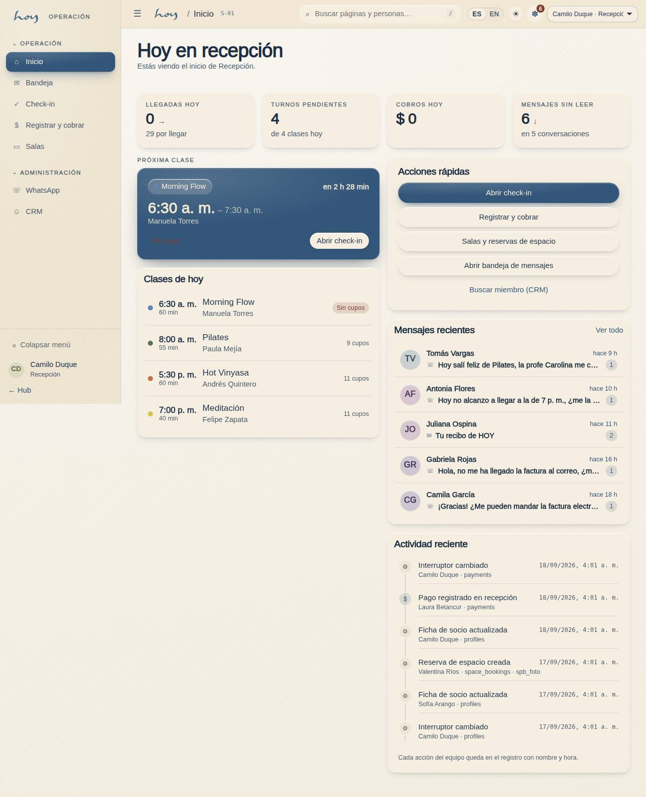

# Roles y permisos

## 1. Organigrama
```
Owner
├─ Admin (super admin en HoyOS)
│  ├─ Coordinación
│  │  ├─ Recepción / front desk
│  │  └─ Maestros
│  └─ Finanzas
└─ Mantenimiento (reporta a coordinación en el día a día)
```
Hoy varias personas pueden cubrir más de un rol. Lo que no cambia es quién aprueba qué.

> DECISIÓN PENDIENTE: nombres de las personas que ocupan cada rol y horario de cobertura de recepción por franja.

## 2. Los roles del sistema
{{roles}}

## 3. Responsabilidades y pantallas
| Rol | Responsable de | Pantallas principales |
|---|---|---|
| Owner | Visión, precios, políticas, contratos, decisiones pendientes | M-01, M-08, M-07, M-09 |
| Admin | Configuración de HoyOS, switches, integraciones, usuarios del equipo | M-01, M-08, M-03 |
| Coordinación | Horario, maestros, sustituciones, eventos, contenido, automatizaciones, calidad | M-02, M-04, M-05, M-06, S-06, C-02 |
| Recepción | Puerta, check-in, ventas en mostrador, cobros, WhatsApp y correo en horario (`13`) | S-02, S-06, S-04, M-06 |
| Finanzas | Conciliación, nómina, facturación electrónica, reembolsos, reportes | M-09, M-01, M-07, M-06 (Pagos; lee la conversación, no escribe) |
| Maestros | La clase: antes, durante, después; asistencia; su perfil | S-03 |
| Mantenimiento | Limpieza, montaje de sala, insumos, equipos, seguridad física | checklists de `07` |

## 4. Quién aprueba qué
| Decisión | Propone | Aprueba | Dónde queda |
|---|---|---|---|
| Cambio de precio o plan | Admin / finanzas | Owner | modelo de valor · M-07 |
| Cambio de política | Coordinación | Owner | M-08a |
| Reembolso en dinero | Recepción / finanzas | Finanzas (≤ 1 clase) · Owner (mayor) | M-06 Pagos · M-07 |
| Devolver un crédito por cortesía | Recepción | Coordinación | M-06 nota + M-07 |
| Cancelar una clase del estudio | Coordinación | Coordinación (avisa a owner) | M-02 Horario · E-03 |
| Sustitución de maestro | Maestro | Coordinación | M-02 Horario |
| Publicar perfil o descripción de maestro | Maestro (S-03) | Coordinación | M-02 flujo de revisión |
| Aprobar la nómina del mes | Finanzas | Owner | M-09 · M-07 |
| Alquiler de espacio | Coordinación | Owner | M-02 + nota en M-06 |
| Nuevo usuario de equipo o cambio de rol | Coordinación | Admin | M-01 |
| Apagar/encender features | Admin | Owner | M-08b |

## 5. Quién abre la bandeja y quién escribe
| Rol | Bandeja S-06 | Conversación en M-06 | Escribir (WhatsApp, correo, nota) |
|---|---|---|---|
| Owner / Admin | sí | sí | sí |
| Coordinación | sí | sí | sí |
| Recepción | sí | sí | sí |
| Finanzas | no | lee | no (la caja aparece deshabilitada) |
| Maestros | no | no | no; una solicitud de sustitución va a coordinación por M-05 |
| Mantenimiento | no | no | no |

La campana de mensajes solo se muestra a quien puede abrir la bandeja. Marcar un mensaje como leído es un acto del equipo: cualquiera de estos roles que abra el hilo lo apaga para todos, y el registro guarda quién.

## 6. Principios
1. Cada acción en HoyOS queda en **M-07 Registro de actividad** con tu nombre. Trabaja siempre con tu
   propio usuario; nunca compartas la sesión.
2. Si te falta un permiso, no lo rodees: pide a admin. Un permiso pedido y registrado es seguro; un
   usuario compartido no lo es.
3. Un super admin puede "ver como" otro rol para probar una pantalla; eso también queda registrado.



## 7. Pantallas por superficie
{{routes:admin}}

{{routes:teacher}}
