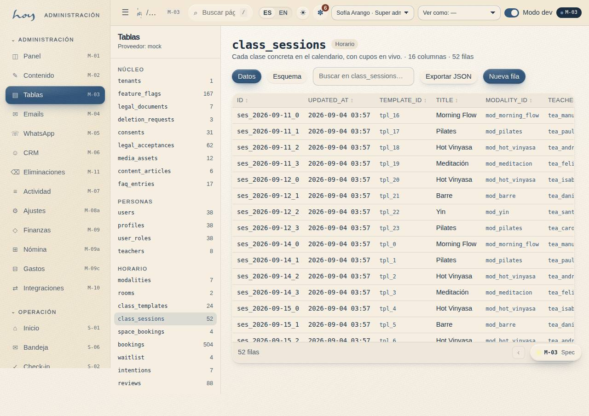

# Datos y tablas

Todo lo que HoyOS sabe está en tablas con la misma forma que tendrá en Postgres el día que se conecte
Supabase. Cada tabla tiene `id`, `tenant_id`, `created_at` y `updated_at`: multi-tenant desde el
primer día.

## 1. El modelo completo
{{tables}}

## 2. Cómo leer una tabla
Cada tabla trae su **contrato de acceso**: quién puede leer y quién puede escribir. Ese contrato se
convierte en las reglas RLS de Postgres, así que no es documentación: es la seguridad.

{{table:bookings}}

## 3. Las que más se consultan
### Reservas y asistencia
{{table:waitlist}}

### Comercio
{{table:memberships}}

### Comunicaciones
{{table:message_log}}

## 4. Reglas al tocar datos
1. Nadie edita una tabla para arreglar un caso que tiene pantalla. Si hay pantalla, se usa la pantalla:
   la pantalla escribe el registro de actividad y la tabla no.
2. **M-03 Tablas** es para admin y para desarrollo. Un cambio ahí queda igualmente en M-07.
3. Nunca se exporta una lista de personas fuera del sistema sin autorización del owner (`23`).
4. Todo el dinero se guarda en COP como entero; los tiempos en UTC.

## 5. El estudio ahora mismo
{{stats}}

## 6. Superficies y pantallas
La lista completa de rutas, por superficie:

{{routes:customer}}

{{routes:docs}}
