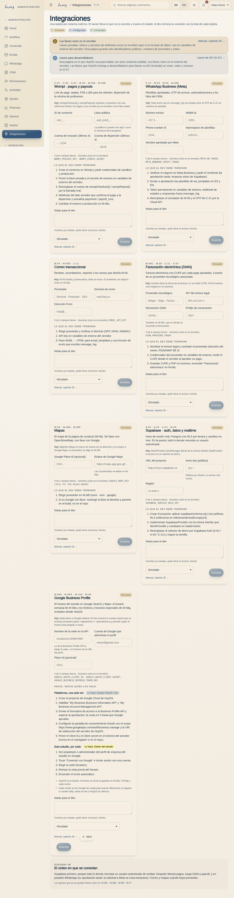

# Integraciones y qué está simulado

Qué sistemas externos usa HOY, cuáles ya funcionan y cuáles todavía no.

{{audience:26-integraciones}}

## Para qué te sirve esto
Este capítulo existe para que nadie prometa algo que el sistema todavía no hace. Todas las integraciones están
diseñadas, pero no todas están conectadas.

1. **Si trabajas en la puerta o con clientes:** lee la sección 3. Te dice qué frases puedes decir hoy.
2. **Si eres owner o admin:** la sección 1 te dice qué datos puedes llenar desde ya.
3. **Si eres de desarrollo:** todo el capítulo, más la documentación del software.

La regla: si una integración dice **simulado**, la frase se dice en futuro.

## 1. La pantalla de Integraciones
Cada sistema externo tiene una tarjeta con cinco partes:

1. **Qué hace y qué está simulado hoy**, en una frase que se puede decir en la puerta sin mentir.
2. **Los datos que no son secretos**, listos para llenar antes de que llegue desarrollo: el id de comercio y la
   llave pública de Wompi, el número y las plantillas de WhatsApp, el proveedor y el dominio de correo, el
   proveedor de facturación y el emisor legal, el enlace del mapa, la dirección del proyecto de base de datos.
3. **Un estado** que cambia una persona: **simulado** (existe, pero no llama a nadie) → **configurado** (los
   datos están, falta conectar) → **conectado** (funcionando de verdad).
4. **Lo que desarrollo tiene que terminar**, en orden, y los **secretos que existen**, nombrados pero nunca
   escritos: viven en el servidor, no en la pantalla.
5. **Notas** para desarrollo (qué cuenta existe, quién tiene el acceso) y un enlace a este capítulo.

Cada cambio queda en el registro de actividad, con el antes y el después.

> EN HOYOS: M-10 Integraciones → tarjeta → llenar los datos públicos → cambiar el estado → Guardar.

## 2. En qué estado está cada una
| Integración | Para qué | Hoy | Qué falta |
|---|---|---|---|
| Base de datos e inicio de sesión (Supabase) | entrar con usuario real y guardar los datos en un servidor | **simulado**: los datos viven en el navegador y se entra con usuarios de demostración | crear el proyecto, aplicar el esquema y las reglas de acceso, conectar |
| Pagos (Wompi) | link de pago, datáfono, tarjeta guardada | **simulado**: guarda pagos y facturas y muestra rechazos, pero no mueve dinero | credenciales del comercio, ambiente de pruebas y confirmaciones del servidor |
| Pago a maestros (Wompi) | pagarle a cada maestro | **simulado**: se calcula, se aprueba y se marca pagado, pero no se envía dinero ([16](16-nomina-y-payouts.md)) | credenciales de dispersión y la confirmación |
| WhatsApp Business | mensajes automáticos, la conversación y la Bandeja ([13](13-crm-y-whatsapp.md)), códigos de acceso | **simulado**: lo que entra y sale queda guardado, pero no se envía | número aprobado por Meta y plantillas por idioma. **La aprobación tarda: se pide primero** |
| Correo | recibos, reportes, newsletters, correspondencia | **simulado**: queda guardado, pero no se envía ni se recibe | proveedor de envío, dominio verificado y correo entrante |
| Factura electrónica (DIAN) | facturar | **simulado**: la factura tiene su forma, pero no se emite ([15](15-facturacion-y-dian.md)) | proveedor tecnológico y emisor legal |
| Mapas | el mapa en contacto | **por elegir** | decidir el proveedor (uno libre o Google) |

Así está guardado el estado de cada una:

{{table:integrations}}

## 3. Qué se puede decir hoy
1. "Te mando el link de pago" → **sí**. El link existe; finanzas confirma el pago (ver
   [Pagos y caja](14-pagos-y-caja.md)).
2. "Te llega el recibo por WhatsApp" → **todavía no**. Se entrega en pantalla o por escrito.
3. "Te llega la factura electrónica" → **todavía no**. Se dice que llegará cuando esté encendida.
4. "Te aviso si se libera un cupo" → **sí**, pero hoy lo escribe una persona.
5. "Tu tarjeta quedó guardada" → se guarda solo una referencia. El número de la tarjeta nunca pasa por HoyOS.

## 4. El orden en que se conectan
{{for:super_admin,admin,developer}}
1. **Base de datos e inicio de sesión primero**, porque todo lo demás necesita un usuario real.
2. **Pagos con Wompi** después.
3. **Facturación y pago a maestros** a continuación.
4. **WhatsApp en paralelo**, desde el principio, porque la aprobación de Meta tarda.
5. **Correo y mapas** cuando haya proveedor.

La pantalla de Integraciones repite este orden al final.
{{/for}}

## 5. Dónde se llena lo que ya se puede llenar
| Qué | Dónde |
|---|---|
| Datos públicos, estado y notas de cada integración | Integraciones |
| Dirección, WhatsApp, correo, Instagram, mapa y "datos confirmados" | Ajustes → General ([01](01-quienes-somos-y-filosofia.md)) |
| Cuenta de pagos, NIT, IVA, resolución DIAN, ambiente de Wompi, frecuencia de nómina y tarifas | Ajustes → Pagos ([16](16-nomina-y-payouts.md)) |
| Número de WhatsApp, correo del estudio y horas silenciosas | Ajustes → Comunicaciones |
| Proveedor del mapa, versiones legales | Ajustes → Contenido ([02](02-nuestras-clases.md), [22](22-documentos-legales.md)) |
| Encender o apagar un flujo | Ajustes → Funciones |

> EN HOYOS: M-10 Integraciones · M-08a General · M-08c Pagos · M-08d Comunicaciones · M-08f Contenido · M-08b Funciones.

## 6. Lo que queda guardado de un mensaje simulado
Cada fila es un mensaje de la conversación de una persona: el canal, si entró o salió, quién lo originó, el estado
y el id que llenará el proveedor cuando esté conectado.

{{table:message_log}}
