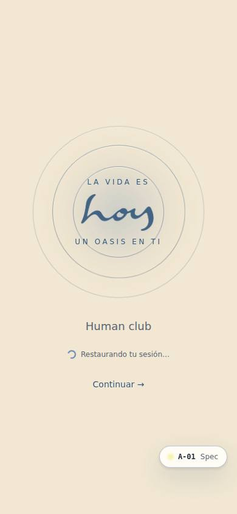
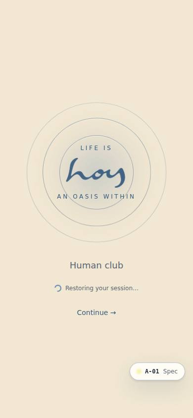
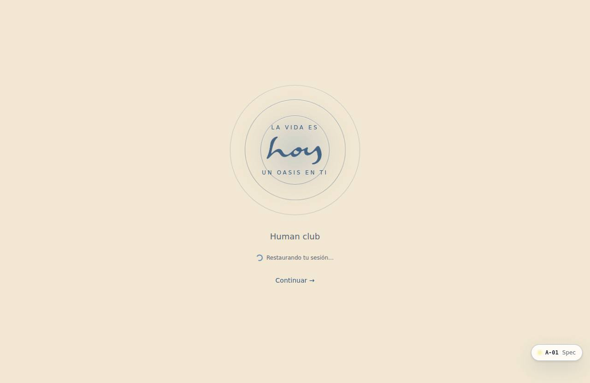
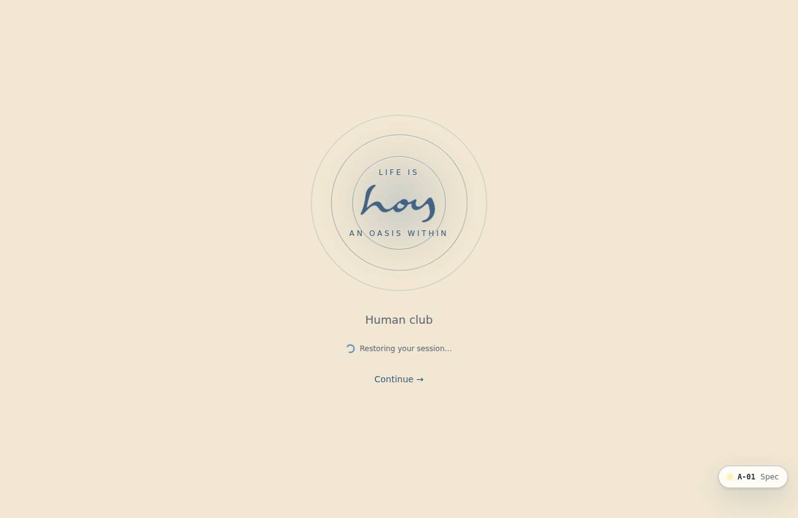

# A-01 — Splash / breathing load

**Route** `/#/auth` · **Roles** public, super_admin, admin, coordinator, front_desk, finance, teacher, maintenance, customer · **Surface** public · **Spec** `spec.code === 'A-01'` (see `/#/dev/specs`)

## Purpose
Set the emotional register before any UI: three concentric circles breathe around the wordmark at 7s, roughly a calm respiratory cycle. Covers session restore, feature-flag fetch and locale detection.

## Screenshots
| ES · mobile | EN · mobile |
| --- | --- |
|  |  |

| ES · desktop | EN · desktop |
| --- | --- |
|  |  |

## Sections (layout order — `useLayout(spec)`)
1. `BreathingRings + Wordmark`
2. `Tagline`
3. `LoadState`
4. `ContinueButton`

## Data
| Table | Read / write | Notes |
| --- | --- | --- |
| `users` | read / write | |
| `feature_flags` | read | |

## Logic and integrations
- Breath cycle is 7 s (--dur-breath).
- Auto-continues to /auth/sign-in after 2.8 s; a button skips the wait.
- Integrations: Supabase Auth

## States
- breathing
- reduced motion

## Real vs mock
- Real: the page renders from the data layer (`useData()` / `useTable`) over the tables above; every write goes through the `DataProvider` so the Supabase provider replaces the mock unchanged.
- Mock / pending: Supabase Auth are simulated or deferred; data is the browser-local `MockProvider` seed.
- Note: Session restore is the demo session in localStorage; Supabase Auth later.

## Changelog
- `docs/changelog/0005-final-integration.md` — screenshots and this page doc (v0.3.0)

---
**Resumen (ES).** Splash / carga que respira. Marcar el registro emocional antes de cualquier UI: tres círculos respiran alrededor del logo mientras se restaura la sesión, se cargan los feature flags y se detecta el idioma.
