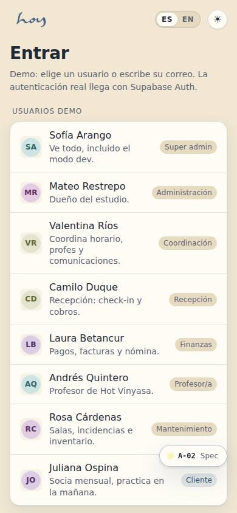
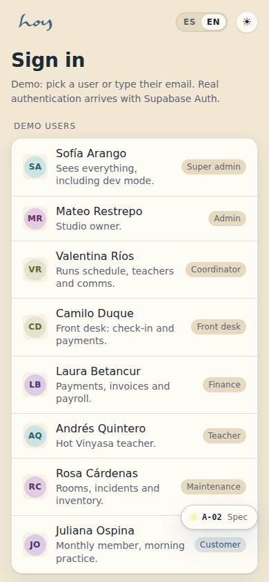
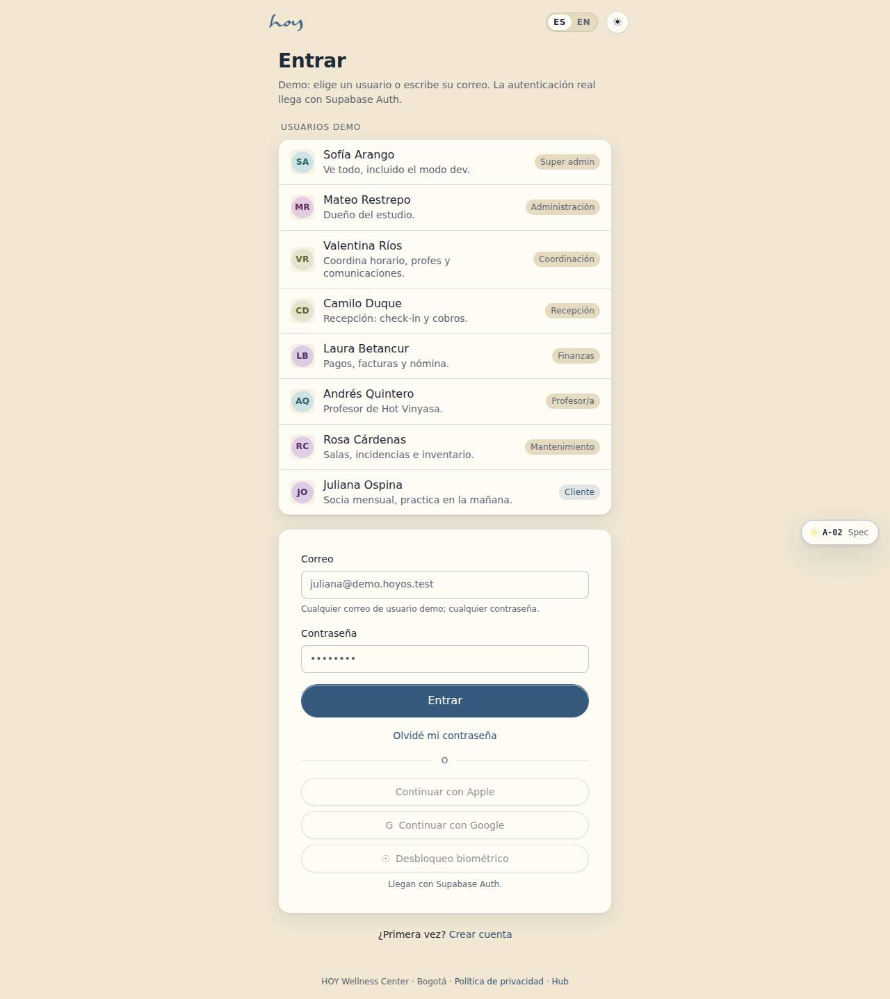
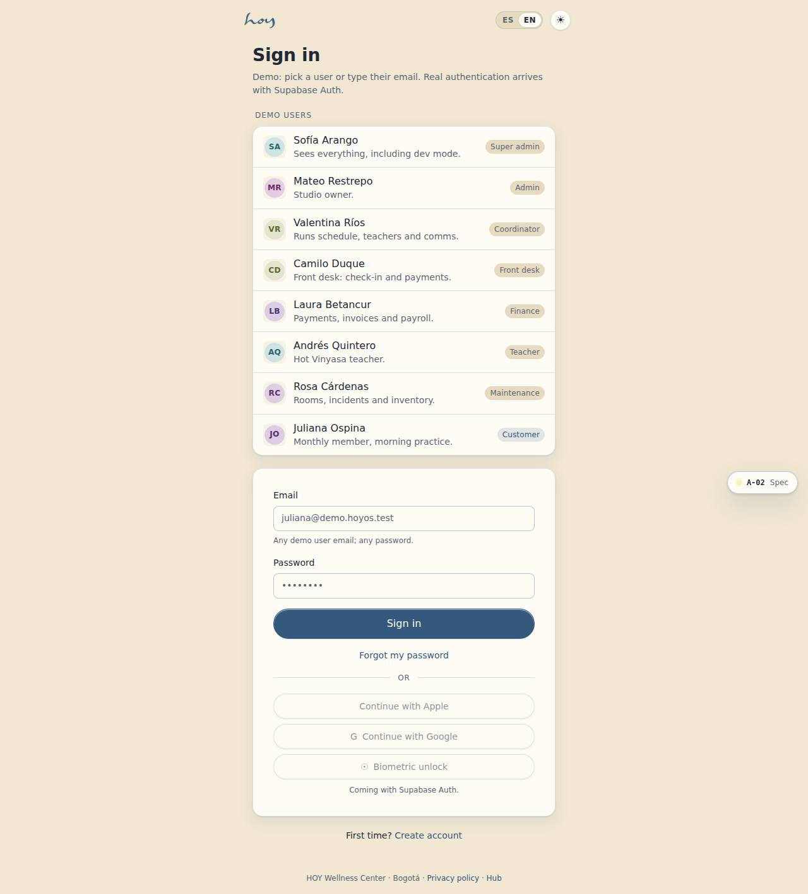

# A-02 — Sign in

**Route** `/#/auth/sign-in` · **Roles** public · **Surface** public · **Spec** `spec.code === 'A-02'` (see `/#/dev/specs`)

## Purpose
Get a returning student into the app in one tap where possible: biometric first on a known device, then Apple or Google, then email and password.

## Screenshots
| ES · mobile | EN · mobile |
| --- | --- |
|  |  |

| ES · desktop | EN · desktop |
| --- | --- |
|  |  |

## Sections (layout order — `useLayout(spec)`)
1. `Logo block`
2. `DemoUserPicker`
3. `CredentialCard (email, password)`
4. `Divider / OR`
5. `ProviderStack (Apple, Google, Biometric — disabled)`
6. `CreateAccountLink`

## Data
| Table | Read / write | Notes |
| --- | --- | --- |
| `users` | read / write | |
| `user_roles` | read | |
| `audit_log` | read / write | |

## Logic and integrations
- Apple button shows on iOS, Google on Android; both on web.
- Biometric appears only if a token is stored for this device.
- 5 failed attempts → 15 minute lockout and an email alert.
- Staff accounts land on their role home, not the student home.
- Integrations: Email, Supabase Auth

## States
- default
- wrong credentials: attempts left
- locked → E-04

## Real vs mock
- Real: the page renders from the data layer (`useData()` / `useTable`) over the tables above; every write goes through the `DataProvider` so the Supabase provider replaces the mock unchanged.
- Mock / pending: Email, Supabase Auth are simulated or deferred; data is the browser-local `MockProvider` seed.
- Note: Demo mode: any demo user email signs in; 5 failed attempts route to /auth/locked (E-04).
- Note: Apple / Google / biometric buttons are disabled until Supabase Auth.

## Changelog
- `docs/changelog/0005-final-integration.md` — screenshots and this page doc (v0.3.0)

---
**Resumen (ES).** Iniciar sesión. Que un alumno que vuelve entre en un toque: biometría en dispositivo conocido, luego Apple o Google, luego correo y contraseña.
