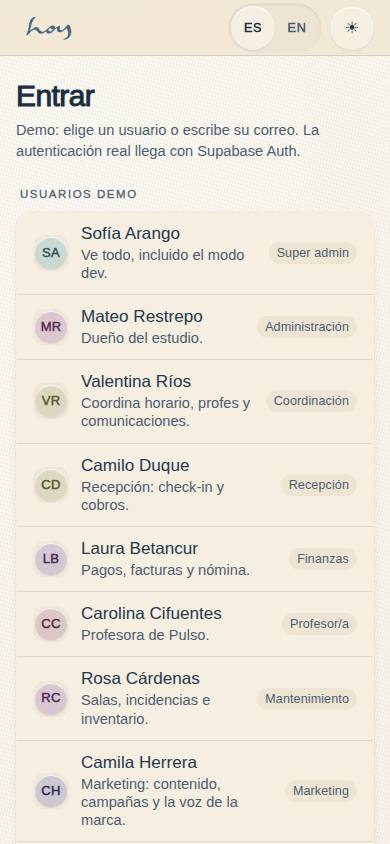
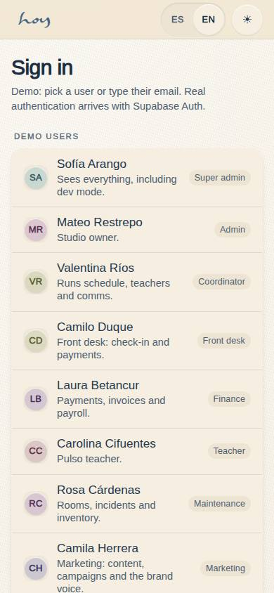
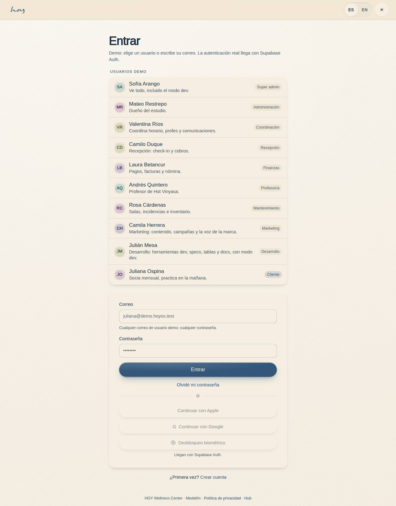
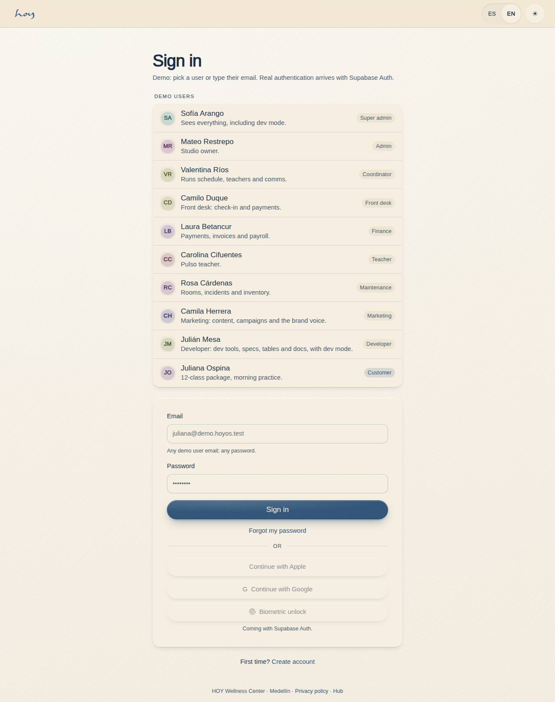

# A-02 — Sign in

**Route** `/#/auth/sign-in` · **Roles** public · **Surface** public · **Spec** `spec.code === 'A-02'` (see `/#/dev/specs`)

## Purpose
Get a returning student into the app in one tap where possible: biometric first on a known device, then Apple or Google, then email and password.

## Screenshots
| ES · mobile | EN · mobile |
| --- | --- |
|  |  |

| ES · desktop | EN · desktop |
| --- | --- |
|  |  |

## Sections (layout order — `useLayout(spec)`)
1. `Logo block`
2. `DemoUserPicker`
3. `CredentialCard (email, password)`
4. `Divider / OR`
5. `ProviderStack (Apple, Google, Biometric — disabled)`
6. `CreateAccountLink`

## Responsive layout (0025)
**Shell** `AuthShell` on the shared `TopBar` (wordmark → hub, `LangToggle`, a 44 px theme button), over one centred column: `--w-auth` 480 px below 900 px, `--w-auth-wide` 576 px from 900 px with extra top padding, so the site → sign-in → app hand-off keeps one top bar and no longer narrows to a phone (D-0006).

- The page is still the demo-user picker plus the credential card; providers stay disabled until Supabase Auth.
- `?next=` is followed for customers, so W-04 → A-02 → C-04 and W-05 → A-02 → C-06 stay inside one visual system.

Verified 2026-09-28 at 390 · 1280 · 3840 px (ES, light) during the 0025 build; `PageSpec.checkedAt` = `[390, 1280, 3840]`. The full 360…3840 matrix is a follow-up.
The 1280 captures above predate 0025 and may still show the phone frame; the screenshot pass regenerates them.

## Actions (WebMCP)
| id | Intent (ES) | Params | Permission |
| --- | --- | --- | --- |
| `auth.signIn` | Entra como {user} | `user` (a demo user id: `usr_super` … `usr_cust`) — follows `?next=` like a tap | — |

Declared in the page spec (`src/modules/customer/actions.ts` → `CUSTOMER_ACTIONS`), mounted with `useActions()`, listed at `window.__hoyos.actions` and run with `window.__hoyos.run(id, params)`. `permission` is advisory; see `docs/reference/surfaces.md`.

## Data
| Table | Read / write | Notes |
| --- | --- | --- |
| `users` | read / write | |
| `user_roles` | read | |
| `audit_log` | read / write | |

## Logic and integrations
- Apple button shows on iOS, Google on Android; both on web.
- Biometric appears only if a token is stored for this device.
- 5 failed attempts → 15 minute lockout and an email alert.
- Staff accounts land on their role home, not the student home.
- Integrations: Email, Supabase Auth

## States
- default
- wrong credentials: attempts left
- locked → E-04

## Real vs mock
- Real: the page renders from the data layer (`useData()` / `useTable`) over the tables above; every write goes through the `DataProvider` so the Supabase provider replaces the mock unchanged.
- Mock / pending: Email, Supabase Auth are simulated or deferred; data is the browser-local `MockProvider` seed.
- Note: Demo mode: any demo user email signs in; 5 failed attempts route to /auth/locked (E-04).
- Note: Apple / Google / biometric buttons are disabled until Supabase Auth.

## Changelog
- `docs/changelog/0005-final-integration.md` — screenshots and this page doc (v0.3.0)
- `docs/changelog/0025-responsive-app-shell.md` — responsive `AppShell` / ≥ 900 px layout, WebMCP actions (v0.10.0, 2026-09-28)

---
**Resumen (ES).** Iniciar sesión. Que un alumno que vuelve entre en un toque: biometría en dispositivo conocido, luego Apple o Google, luego correo y contraseña.
