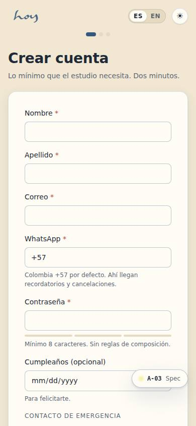
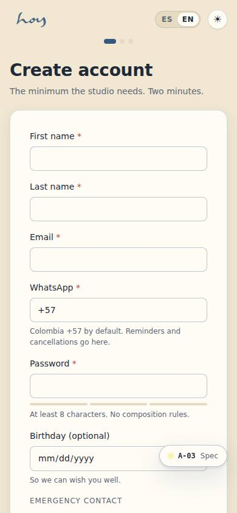
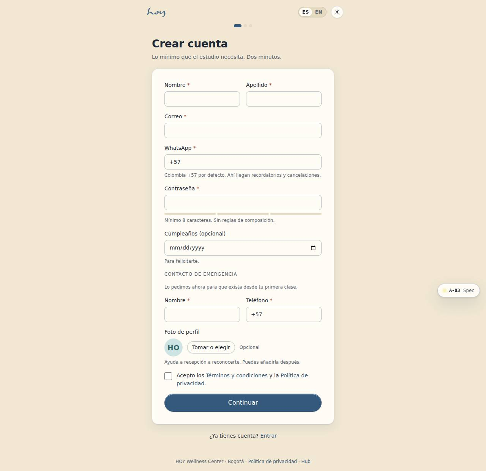
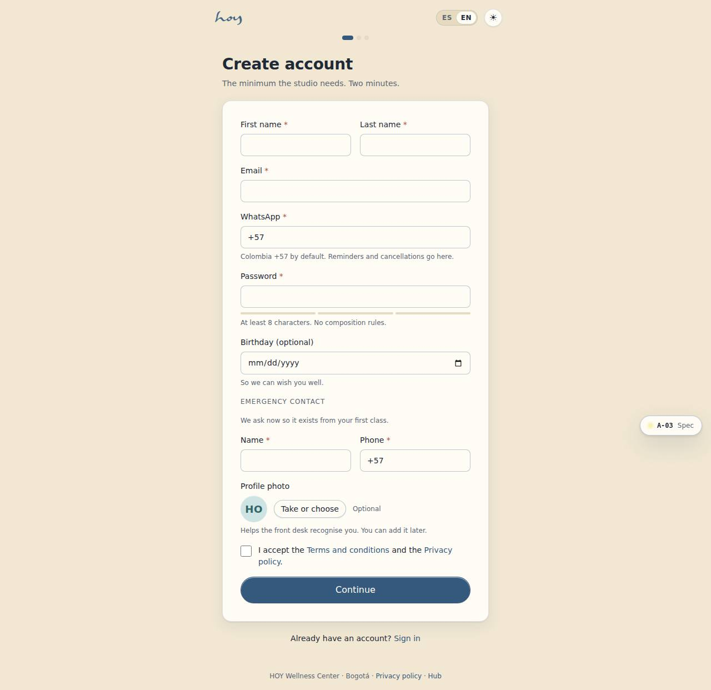

# A-03 — Create account

**Route** `/#/auth/sign-up` · **Roles** public · **Surface** public · **Spec** `spec.code === 'A-03'` (see `/#/dev/specs`)

## Purpose
Collect the minimum the studio actually needs, with WhatsApp as a first-class channel because that is where reminders and cancellations go.

## Screenshots
| ES · mobile | EN · mobile |
| --- | --- |
|  |  |

| ES · desktop | EN · desktop |
| --- | --- |
|  |  |

## Sections (layout order — `useLayout(spec)`)
1. `ProgressDots`
2. `Heading + sub`
3. `FormStack (name, email, WhatsApp +57, password, birthday, emergency contact, photo)`
4. `ConsentRow → /site/legal`
5. `PrimaryButton`

## Data
| Table | Read / write | Notes |
| --- | --- | --- |
| `users` | read / write | |
| `profiles` | read / write | |
| `user_roles` | read | |
| `consents` | read / write | |
| `legal_documents` | read | |

## Logic and integrations
- Email and WhatsApp must be unique; duplicates offer sign-in instead.
- Emergency contact is collected here so it exists from the first booking, not only once a waiver is signed.
- Password min 8 chars, strength meter, no composition rules.
- Consent checkbox is required and stored with timestamp, IP and policy version.
- Birthday optional — feeds the birthday WhatsApp/email automation.
- Profile photo is optional and offered here, either from the camera or the library, so the front desk can recognise a student on arrival; it can be added later in Settings.
- Colombia default country code +57.
- Integrations: WhatsApp, Email, Supabase Auth

## States
- default
- validation errors
- duplicate email → sign-in offer
- created

## Real vs mock
- Real: the page renders from the data layer (`useData()` / `useTable`) over the tables above; every write goes through the `DataProvider` so the Supabase provider replaces the mock unchanged.
- Mock / pending: WhatsApp, Email, Supabase Auth are simulated or deferred; data is the browser-local `MockProvider` seed.
- Note: Inserts users + profiles + user_roles + consents rows via useData(), then SessionProvider signs in as the created row (any users id is accepted). The account lives until the mock reseeds on the next day.

## Changelog
- `docs/changelog/0005-final-integration.md` — screenshots and this page doc (v0.3.0)

---
**Resumen (ES).** Crear cuenta. Crear la cuenta con lo mínimo necesario y recoger consentimientos, contacto de emergencia y verificación de WhatsApp.
