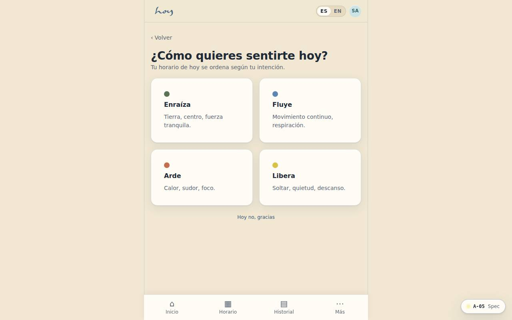
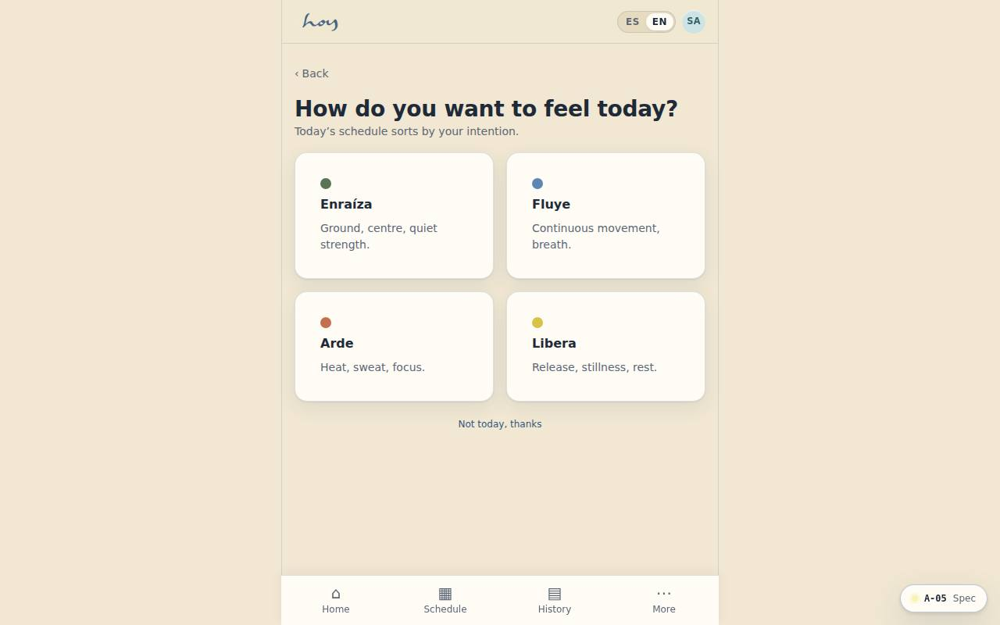

# A-05 — Intention check — ¿Cómo quieres sentirte hoy?

**Route** `/#/app/intention` · **Roles** customer, teacher · **Surface** customer · **Spec** `spec.code === 'A-05'` (see `/#/dev/specs`)

## Purpose
The signature moment of the product. One question, four verbs; the choice re-orders the home feed and the recommended classes for the session. The verbs are what the student wants to do, and each resolves to one of the four movement tags the rest of the system already colours by.

## Screenshots
| ES · mobile | EN · mobile |
| --- | --- |
|  |  |

| ES · desktop | EN · desktop |
| --- | --- |
|  |  |

## Sections (layout order — `useLayout(spec)`)
1. `Question`
2. `MovementPicker ×4`
3. `Explanation`
4. `SkipLink`

## Data
| Table | Read / write | Notes |
| --- | --- | --- |
| `intentions` | read / write | |

## Logic and integrations
- Shown once per day on first open; skippable.
- Each verb maps to exactly one movement tag — Muévete→Arde, Respira→Fluye, Equilíbrate→Enraíza, Conecta→Libera — so the icon colour here matches the chip colour on every class card.
- Selection tags the session and sorts Today's Classes by matching class_tags.
- Stored as a time series — becomes a mood/practice insight later.
- Copy stays in Spanish in both locales; it is brand voice, not UI text.
- Integrations: Supabase Auth

## States
- no intention yet
- already answered today

## Real vs mock
- Real: the page renders from the data layer (`useData()` / `useTable`) over the tables above; every write goes through the `DataProvider` so the Supabase provider replaces the mock unchanged.
- Mock / pending: Supabase Auth are simulated or deferred; data is the browser-local `MockProvider` seed.

## Changelog
- `docs/changelog/0005-final-integration.md` — screenshots and this page doc (v0.3.0)

---
**Resumen (ES).** Intención del día — ¿Cómo quieres sentirte hoy?. Preguntar cómo quiere sentirse hoy la persona y usar esa intención para ordenar las clases del día.
