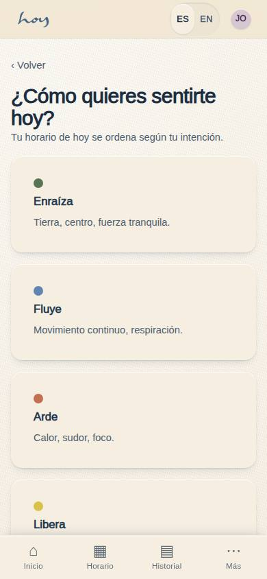
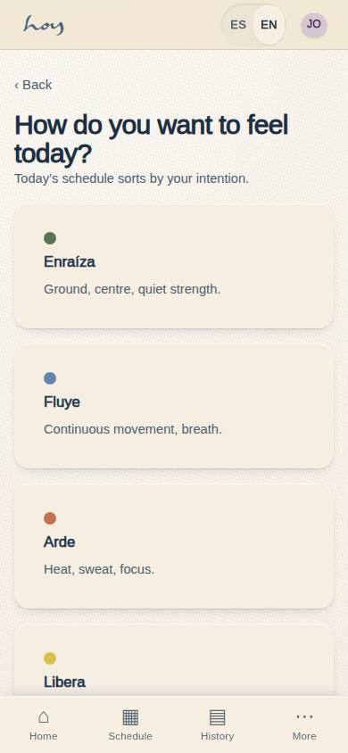
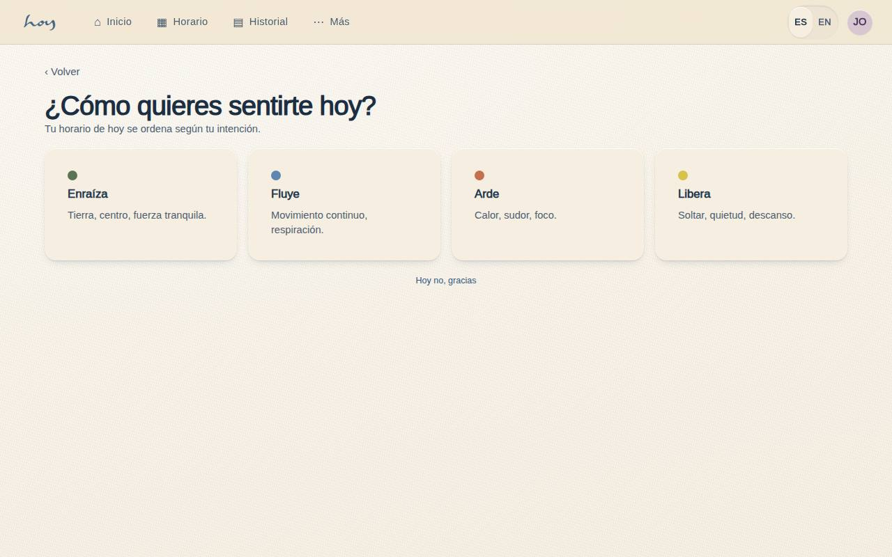
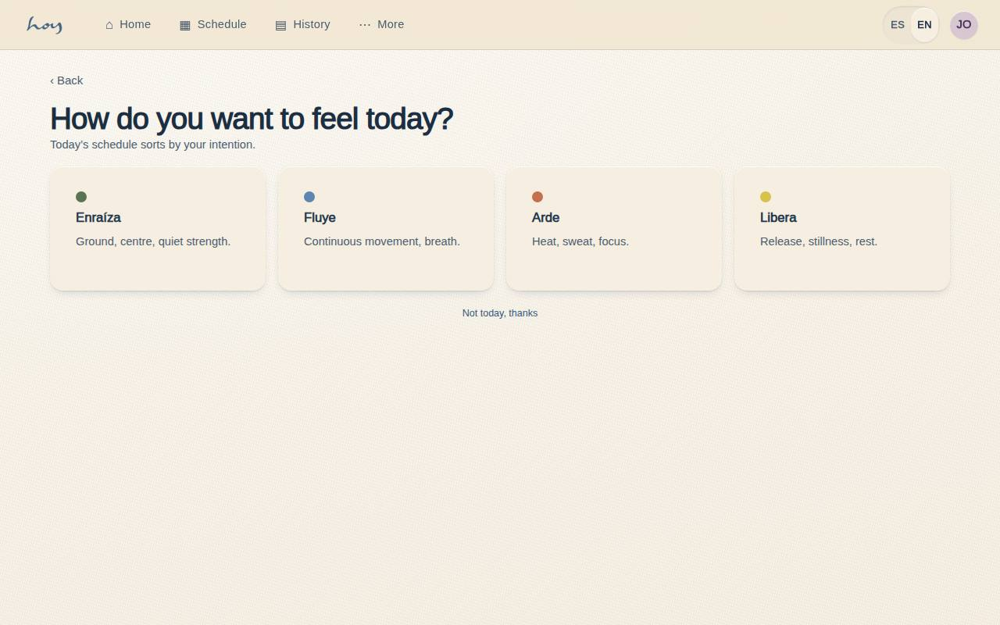

# A-05 — Intention check — ¿Cómo quieres sentirte hoy?

**Route** `/#/app/intention` · **Roles** customer, teacher · **Surface** customer · **Spec** `spec.code === 'A-05'` (see `/#/dev/specs`)

> **Retired in 0030 (v0.12.0, 2026-09-29).** Justin (Slack #hoy): “erase the "How do you want to feel today" component
> from the experience.” The page is no longer routed (`/app/intention` redirects to `/app` through the module
> `redirects` export), C-01 lost its intention card and its intention sort, sign-up (A-03) lands on Home, the C-02
> "Elegir mi intención" link is gone, and the two A-05 feature switches are no longer seeded (`src/specs/retired.ts`).
> The `intentions` table stays in the schema as deprecated history (nothing reads or writes it). The spec code stays in
> `canvasSpecs` as frozen canvas reference. Everything below describes the page as it was; the screenshots are the last
> captures before retirement. See `docs/changelog/0030-icons.md`.

## Purpose
The signature moment of the product. One question, four verbs; the choice re-orders the home feed and the recommended classes for the session. The verbs are what the student wants to do, and each resolves to one of the four movement tags the rest of the system already colours by.

## Screenshots
| ES · mobile | EN · mobile |
| --- | --- |
|  |  |

| ES · desktop | EN · desktop |
| --- | --- |
|  |  |

## Sections (layout order — `useLayout(spec)`)
1. `Question`
2. `MovementPicker ×4`
3. `Explanation`
4. `SkipLink`

## Responsive layout (0025)
**Shell** `AppShell` (D-0006). Below 900 px: brand top bar, a content column of at most 560 px and the sticky bottom dock (Home · Schedule · History · More), exactly the phone layout. From 900 px (`useMinWidth('shell')`): a full-viewport page, the primary nav moves into the top bar (`NavBar variant="top"`), content sits in a centred `--w-app` container (75rem, growing with the `--ui` band at 1920 / 2560 / 3840) and the document scrolls. No phone bezel at any width; the bezel exists only in the hub's `DeviceFrame` simulator.

- **≥ 900 px**: the four movement cards sit in one row (`.cust-intention-grid`, min-height 10rem).
- **< 900 px**: a 2 × 2 grid, as before.

Verified 2026-09-28 at 390 · 1280 · 3840 px (ES, light) during the 0025 build; `PageSpec.checkedAt` = `[390, 1280, 3840]`. The full 360…3840 matrix is a follow-up.
The 1280 captures above predate 0025 and may still show the phone frame; the screenshot pass regenerates them.

## Data
| Table | Read / write | Notes |
| --- | --- | --- |
| `intentions` | read / write | |

## Logic and integrations
- Shown once per day on first open; skippable.
- Each verb maps to exactly one movement tag — Muévete→Arde, Respira→Fluye, Equilíbrate→Enraíza, Conecta→Libera — so the icon colour here matches the chip colour on every class card.
- Selection tags the session and sorts Today's Classes by matching class_tags.
- Stored as a time series — becomes a mood/practice insight later.
- Copy stays in Spanish in both locales; it is brand voice, not UI text.
- Integrations: Supabase Auth

## States
- no intention yet
- already answered today

## Real vs mock
- Real: the page renders from the data layer (`useData()` / `useTable`) over the tables above; every write goes through the `DataProvider` so the Supabase provider replaces the mock unchanged.
- Mock / pending: Supabase Auth are simulated or deferred; data is the browser-local `MockProvider` seed.

## Changelog
- `docs/changelog/0005-final-integration.md` — screenshots and this page doc (v0.3.0)
- `docs/changelog/0025-responsive-app-shell.md` — responsive `AppShell` / ≥ 900 px layout (v0.10.0, 2026-09-28)

---
**Resumen (ES).** Intención del día — ¿Cómo quieres sentirte hoy?. Preguntar cómo quiere sentirse hoy la persona y usar esa intención para ordenar las clases del día.
