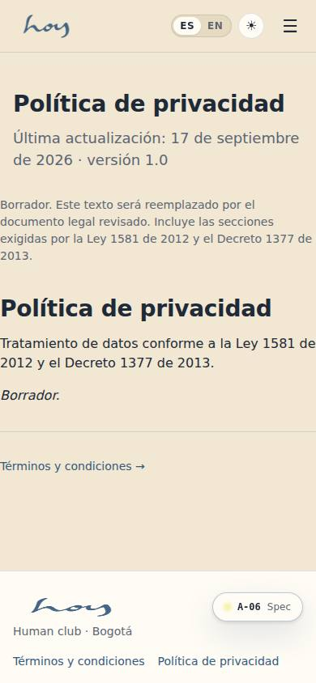
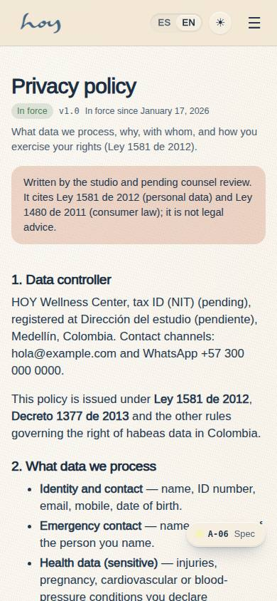
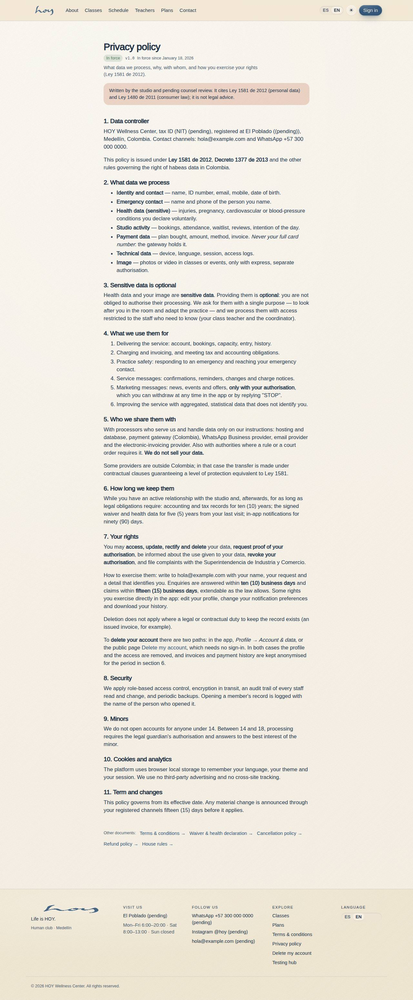

# A-06 — Terms & Conditions / Privacy Policy

**Route** `/#/site/legal/terms` · `/#/site/legal/privacy` · **Roles** public, super_admin, admin, coordinator, front_desk, finance, teacher, maintenance, customer · **Surface** public · **Spec** `spec.code === 'A-06'` (see `/#/dev/specs`)

## Purpose
Real, linkable, versioned legal pages reachable from sign-up, settings and the website — with placeholder body copy until counsel supplies the text.

## Screenshots
| ES · mobile | EN · mobile |
| --- | --- |
|  |  |

| ES · desktop | EN · desktop |
| --- | --- |
|  |  |

## Sections (layout order — `useLayout(spec)`)
One renderer — the `LegalDocument` organism — serves the public site (`/site/legal/:kind`) and the app
(`/app/legal/:kind`):

1. `BackLink` (in-app)
2. `LegalDocument` header — title, status badge, version, effective date, one-line summary
3. `AcceptanceReceipt` — "aceptaste esta versión el …" plus an accept action when the member has not
4. `CounselNotice` — shown on every version, because none is lawyer-reviewed yet
5. `VersionSwitcher` — only when a kind has more than one version
6. `Body` — markdown with `{{tenant.*}}` and `{{policy.*}}` resolved live
7. `SiblingLinks` to the rest of the library · `PrintButton`

## Data
| Table | Read / write | Notes |
| --- | --- | --- |
| `legal_documents` | read | six kinds, bilingual, versioned; `status` draft or published |
| `legal_acceptances` | read / write | append-only: user, document, version, date, channel |
| `consents` | read / write | the older sign-up consent rows (A-03) still point at terms and privacy |
| `tenants` | read | the M-08 numbers and studio identity the tokens resolve to |

## Logic and integrations
- **Six kinds**: `terms`, `privacy`, `waiver` (liability + heat and health), `cancellation`, `refunds`,
  `house-rules`. Colombian framing throughout: Ley 1581 de 2012 and Decreto 1377 de 2013 (habeas data,
  SIC), Ley 1480 de 2011 art. 47 (retracto within five business days) and art. 51 (payment reversal),
  Ley 527 de 1999 (electronic acceptance).
- **Every number is a token.** The body carries `{{policy.cancellationHours}}`,
  `{{policy.waitlistClaimMin}}`, `{{policy.lateGraceMin}}`, `{{policy.pauseDaysPerYear}}`,
  `{{policy.maxPausesPerYear}}`, `{{policy.chargeNoticeDays}}` and a derived no-show-fee clause, plus
  `{{tenant.*}}` for the studio's name, legal name, NIT, address, city, email, WhatsApp and mats.
  `resolveLegalTokens()` fills them from `usePolicy()` and `src/tenant/tenant.ts` at render time, so a
  cancellation window changed in M-08 changes this page in the same breath and the copy can never go
  stale. An unknown token renders visibly as `⟨token⟩`, the way a missing i18n key does.
- **Versioning.** A new version is a new row (`kind` + `version` + `effective_from` + `status`); a
  published row is never edited in place, because that would silently change what people already
  accepted. The version in force is the newest `published` row.
- **Acceptance.** `legal_acceptances` is append-only and records the exact `document_id` and `version`,
  so the in-app page can show a member the waiver they signed and flag it when they accepted an older
  version. `requires_acceptance` marks the documents a member must accept.
- Integrations: Email (sending a version notice), Supabase Auth (the acceptance is tied to a real user
  once auth lands).

## States
- Published version in force · draft pending counsel review
- More than one version: the switcher appears (the waiver ships v1.0 in force and v1.1 in review)
- Accepted by this member (date + channel) · accepted an older version · not accepted yet
- Kind not found

## Real vs mock
- **Real.** The copy is written in full, in Spanish and English, for all six kinds — this is no longer
  placeholder body text. Versioning, the effective date, the status badge, the version switcher, the
  acceptance rows and the token resolution are all real behaviour, and the in-app route renders the
  same document the website does.
- **Mock / pending.** The text is **studio-written and not reviewed by counsel**: every version renders
  "texto redactado por el estudio y pendiente de revisión por abogado", and the four documents that are
  not operationally in force keep `status = draft`. Terms, privacy and the waiver v1.0 are `published`
  because members accept them at sign-up and an acceptance must point at a version in force.
- **Note.** The NIT and the address resolve to "(pendiente)" until M-08c is filled in — the page shows
  the gap rather than inventing a number.

## Changelog
- `docs/changelog/0012-thin-screens-depth.md` — depth pass on the thin screens (v0.6.0)
- `docs/changelog/0005-final-integration.md` — screenshots and this page doc (v0.3.0)

---
**Resumen (ES).** Términos y condiciones / Política de privacidad. Páginas legales reales, enlazables y versionadas; los consentimientos registran qué versión se aceptó.
