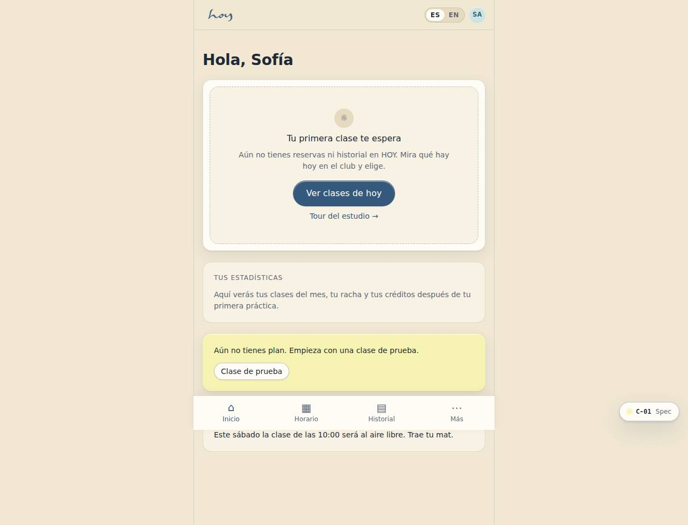
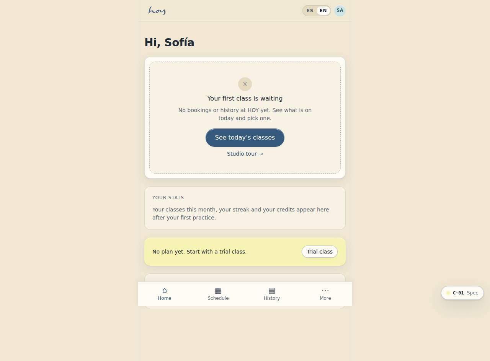
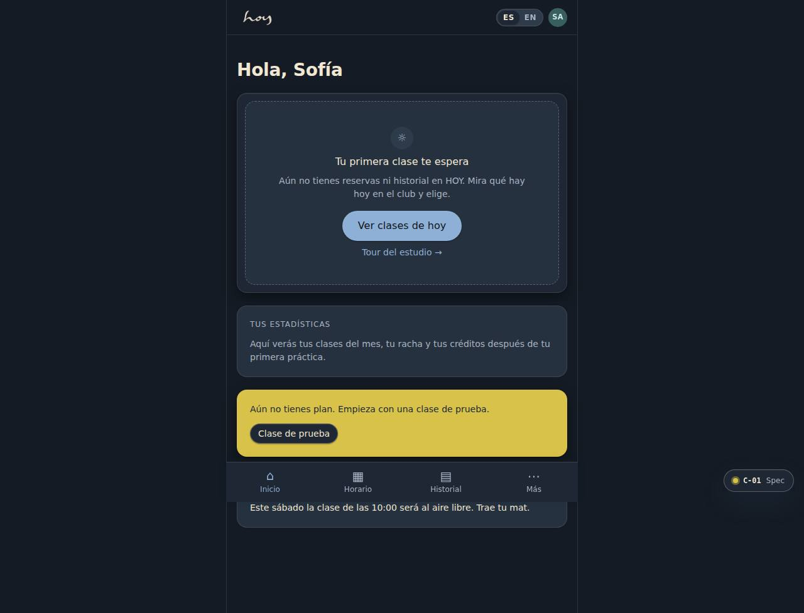
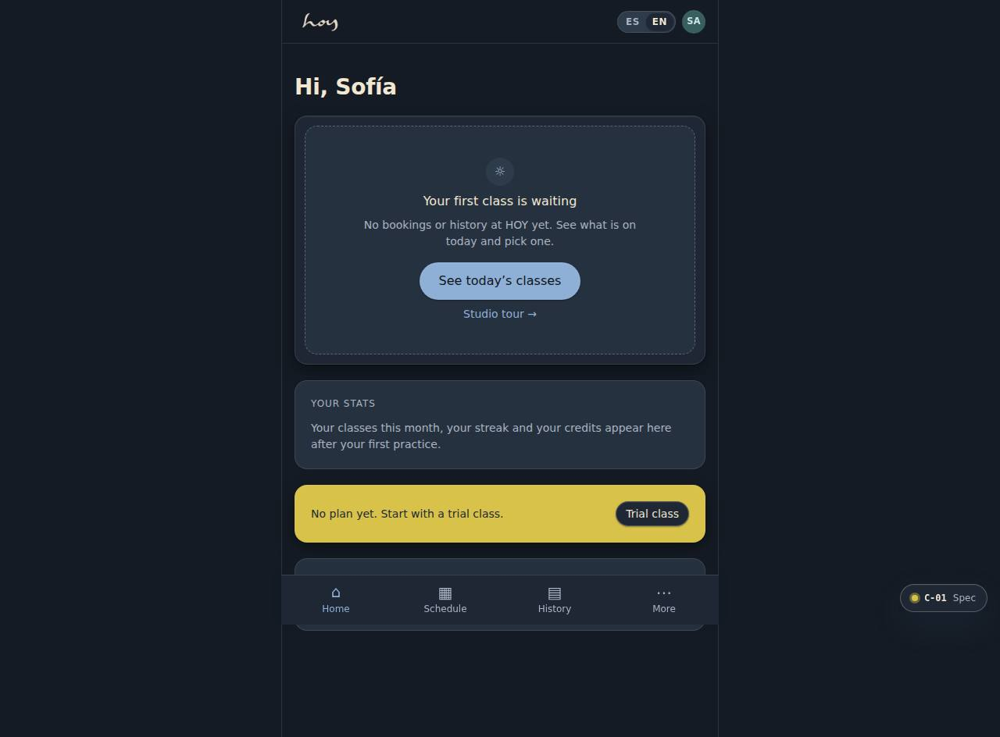

# C-01 — Home dashboard

**Route** `/#/app` · **Roles** customer, teacher · **Surface** customer · **Spec** `spec.code === 'C-01'` (see `/#/dev/specs`)

## Purpose
The daily landing surface: what is happening today, what I have booked, what the studio wants me to know, and the nudges the studio needs (membership, feedback).

## Screenshots
| ES · mobile | EN · mobile |
| --- | --- |
|  |  |

| ES · desktop | EN · desktop |
| --- | --- |
|  |  |

| ES · dark | EN · dark |
| --- | --- |
|  |  |

## Sections (layout order — `useLayout(spec)`)
1. `TopBar (logo, avatar, bell)`
2. `FeedbackPrompt (conditional)`
3. `MembershipNudge (if no plan)`
4. `AnnouncementCard (if active)`
5. `NextClassCard + countdown`
6. `QuickActions ×4`
7. `TodayList (intention-sorted)`
8. `StatsRow ×3`
9. `EventsStrip → BottomNav`

## Data
| Table | Read / write | Notes |
| --- | --- | --- |
| `bookings` | read / write | |
| `classes` | read | |
| `announcements` | read | |
| `memberships` | read / write | |
| `credits` | read / write | |
| `practice_stats` | read | |
| `feedback_requests` | read | |
| `events` | read | |

## Logic and integrations
- Blocks render in priority order; each is independently toggleable in Admin → Features.
- Feedback prompt appears only for a class attended in the last 72h and not yet rated.
- Membership nudge hides for active members and for staff.
- Countdown shows under 24h, otherwise the weekday.
- Today's list re-orders by the day's intention tags.
- Integrations: none

## States
- Loading: skeleton cards, no layout shift
- Empty: no bookings → 'Reserve your first class'
- Error: cached feed + retry chip
- Offline: last fetch with stale badge

## Real vs mock
- Real: the page renders from the data layer (`useData()` / `useTable`) over the tables above; every write goes through the `DataProvider` so the Supabase provider replaces the mock unchanged.
- Mock / pending: no external integrations; data is the browser-local `MockProvider` seed.

## Changelog
- `docs/changelog/0005-final-integration.md` — screenshots and this page doc (v0.3.0)

---
**Resumen (ES).** Inicio. La superficie diaria: qué pasa hoy, qué tengo reservado, qué quiere contarme el estudio y los recordatorios que el estudio necesita.
