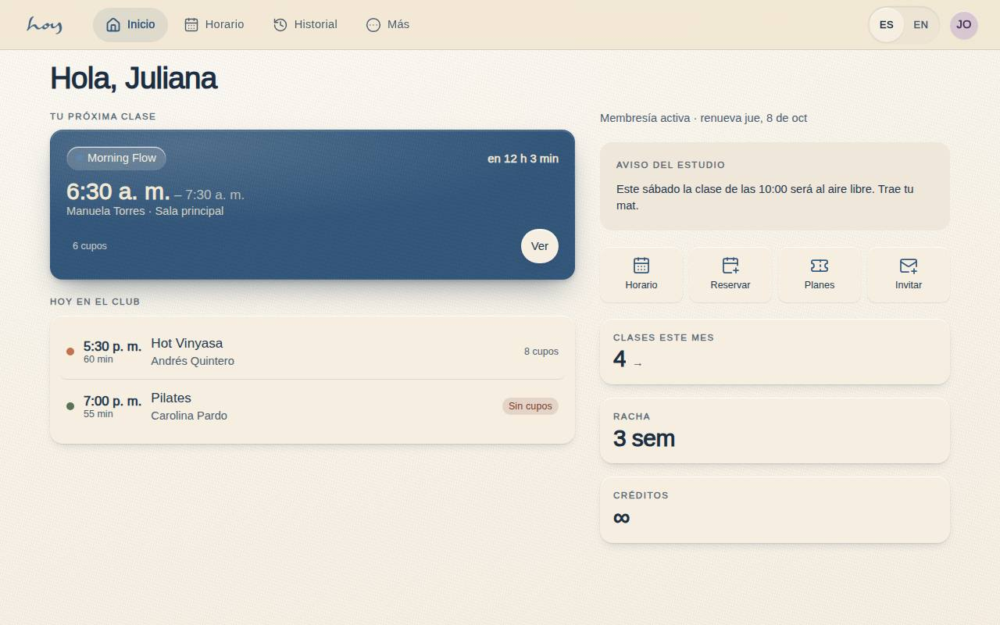
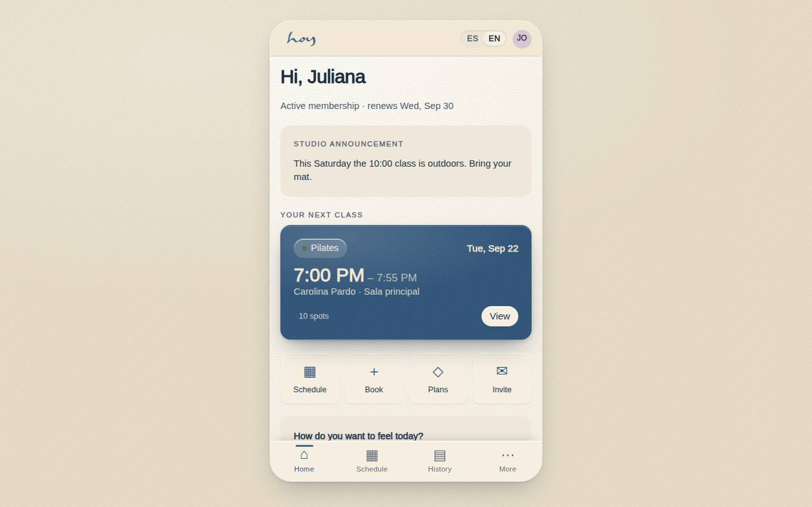
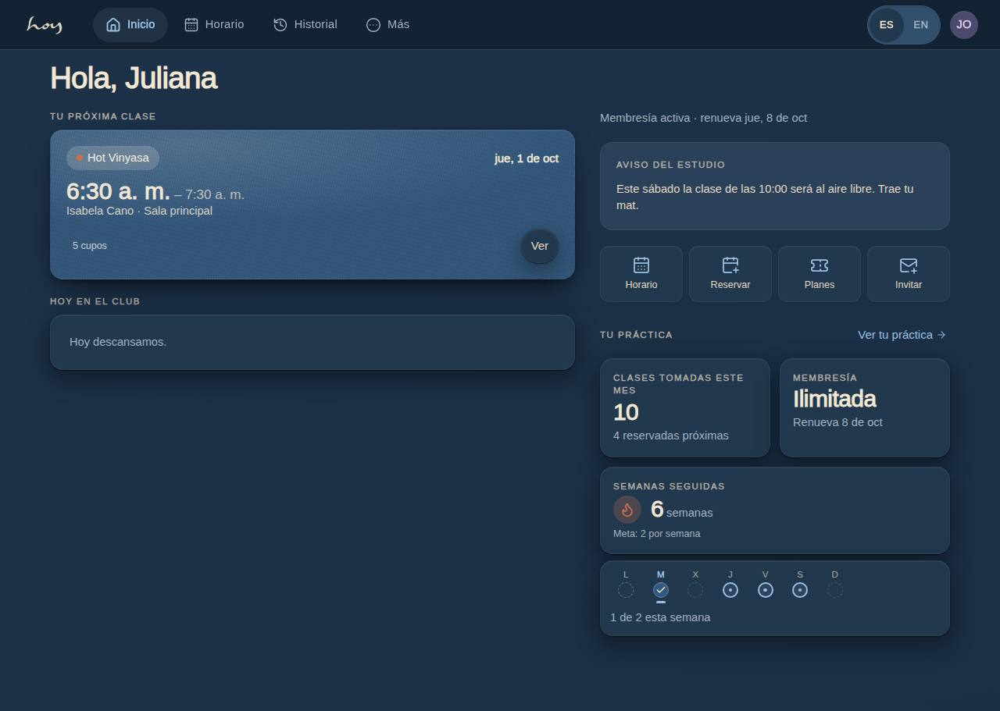
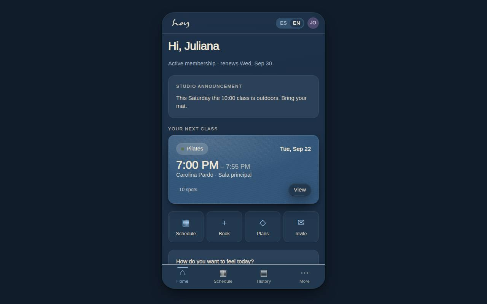

# C-01 — Home dashboard

**Route** `/#/app` · **Roles** customer, teacher · **Surface** customer · **Spec** `spec.code === 'C-01'` (see `/#/dev/specs`)

## Purpose
The daily landing surface: what is happening today, what I have booked, what the studio wants me to know, and the nudges the studio needs (membership, feedback).

## Screenshots
| ES · mobile | EN · mobile |
| --- | --- |
|  |  |

| ES · desktop | EN · desktop |
| --- | --- |
|  |  |

| ES · dark | EN · dark |
| --- | --- |
|  |  |

## Sections (layout order — `useLayout(spec)`)
1. `TopBar (logo, avatar, bell)`
2. `FeedbackPrompt (conditional)`
3. `MembershipNudge (if no plan)`
4. `AnnouncementCard (if active)`
5. `NextClassCard + countdown`
6. `QuickActions ×4`
7. `TodayList` (start-time order; the intention card was removed in 0030)
8. `StatsRow ×3` — since 0040 the **practice block** (the section name is kept so stored layouts still resolve): "Tu práctica" eyebrow + "Ver tu práctica" → C-27; tiles **Clases tomadas este mes** (hint: {n} reservadas próximas / Sin reservas próximas) · **Semanas seguidas** (`StreakBadge`: count, state, best, one-line hint — only with a goal) · **Membresía** (Ilimitada · Renueva {date} / En pausa · Hasta {date}) or **Clases restantes en tu plan** (balance · Vence {date} / Sin plan activo); the inline goal question (`GoalPicker` "¿Cuántas veces por semana quieres practicar?") until a `practice_goals` row exists; the current week as `WeekDots` ("{attended} de {target} esta semana" / "{n} clases esta semana").
9. `EventsStrip → BottomNav`

## Responsive layout (0025)
**Shell** `AppShell` (D-0006). Below 900 px: brand top bar, a content column of at most 560 px and the sticky bottom dock (Home · Schedule · History · More), exactly the phone layout. From 900 px (`useMinWidth('shell')`): a full-viewport page, the primary nav moves into the top bar (`NavBar variant="top"`), content sits in a centred `--w-app` container (75rem, growing with the `--ui` band at 1920 / 2560 / 3840) and the document scrolls. No phone bezel at any width; the bezel exists only in the hub's `DeviceFrame` simulator.

- **≥ 900 px** (`SplitSections`, `.cust-home-split`): the greeting (`TopBar (logo, avatar, bell)` section) spans the width; the left column (1.5fr) holds the next class, today's classes and every other main section; the right column (min 18rem, 1fr) holds `MembershipNudge`, `AnnouncementCard`, `QuickActions ×4`, `StatsRow ×3` and `FeedbackPrompt`. Greeting at `--fs-3xl`.
- **< 900 px**: the sections render flat in the layout editor's order, unchanged from the phone.
- The layout editor's order is kept inside each column.

Verified 2026-09-28 at 390 · 1280 · 3840 px (ES, light) during the 0025 build; `PageSpec.checkedAt` = `[390, 1280, 3840]`. The full 360…3840 matrix is a follow-up.
The 1280 captures above predate 0025 and may still show the phone frame; the screenshot pass regenerates them.

## Actions (WebMCP)
| id | Intent (ES) | Params | Permission |
| --- | --- | --- | --- |
| `app.goHome` | Llévame al inicio de la app | — | — |
| `app.openSchedule` | Muéstrame el horario de clases | — | `classes.read` |
| `app.openPractice` | Muéstrame mi práctica | — | — |
| `app.setGoal` | Quiero practicar {target} veces por semana | `target: number 0–7 (0 = sin meta)` | `bookings.write` |

Declared in the page spec (`src/modules/customer/actions.ts` → `CUSTOMER_ACTIONS`), mounted with `useActions()`, listed at `window.__hoyos.actions` and run with `window.__hoyos.run(id, params)`. `permission` is advisory; see `docs/reference/surfaces.md`.

## Data
| Table | Read / write | Notes |
| --- | --- | --- |
| `bookings` | read / write | |
| `classes` | read | |
| `announcements` | read | |
| `memberships` | read / write | |
| `credits` | read / write | the plan tile (balance, next expiry) via `useEntitlements()` |
| `class_sessions` | read | dates every visit by the session start (0040) |
| `practice_goals` | read / write | the active weekly goal; the inline picker ends it and inserts a new row |
| `activity_events` | read / write | `goal.set` on a goal change; `milestone` / `streak.saved` written once by `useMilestoneRecorder`; read for the one-time milestone toast |
| `feedback_requests` | read | |
| `events` | read | |

## Logic and integrations
- Blocks render in priority order; each is independently toggleable in Admin → Features.
- Feedback prompt appears only for a class attended in the last 72h and not yet rated.
- Membership nudge hides for active members and for staff.
- Countdown shows under 24h, otherwise the weekday.
- Today's list is in start-time order (the A-05 intention sort was retired in 0030).
- Practice block (0040): every number is `usePracticeStats()` over `src/data/analytics.ts` — a visit is a `checked_in` booking dated by the **session** start; the streak is weekly (Mon–Sun), met when visits ≥ the goal, one rest week per rolling four, paused weeks skipped, best kept; goal 0 hides the streak tile (two-tile grid) but keeps the counts. `useMilestoneRecorder` writes events idempotently; a milestone recorded this session and ≤ 14 days old shows "¡Clase número {n}!" once. Same numbers as C-27, C-22 and the M-06 Práctica tab. Rationale and glossary: `docs/reference/analytics.md`.
- Integrations: none

## States
- Loading: skeleton cards, no layout shift
- Empty: no bookings → 'Reserve your first class'
- Error: cached feed + retry chip
- Offline: last fetch with stale badge

## Real vs mock
- Real: the page renders from the data layer (`useData()` / `useTable`) over the tables above; every write goes through the `DataProvider` so the Supabase provider replaces the mock unchanged.
- Mock / pending: no external integrations; data is the browser-local `MockProvider` seed.

## Changelog
- `docs/changelog/0005-final-integration.md` — screenshots and this page doc (v0.3.0)
- `docs/changelog/0025-responsive-app-shell.md` — responsive `AppShell` / ≥ 900 px layout, WebMCP actions (v0.10.0, 2026-09-28)
- `docs/changelog/0030-icons.md` — icon system: lucide glyphs behind the `Icon` atom (dock and top-bar nav with active pill, quick-action glyphs; the “¿Cómo quieres sentirte hoy?” card is removed and today's list is in start-time order) (v0.12.0, 2026-09-29)
- `docs/changelog/0040-practice-analytics.md` — the `StatsRow ×3` section becomes the practice block: labels that say what they count, the weekly goal-based streak, the plan balance named by what it is, `WeekDots`, the inline goal question, the milestone toast and the link to the new C-27 (v0.16.0, 2026-09-29)

---
**Resumen (ES).** Inicio. La superficie diaria: qué pasa hoy, qué tengo reservado, qué quiere contarme el estudio y los recordatorios que el estudio necesita. Desde 0040 el bloque "Tu práctica": clases tomadas este mes, semanas seguidas cumpliendo tu meta, clases restantes en tu plan, la semana en puntos y la pregunta de la meta semanal.
