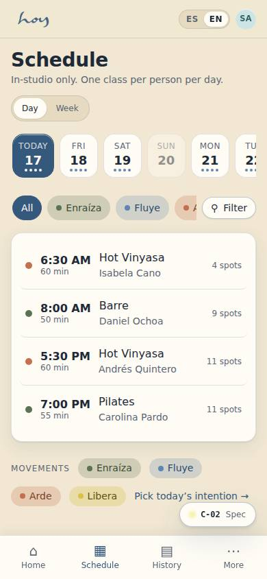
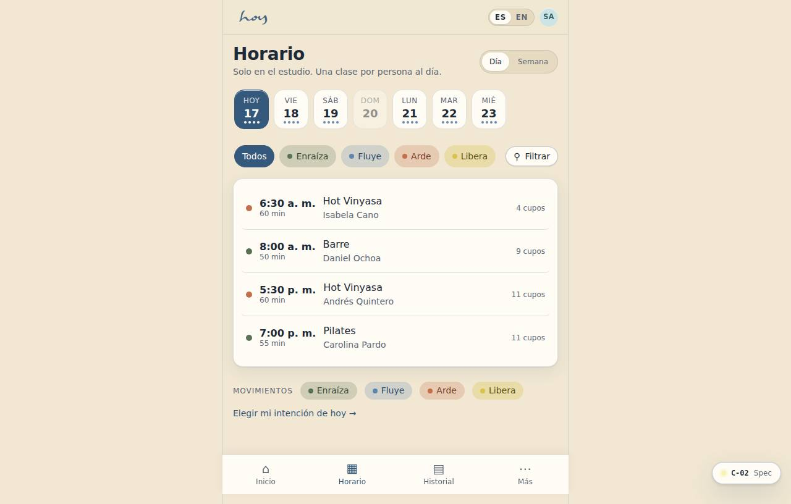
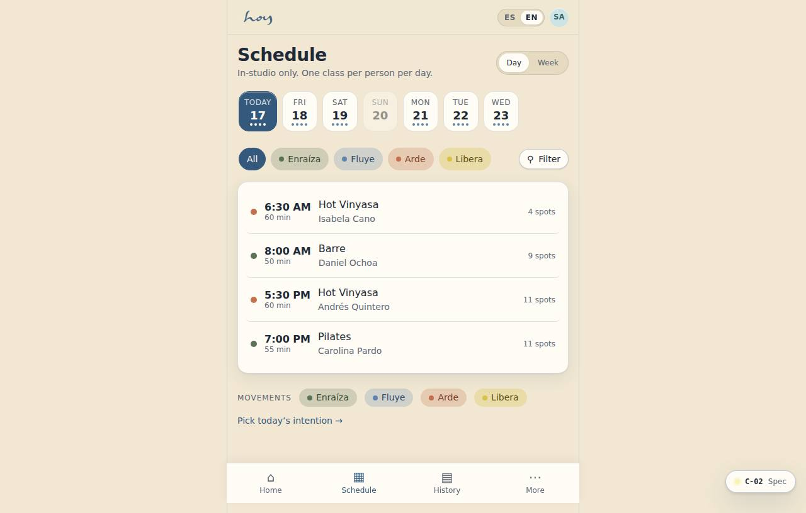

# C-02 — Class schedule

**Route** `/#/app/schedule` · **Roles** customer, front_desk, coordinator, super_admin · **Surface** customer · **Spec** `spec.code === 'C-02'` (see `/#/dev/specs`)

## Purpose
Find the right class fast. Two views (today, week) over one filterable list. Studio only — there are no online classes.

## Screenshots
| ES · mobile | EN · mobile |
| --- | --- |
|  |  |

| ES · desktop | EN · desktop |
| --- | --- |
|  |  |

## Sections (layout order — `useLayout(spec)`)
1. `ViewSwitch (Today / Week)`
2. `DateStrip`
3. `FilterBar → FilterSheet`
4. `ClassList → ClassRow`
5. `WeekGrid`
6. `Legend`

## Data
| Table | Read / write | Notes |
| --- | --- | --- |
| `class_sessions` | read | |
| `modalities` | read | |
| `teachers` | read | |
| `rooms` | read | |
| `bookings` | read / write | |
| `waitlist` | read / write | |

## Logic and integrations
- Two views only: Today and Week. Month and recurring were removed — students book within the week, and a month grid answers a question nobody asked.
- No 'Live Online' or 'On Demand' tabs — in-studio only.
- A full class shows Waitlist; joining notifies on release with a 30-minute claim window.
- Filters persist per device for the session.
- Integrations: Supabase Auth, Supabase Realtime

## States
- Loading: three skeleton rows
- Empty: 'No classes match' + clear-filters
- Error: retry
- Past days: rows read-only
- Week view (C-02b)

## Real vs mock
- Real: the page renders from the data layer (`useData()` / `useTable`) over the tables above; every write goes through the `DataProvider` so the Supabase provider replaces the mock unchanged.
- Mock / pending: Supabase Auth, Supabase Realtime are simulated or deferred; data is the browser-local `MockProvider` seed.
- Note: C-02b week view is the Week segment of this page (?view=week).
- Note: Capacity updates live through useTable subscriptions (MockProvider change events).

## Changelog
- `docs/changelog/0005-final-integration.md` — screenshots and this page doc (v0.3.0)

---
**Resumen (ES).** Horario de clases. Ver y filtrar el horario semanal por modalidad, profesor y nivel, con capacidad en vivo.
