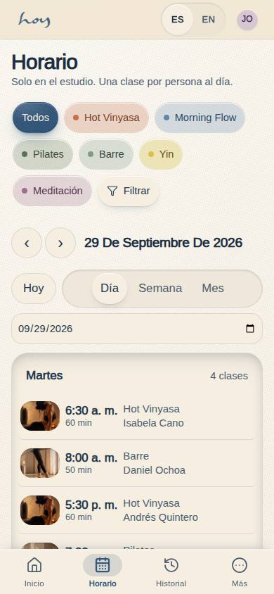
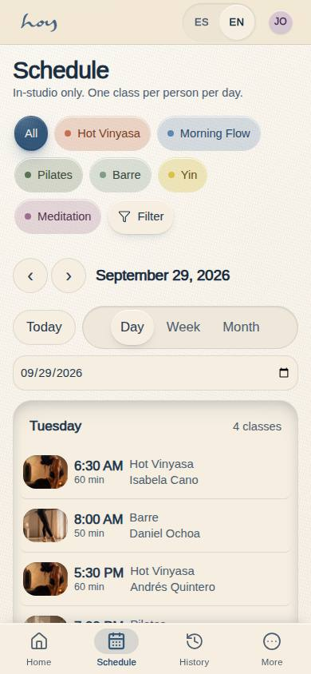
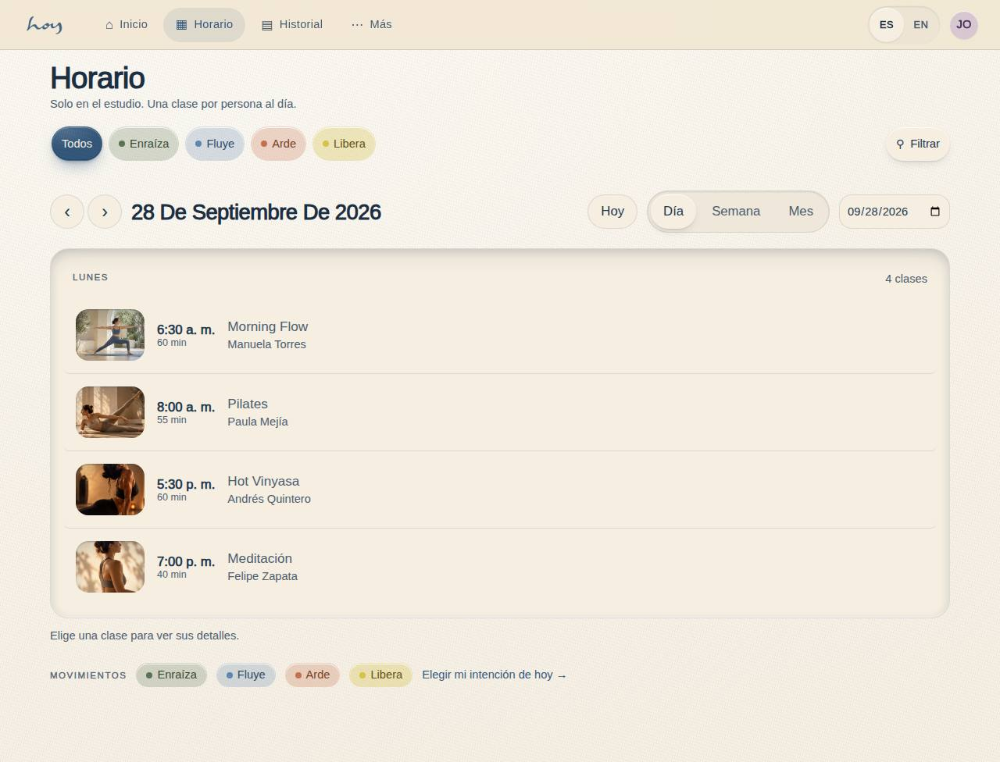
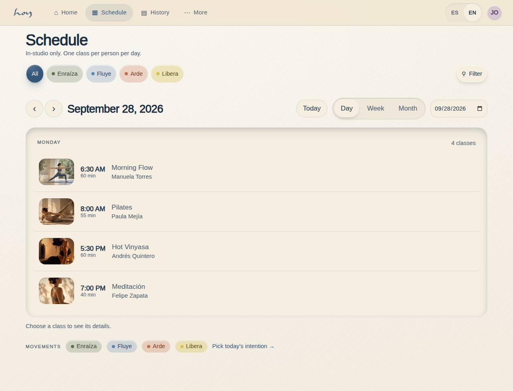

# C-02 — Class schedule

**Route** `/#/app/schedule` · **Roles** customer, front_desk, coordinator, super_admin · **Surface** customer · **Spec** `spec.code === 'C-02'` (see `/#/dev/specs`)

## Purpose
Find the right class fast. Two views (today, week) over one filterable list. Studio only — there are no online classes.

## Screenshots
| ES · mobile | EN · mobile |
| --- | --- |
|  |  |

| ES · desktop | EN · desktop |
| --- | --- |
|  |  |

## Sections (layout order — `useLayout(spec)`)
1. `ViewSwitch (Today / Week)`
2. `DateStrip`
3. `FilterBar → FilterSheet`
4. `ClassList → ClassRow`
5. `WeekGrid`
6. `Legend`

## Responsive layout (0025)
**Shell** `AppShell` (D-0006). Below 900 px: brand top bar, a content column of at most 560 px and the sticky bottom dock (Home · Schedule · History · More), exactly the phone layout. From 900 px (`useMinWidth('shell')`): a full-viewport page, the primary nav moves into the top bar (`NavBar variant="top"`), content sits in a centred `--w-app` container (75rem, growing with the `--ui` band at 1920 / 2560 / 3840) and the document scrolls. No phone bezel at any width; the bezel exists only in the hub's `DeviceFrame` simulator.

- **≥ 900 px**: the page uses the full `--w-app` width; the filter chips wrap onto more lines instead of scrolling sideways (the 430 px frame clipped them at 1920); the `FilterSheet` (`Drawer side="bottom"`) opens as a centred dialog.
- **< 900 px**: chips scroll horizontally with the fade mask; the filter sheet is a bottom sheet.
- Every chip and control is at least 44 px (`--h-ctl`).

Verified 2026-09-28 at 360 · 390 · 768 · 1280 · 1920 · 3840 px (ES and EN, light) during the 0026 build: DOM audit (`scrollWidth === innerWidth`, calendar window without horizontal overflow, no control under 44 px) plus the captures above regenerated at all six widths; `PageSpec.checkedAt` = `[360, 390, 768, 1280, 1920, 3840]`.

## Responsive layout (0026) — calendar on phones
`SessionCalendar` picks its layout from the viewport (`useMinWidth('shell')`, 900 px):

- **< 900 px · Week**: a snap-scrolling strip of the seven days (44 px chips: weekday, date, one movement-coloured dot per class, `aria-pressed` on the selected day) above the selected day's classes as `ClassRow`s. Tapping a chip selects the day; the toolbar arrows move a week.
- **< 900 px · Month**: a compact 7-column grid of 44 px day cells with the same dots (outside-month days dimmed, today ringed, selected day filled) above the selected day's list. Tapping a cell selects the day; arrows move a month.
- **< 900 px · Day**: unchanged (the list).
- **≥ 900 px**: the seven-column card grids of 0025, unchanged.
- No horizontal scroll region at any width; sizes are rem / tokens so the 4K band scales them. The footnote no longer asks to swipe.

- Movement chips: under 480 px of app column the chips and the Filter button wrap as one row (QA I-04); the fade-mask swipe row remains between 480 and 899 px.

## Actions (WebMCP)
| id | Intent (ES) | Params | Permission |
| --- | --- | --- | --- |
| `app.reserve` | Reserva la clase {session} | `session` (`class_sessions.id`, must be scheduled and in the future) | `bookings.write` |
| `app.goHome` | Llévame al inicio de la app | — | — |
| `app.openSchedule` | Muéstrame el horario de clases | — | `classes.read` |

Declared in the page spec (`src/modules/customer/actions.ts` → `CUSTOMER_ACTIONS`), mounted with `useActions()`, listed at `window.__hoyos.actions` and run with `window.__hoyos.run(id, params)`. `permission` is advisory; see `docs/reference/surfaces.md`.

## Data
| Table | Read / write | Notes |
| --- | --- | --- |
| `class_sessions` | read | |
| `modalities` | read | |
| `teachers` | read | |
| `rooms` | read | |
| `bookings` | read / write | |
| `waitlist` | read / write | |

## Logic and integrations
- Two views only: Today and Week. Month and recurring were removed — students book within the week, and a month grid answers a question nobody asked.
- No 'Live Online' or 'On Demand' tabs — in-studio only.
- A full class shows Waitlist; joining notifies on release with a 30-minute claim window.
- Filters persist per device for the session.
- Integrations: Supabase Auth, Supabase Realtime

## States
- Loading: three skeleton rows
- Empty: 'No classes match' + clear-filters
- Error: retry
- Past days: rows read-only
- Week view (C-02b)

## Real vs mock
- Real: the page renders from the data layer (`useData()` / `useTable`) over the tables above; every write goes through the `DataProvider` so the Supabase provider replaces the mock unchanged.
- Mock / pending: Supabase Auth, Supabase Realtime are simulated or deferred; data is the browser-local `MockProvider` seed.
- Note: C-02b week view is the Week segment of this page (?view=week).
- Note: Capacity updates live through useTable subscriptions (MockProvider change events).

## Changelog
- `docs/changelog/0026-calendar-teacher-mats.md` — phone Week strip and Month grid in `SessionCalendar`, movement chips wrap on phones (v0.10.1, 2026-09-28)
- `docs/changelog/0005-final-integration.md` — screenshots and this page doc (v0.3.0)
- `docs/changelog/0025-responsive-app-shell.md` — responsive `AppShell` / ≥ 900 px layout, WebMCP actions (v0.10.0, 2026-09-28)
- `docs/changelog/0030-icons.md` — icon system: lucide glyphs behind the `Icon` atom (filter button glyph; the “Elegir mi intención” link is gone and the filter reads “Movimiento”) (v0.12.0, 2026-09-29)

---
**Resumen (ES).** Horario de clases. Ver y filtrar el horario semanal por modalidad, profesor y nivel, con capacidad en vivo.
