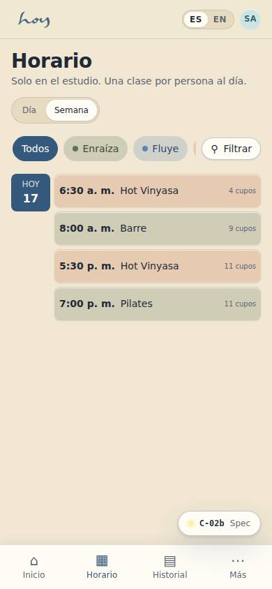
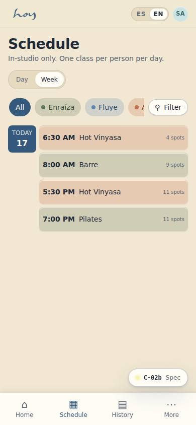
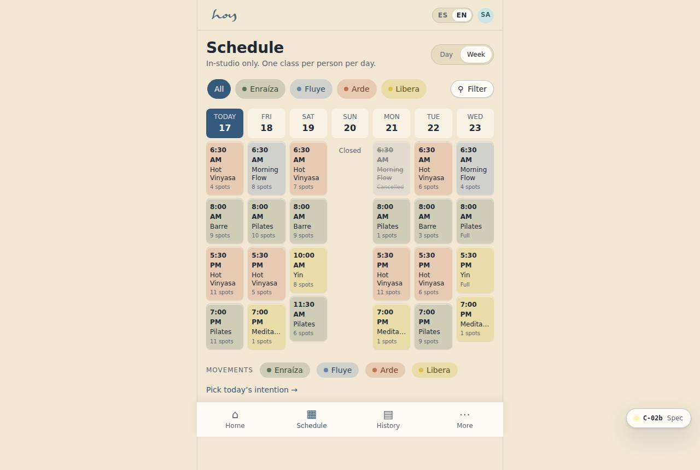

# C-02b — Class schedule · week

**Route** `/#/app/schedule/week` · **Roles** customer, front_desk, coordinator, super_admin · **Surface** customer · **Spec** `spec.code === 'C-02b'` (see `/#/dev/specs`)

## Purpose
The week view of C-02: a six-column day grid of compact time chips, because comparing across days is the reason to open it. Same data, filters and booking state as Today.

## Screenshots
| ES · mobile | EN · mobile |
| --- | --- |
|  |  |

| ES · desktop | EN · desktop |
| --- | --- |
|  |  |

## Sections (layout order — `useLayout(spec)`)
1. `ViewSwitch (Today / Week)`
2. `FilterBar → FilterSheet`
3. `WeekGrid (Mon–Sat columns → DayChip)`
4. `Legend`

## Data
| Table | Read / write | Notes |
| --- | --- | --- |
| `class_sessions` | read | |
| `modalities` | read | |
| `teachers` | read | |
| `rooms` | read | |
| `bookings` | read / write | |

## Logic and integrations
- Tapping a chip opens C-03 for that class; booked chips are filled in the selection colour.
- Past days are read-only; the current day is pre-selected.
- Filters set on Today carry over to Week for the session.
- Six columns, Monday to Saturday — the studio does not open on Sunday; a seventh column appears only if M-08 hours change.
- Integrations: Supabase Auth, Supabase Realtime

## States
- Loading: skeleton
- Empty day: dash in the column
- Past days: chips dimmed
- Booked: chip outlined

## Real vs mock
- Real: the page renders from the data layer (`useData()` / `useTable`) over the tables above; every write goes through the `DataProvider` so the Supabase provider replaces the mock unchanged.
- Mock / pending: Supabase Auth, Supabase Realtime are simulated or deferred; data is the browser-local `MockProvider` seed.
- Note: Rendered by SchedulePage with view=week at /app/schedule/week; on phones the six columns stack as day groups.

## Changelog
- `docs/changelog/0005-final-integration.md` — screenshots and this page doc (v0.3.0)

---
**Resumen (ES).** Horario de clases · semana. La vista semanal de C-02: cuadrícula de seis columnas con chips de hora; mismos datos, filtros y estado de reserva que Hoy.
