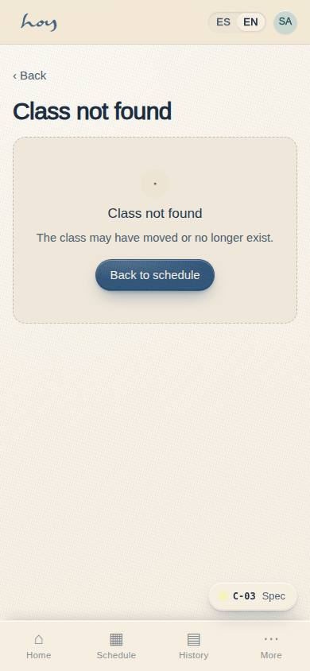
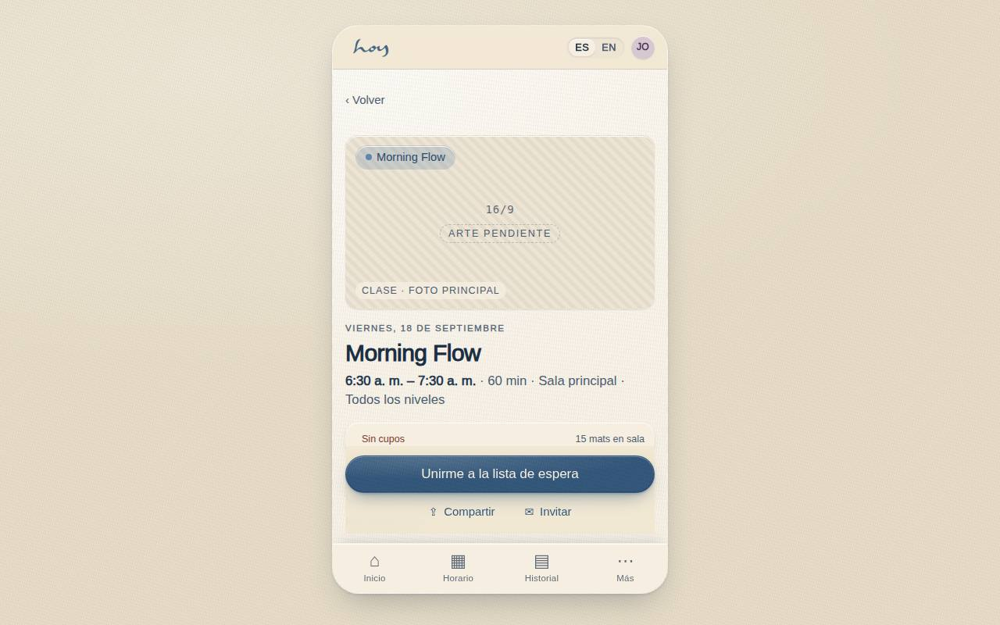

# C-03 — Class detail

**Route** `/#/app/class/:id` · **Roles** customer, public, coordinator, front_desk · **Surface** customer · **Spec** `spec.code === 'C-03'` (see `/#/dev/specs`)

## Purpose
Everything needed to commit: what the class is, who teaches it, what to bring, how full it is, and how to reserve.

## Screenshots
| ES · mobile | EN · mobile |
| --- | --- |
|  |  |

| ES · desktop | EN · desktop |
| --- | --- |
|  |  |

## Sections (layout order — `useLayout(spec)`)
1. `HeroImage (placeholder)`
2. `TitleBlock (time, duration, room)`
3. `CapacityMeter`
4. `AboutSection`
5. `TeacherCard → TeacherProfile`
6. `PrepList → Club rules`
7. `StickyCTA (Reserve / Waitlist)`

## Data
| Table | Read / write | Notes |
| --- | --- | --- |
| `class_sessions` | read | |
| `modalities` | read | |
| `teachers` | read | |
| `rooms` | read | |
| `bookings` | read / write | |
| `waitlist` | read / write | |

## Logic and integrations
- Reserve resolves to: use credit → membership entitlement → pay per class → trial class.
- Capacity meter turns amber under 4 spots.
- Deep-linkable for the website and WhatsApp shares.
- Integrations: WhatsApp, Supabase Realtime

## States
- Loading: hero shimmer
- Cancelled class: banner + reschedule options
- Full: CTA becomes Waitlist
- Already booked: CTA opens the booking
- Same-day conflict: CTA disabled with reason
- Not found

## Real vs mock
- **Real.** The class, its capacity, the teacher, the room and the booking conflict rules come from the
  data layer; the CTA switches between reserve, waitlist, open-booking and a disabled same-day conflict
  from real rows.
- **Mock / pending.** Payment goes through the simulated Wompi seam; data is the browser-local
  `MockProvider` seed.
- **The hero slot is now wired.** `MediaPlaceholder` asks the media library for `class.hero`
  (16:9). While that `media_assets` row is `pending`, the slot renders as an intentional, branded
  empty frame — movement tint, ratio badge and an "arte pendiente / art pending" chip — instead of a
  grey box. The moment the owner pastes a URL in M-02d and marks the row ready, the real photograph
  appears here and in every other place that slot is used, with no deploy. The same mechanism serves
  `teacher.portrait` (C-18), `event.cover` (C-23) and `studio.tour` (C-13).

## Changelog
- `docs/changelog/0012-thin-screens-depth.md` — depth pass on the thin screens (v0.6.0)
- `docs/changelog/0005-final-integration.md` — screenshots and this page doc (v0.3.0)

---
**Resumen (ES).** Detalle de clase. Todo sobre una clase: profesor, sala, nivel, preparación, cupos y el botón de reservar.
