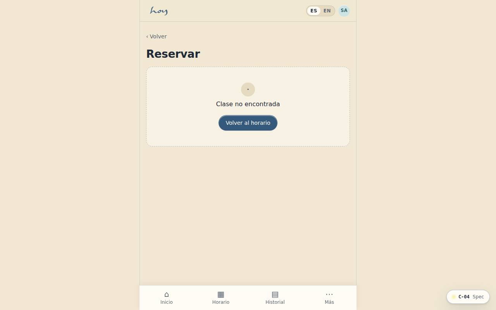
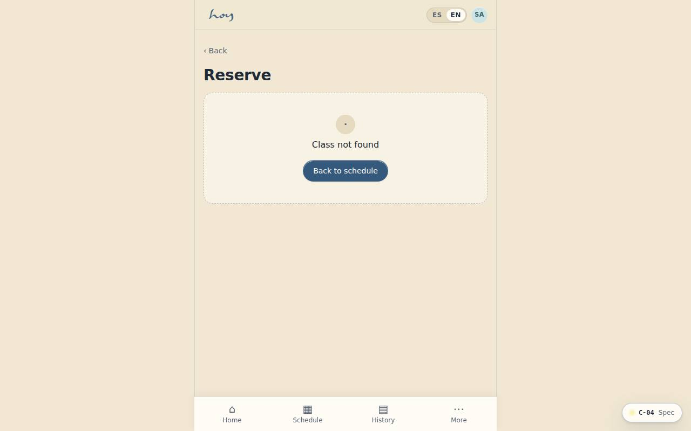

# C-04 — Reserve & checkout

**Route** `/#/app/checkout/:id` · **Roles** customer, front_desk · **Surface** customer · **Spec** `spec.code === 'C-04'` (see `/#/dev/specs`)

## Purpose
One screen from intent to confirmed, choosing the cheapest valid entitlement by default and only asking for money when there is none.

## Screenshots
| ES · mobile | EN · mobile |
| --- | --- |
|  |  |

| ES · desktop | EN · desktop |
| --- | --- |
|  |  |

## Sections (layout order — `useLayout(spec)`)
1. `ClassSummary`
2. `EntitlementPicker`
3. `PaymentMethodRow`
4. `OrderSummary (subtotal, IVA, total)`
5. `ConfirmButton`

## Data
| Table | Read / write | Notes |
| --- | --- | --- |
| `class_sessions` | read | |
| `bookings` | read / write | |
| `credits` | read / write | |
| `memberships` | read / write | |
| `plans` | read | |
| `payments` | read / write | |
| `invoices` | read / write | |

## Logic and integrations
- Entitlement order: credits → membership → trial → single purchase.
- Prices in COP; IVA shown as a line item.
- Trial class is one per person, verified by document/phone.
- Confirmation sends both a WhatsApp message and an email receipt.
- No-show and late-cancel fees follow the cancellation window rule.
- Integrations: WhatsApp, Wompi, Email, Supabase Realtime, DIAN e-invoicing

## States
- Loading: CTA spinner, form locked
- Declined: inline reason + alternate method
- Race: class filled during checkout → waitlist offer
- Success: confirmation sheet

## Real vs mock
- Real: the page renders from the data layer (`useData()` / `useTable`) over the tables above; every write goes through the `DataProvider` so the Supabase provider replaces the mock unchanged.
- Mock / pending: WhatsApp, Wompi, Email, Supabase Realtime, DIAN e-invoicing are simulated or deferred; data is the browser-local `MockProvider` seed.
- Note: Wompi is simulated in src/modules/customer/payments.ts (wompiCheckout). Manual transfer/cash create pending payments the front desk settles.
- Note: IVA 19% is computed by OrderSummary from policy.ivaRate; prices are IVA-inclusive.
- Note: Declined payments render E-02 inline and keep the spot held 10 minutes.

## Changelog
- `docs/changelog/0005-final-integration.md` — screenshots and this page doc (v0.3.0)

---
**Resumen (ES).** Reservar y pagar. Reservar y pagar en un solo flujo: usar crédito, membresía o pagar la clase; recibo al instante.
