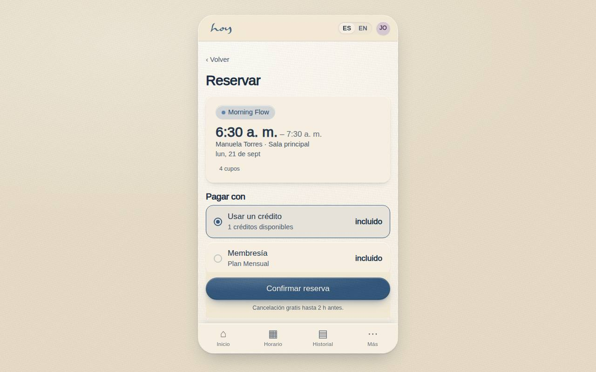
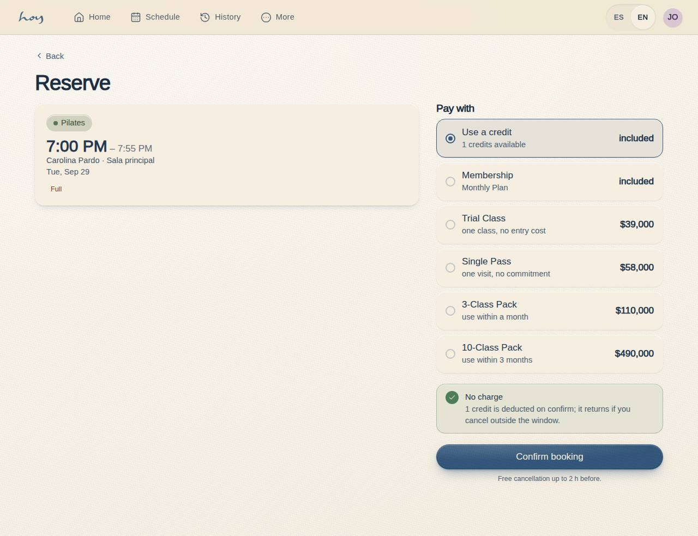

# C-04 — Reserve & checkout

**Route** `/#/app/checkout/:id` · **Roles** customer, front_desk · **Surface** customer · **Spec** `spec.code === 'C-04'` (see `/#/dev/specs`)

## Purpose
One screen from intent to confirmed, choosing the cheapest valid entitlement by default and only asking for money when there is none.

## Screenshots
| ES · mobile | EN · mobile |
| --- | --- |
|  |  |

| ES · desktop | EN · desktop |
| --- | --- |
|  |  |

## Sections (layout order — `useLayout(spec)`)
1. `ClassSummary`
2. `EntitlementPicker`
3. `PaymentMethodRow`
4. `OrderSummary (subtotal, IVA, total)`
5. `ConfirmButton`

## Responsive layout (0025)
**Shell** `AppShell` (D-0006). Below 900 px: brand top bar, a content column of at most 560 px and the sticky bottom dock (Home · Schedule · History · More), exactly the phone layout. From 900 px (`useMinWidth('shell')`): a full-viewport page, the primary nav moves into the top bar (`NavBar variant="top"`), content sits in a centred `--w-app` container (75rem, growing with the `--ui` band at 1920 / 2560 / 3840) and the document scrolls. No phone bezel at any width; the bezel exists only in the hub's `DeviceFrame` simulator.

- **≥ 900 px** (`SplitSections`, `.cust-checkout`): left column = what you are booking — `ClassSummary` with the `MatPicker` for mat classes; right column (20–26rem) = how you pay — `EntitlementPicker`, `PaymentMethodRow`, `OrderSummary`, `ConfirmButton`. The sticky confirm block sticks inside the right column (`bottom: --sp-4`) instead of above the dock.
- The booking-confirmed `Drawer side="bottom"` is a centred dialog from 900 px.
- **< 900 px**: one column in the layout editor's order, sticky CTA above the bottom dock.

Verified 2026-09-28 at 360 · 390 · 768 · 1280 · 1920 · 3840 px (ES and EN, light) during the 0026 build: DOM audit (`scrollWidth === innerWidth`, calendar window without horizontal overflow, no control under 44 px) plus the captures above regenerated at all six widths; `PageSpec.checkedAt` = `[360, 390, 768, 1280, 1920, 3840]`.

## Responsive layout (0026) — mat grid
`MatPicker` derives its columns from the room's measured width and the tenant row length (`tenant.studio.mats / matRows` = 8): `matColumns()` picks 8, 4 or 2 mats per line, whichever is the largest divisor that keeps every mat at least `--mat-size` (3.5rem) wide. Each physical row is its own `role="group"` grid ("Fila 1", "Fila 2"); when a row wraps, a "Fila n · mats a–b" label keeps the front (teacher) / entrance reading. Mats are 60–72 px tall (rem). Measured: 4 × 4 at 360 / 390 / 768, 2 × 8 from 1280; never clipped.

## Actions (WebMCP)
| id | Intent (ES) | Params | Permission |
| --- | --- | --- | --- |
| `app.pickMat` | Quiero el tapete {mat} | `mat` (1–16, free, mat classes only) | `bookings.write` |
| `app.confirmReservation` | Confirma mi reserva | — (refuses when a pass would be charged: paying stays a person's click) | `bookings.write` |
| `app.goHome` | Llévame al inicio de la app | — | — |
| `app.openSchedule` | Muéstrame el horario de clases | — | `classes.read` |

Declared in the page spec (`src/modules/customer/actions.ts` → `CUSTOMER_ACTIONS`), mounted with `useActions()`, listed at `window.__hoyos.actions` and run with `window.__hoyos.run(id, params)`. `permission` is advisory; see `docs/reference/surfaces.md`.

## Data
| Table | Read / write | Notes |
| --- | --- | --- |
| `class_sessions` | read | |
| `bookings` | read / write | |
| `credits` | read / write | |
| `memberships` | read / write | |
| `plans` | read | |
| `payments` | read / write | |
| `invoices` | read / write | |

## Logic and integrations
- Entitlement order: credits → membership → trial → single purchase.
- Prices in COP; IVA shown as a line item.
- Trial class is one per person, verified by document/phone.
- Confirmation sends both a WhatsApp message and an email receipt.
- No-show and late-cancel fees follow the cancellation window rule.
- Integrations: WhatsApp, Wompi, Email, Supabase Realtime, DIAN e-invoicing

## States
- Loading: CTA spinner, form locked
- Declined: inline reason + alternate method
- Race: class filled during checkout → waitlist offer
- Success: confirmation sheet

## Real vs mock
- Real: the page renders from the data layer (`useData()` / `useTable`) over the tables above; every write goes through the `DataProvider` so the Supabase provider replaces the mock unchanged.
- Mock / pending: WhatsApp, Wompi, Email, Supabase Realtime, DIAN e-invoicing are simulated or deferred; data is the browser-local `MockProvider` seed.
- Note: Wompi is simulated in src/modules/customer/payments.ts (wompiCheckout). Manual transfer/cash create pending payments the front desk settles.
- Note: IVA 19% is computed by OrderSummary from policy.ivaRate; prices are IVA-inclusive.
- Note: Declined payments render E-02 inline and keep the spot held 10 minutes.

## Changelog
- `docs/changelog/0026-calendar-teacher-mats.md` — room-width `MatPicker` rows (8, 4 or 2 per line, row labels, rem heights) (v0.10.1, 2026-09-28)
- `docs/changelog/0005-final-integration.md` — screenshots and this page doc (v0.3.0)
- `docs/changelog/0025-responsive-app-shell.md` — responsive `AppShell` / ≥ 900 px layout, WebMCP actions (v0.10.0, 2026-09-28)

---
**Resumen (ES).** Reservar y pagar. Reservar y pagar en un solo flujo: usar crédito, membresía o pagar la clase; recibo al instante.
