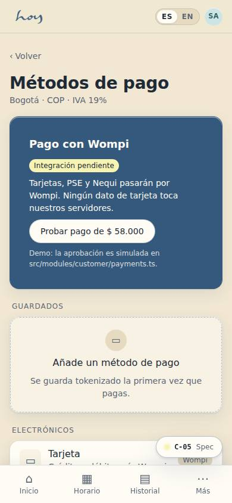
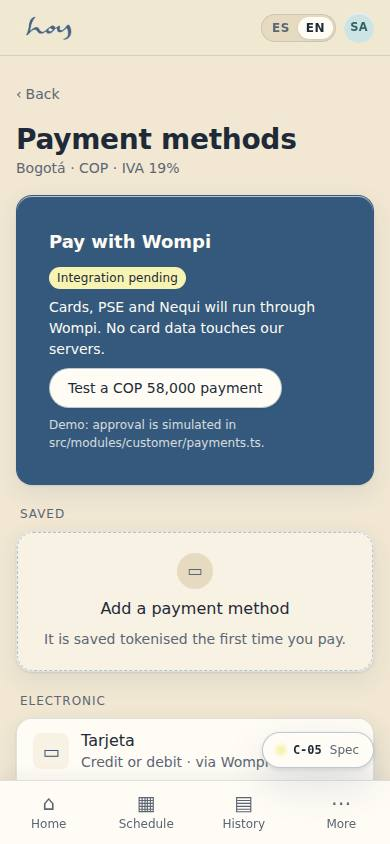
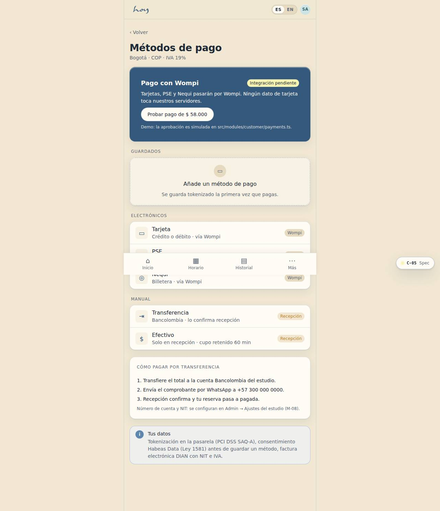
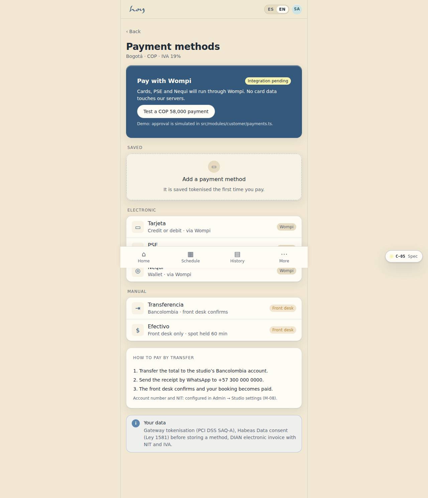

# C-05 — Payment methods

**Route** `/#/app/payment-methods` · **Roles** customer, front_desk, finance, super_admin · **Surface** customer · **Spec** `spec.code === 'C-05'` (see `/#/dev/specs`)

## Purpose
Colombian payment reality: cards, PSE, Nequi, Daviplata, Bancolombia transfer, Mercado Pago, wallet pay, and cash at the front desk.

## Screenshots
| ES · mobile | EN · mobile |
| --- | --- |
|  |  |

| ES · desktop | EN · desktop |
| --- | --- |
|  |  |

## Sections (layout order — `useLayout(spec)`)
1. `WompiCard (placeholder)`
2. `SavedMethods`
3. `ElectronicMethods (card, PSE, Nequi)`
4. `ManualMethods (transfer instructions, cash at desk)`
5. `ComplianceNote`

## Data
| Table | Read / write | Notes |
| --- | --- | --- |
| `payments` | read / write | |
| `invoices` | read / write | |

## Logic and integrations
- No card data touches our servers — gateway tokenisation only; PCI DSS SAQ-A scope.
- Cash creates a pending order that the front desk settles; booking holds 60 minutes.
- Electronic invoicing per DIAN requirements; receipt includes NIT and IVA breakdown.
- Refunds return to the original method; credits are refunded as credits.
- Habeas Data (Ley 1581) consent recorded before storing any method.
- Integrations: WhatsApp, Wompi, Email, DIAN e-invoicing

## States
- Loading: rows shimmer
- Empty: 'Add a payment method'
- Gateway down: cash/transfer only + banner
- Expired card: inline warning

## Real vs mock
- Real: the page renders from the data layer (`useData()` / `useTable`) over the tables above; every write goes through the `DataProvider` so the Supabase provider replaces the mock unchanged.
- Mock / pending: WhatsApp, Wompi, Email, DIAN e-invoicing are simulated or deferred; data is the browser-local `MockProvider` seed.
- Note: Wompi is simulated in src/modules/customer/payments.ts (wompiCheckout). Manual transfer/cash create pending payments the front desk settles.
- Note: No payment_methods table yet: saved methods are derived from approved payments (shared-change request).

## Changelog
- `docs/changelog/0005-final-integration.md` — screenshots and this page doc (v0.3.0)

---
**Resumen (ES).** Métodos de pago. Guardar y gestionar métodos de pago; efectivo solo desde recepción.
