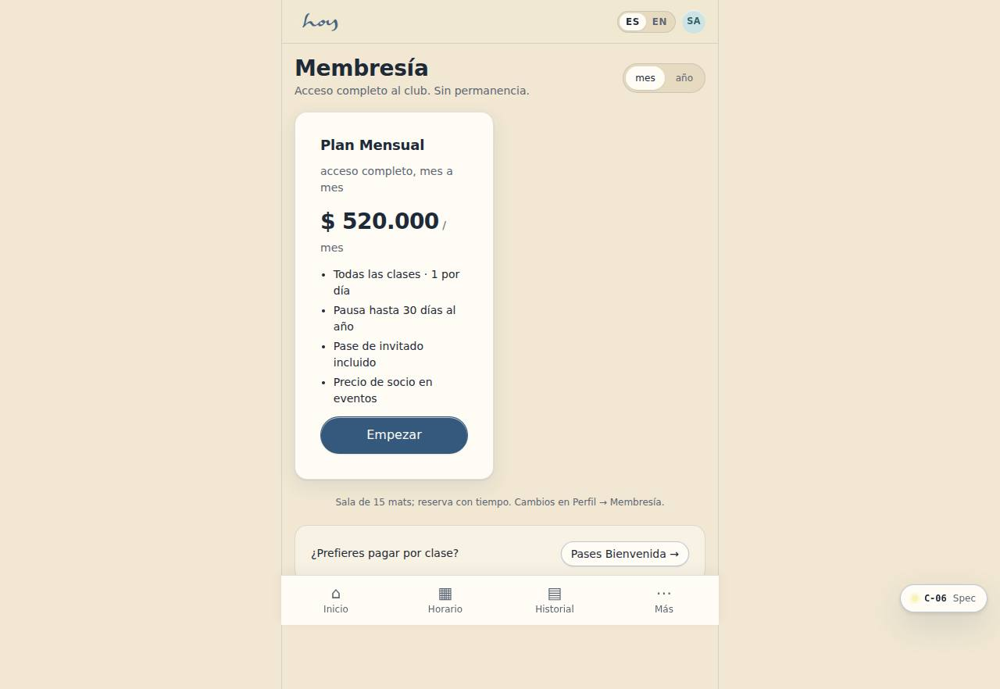
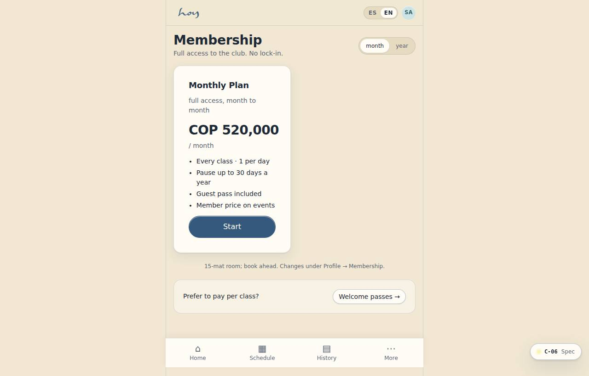

# C-06 — Membership plans

**Route** `/#/app/plans` · **Roles** customer, front_desk, finance, super_admin · **Surface** customer · **Spec** `spec.code === 'C-06'` (see `/#/dev/specs`)

## Purpose
Sell the plan without blocking the booking. Monthly or yearly, with the yearly discount shown as months free.

## Screenshots
| ES · mobile | EN · mobile |
| --- | --- |
|  |  |

| ES · desktop | EN · desktop |
| --- | --- |
|  |  |

## Sections (layout order — `useLayout(spec)`)
1. `CycleSwitch (Monthly / Yearly)`
2. `PlanCards`
3. `ComparisonNote`
4. `PrimaryCTA`
5. `SkipLink (Bienvenida passes)`

## Data
| Table | Read / write | Notes |
| --- | --- | --- |
| `plans` | read | |
| `memberships` | read / write | |
| `payments` | read / write | |

## Logic and integrations
- Yearly = 10× monthly, shown as '2 months free'.
- Skipping is always allowed; the nudge returns on home.
- Freeze, cancel and change-plan handled in Settings → Membership with the studio's notice period.
- Prices come from the CMS and drive the app and the website at once.
- Integrations: none

## States
- Loading: card skeletons
- Existing member: current plan marked, others show 'change'
- Promotion active: badge + strike price

## Real vs mock
- Real: the page renders from the data layer (`useData()` / `useTable`) over the tables above; every write goes through the `DataProvider` so the Supabase provider replaces the mock unchanged.
- Mock / pending: no external integrations; data is the browser-local `MockProvider` seed.
- Note: Prices only from src/tenant/pricing.ts (Modelo de Valor v3).
- Note: Wompi is simulated in src/modules/customer/payments.ts (wompiCheckout). Manual transfer/cash create pending payments the front desk settles.

## Changelog
- `docs/changelog/0005-final-integration.md` — screenshots and this page doc (v0.3.0)

---
**Resumen (ES).** Planes de membresía. Comparar y comprar planes de membresía; muestra el estado del plan actual.
