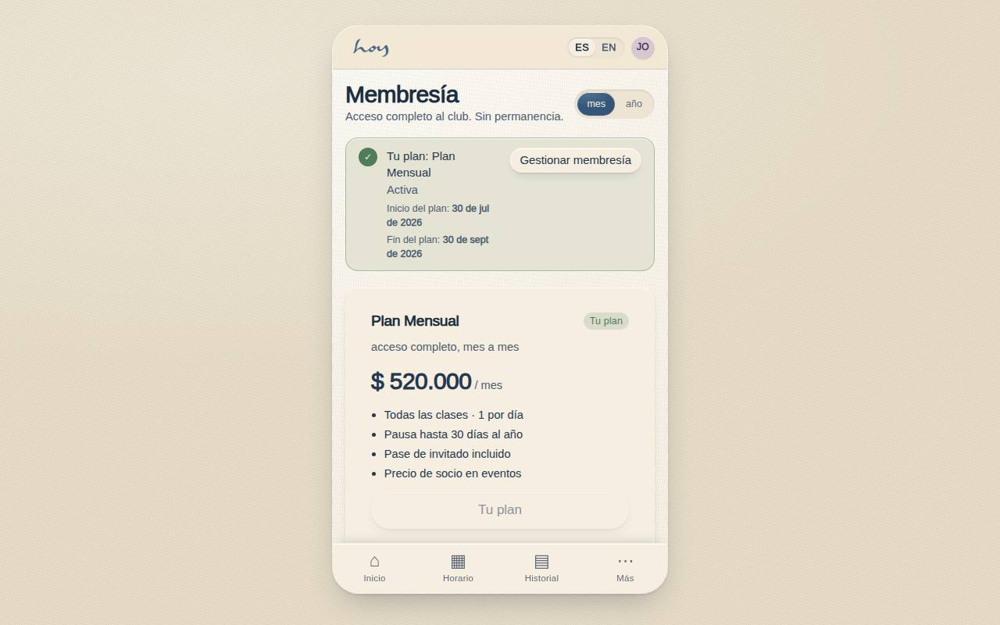
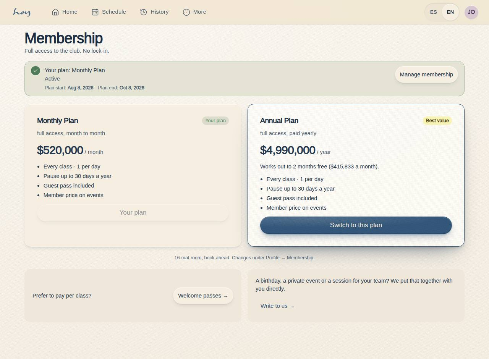
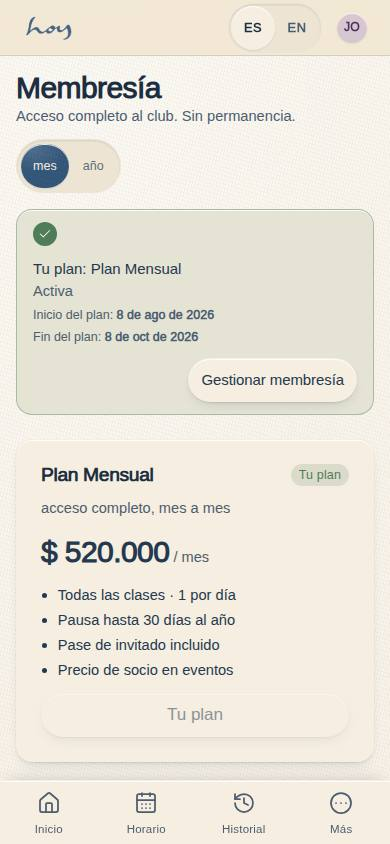

# C-06 — Packages (Paquetes)

**Route** `/#/app/plans` · **Roles** customer, front_desk, finance, super_admin · **Surface** customer · **Spec** `spec.code === 'C-06'` (see `/#/dev/specs`)

## Purpose
Sell the plan without blocking the booking. Monthly or yearly, with the yearly discount shown as months free.

## Screenshots
| ES · mobile | EN · mobile |
| --- | --- |
|  |  |

| ES · desktop | EN · desktop |
| --- | --- |
|  |  |

## Sections (layout order — `useLayout(spec)`)
1. `CycleSwitch (Monthly / Yearly)`
2. `PlanCards`
3. `ComparisonNote`
4. `PrimaryCTA`
5. `SkipLink (Bienvenida passes)`

## Responsive layout (0025)
**Shell** `AppShell` (D-0006). Below 900 px: brand top bar, a content column of at most 560 px and the sticky bottom dock (Home · Schedule · History · More), exactly the phone layout. From 900 px (`useMinWidth('shell')`): a full-viewport page, the primary nav moves into the top bar (`NavBar variant="top"`), content sits in a centred `--w-app` container (75rem, growing with the `--ui` band at 1920 / 2560 / 3840) and the document scrolls. No phone bezel at any width; the bezel exists only in the hub's `DeviceFrame` simulator.

- **≥ 900 px**: both cycles (monthly and annual) sit side by side in a two-column grid and the cycle `SegmentedControl` is hidden; the Bienvenida-passes and Especiales links sit in two columns.
- **`?plan=<id>`** (from W-05 → A-02): the plan chosen on the site is preselected (outlined) and its confirmation opens at once; the cycle follows the plan. Works at every width.
- The confirmation `Drawer side="bottom"` is a centred dialog from 900 px.
- **< 900 px**: the segmented control picks one cycle, as before.

Verified 2026-09-28 at 390 · 1280 · 3840 px (ES, light) during the 0025 build; `PageSpec.checkedAt` = `[390, 1280, 3840]`. The full 360…3840 matrix is a follow-up.
The 1280 captures above predate 0025 and may still show the phone frame; the screenshot pass regenerates them.

## Actions (WebMCP)
| id | Intent (ES) | Params | Permission |
| --- | --- | --- | --- |
| `app.choosePlan` | Quiero el plan {plan} | `plan` (`monthly`, `annual`) — opens the confirmation; paying stays a person's click | `payments.read` |
| `app.goHome` | Llévame al inicio de la app | — | — |
| `app.openSchedule` | Muéstrame el horario de clases | — | `classes.read` |

Declared in the page spec (`src/modules/customer/actions.ts` → `CUSTOMER_ACTIONS`), mounted with `useActions()`, listed at `window.__hoyos.actions` and run with `window.__hoyos.run(id, params)`. `permission` is advisory; see `docs/reference/surfaces.md`.

## Data
| Table | Read / write | Notes |
| --- | --- | --- |
| `plans` | read | |
| `memberships` | read / write | |
| `payments` | read / write | |

## Logic and integrations
- Yearly = 10× monthly, shown as '2 months free'.
- Skipping is always allowed; the nudge returns on home.
- Freeze, cancel and change-plan handled in Settings → Membership with the studio's notice period.
- Prices come from the CMS and drive the app and the website at once.
- Integrations: none

## States
- Loading: card skeletons
- Existing member: current plan marked, others show 'change'
- Promotion active: badge + strike price

## Real vs mock
- Real: the page renders from the data layer (`useData()` / `useTable`) over the tables above; every write goes through the `DataProvider` so the Supabase provider replaces the mock unchanged.
- Mock / pending: no external integrations; data is the browser-local `MockProvider` seed.
- Note: Prices only from src/tenant/pricing.ts (Modelo de Valor v3).
- Note: Wompi is simulated in src/modules/customer/payments.ts (wompiCheckout). Manual transfer/cash create pending payments the front desk settles.

## 0051 — the studio's verified content (2026-10-01)
Now **Paquetes**: the 12-class package and the Santa María Tennis Club price with their rules (12 classes, 3 months,
freeze once, non-refundable), a confirmation drawer that writes the purchase to `class_ledger`, links to the trial /
individual class (C-07), private classes (WhatsApp) and gift cards (C-17). `?plan=pack12` preselects; `?plan=trial` /
`single` go to the schedule with the pass ready.
| Before (0.21.3) | After (0.22.0) |
| --- | --- |
|  |  |

## Changelog
- `docs/changelog/0051-website-verified-content.md` — Paquetes: the 12-class package and the affiliate price, private classes, gift cards (v0.22.0, 2026-10-01)
- `docs/changelog/0005-final-integration.md` — screenshots and this page doc (v0.3.0)
- `docs/changelog/0025-responsive-app-shell.md` — responsive `AppShell` / ≥ 900 px layout, WebMCP actions (v0.10.0, 2026-09-28)

---
**Resumen (ES).** Paquetes. El paquete de 12 clases y el precio para afiliados de Santa María Tennis Club, con sus reglas; enlaces a la clase de prueba o individual, las clases privadas y las tarjetas de regalo. Sin membresía.
