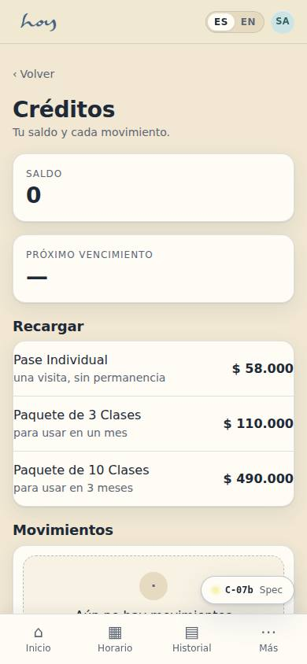
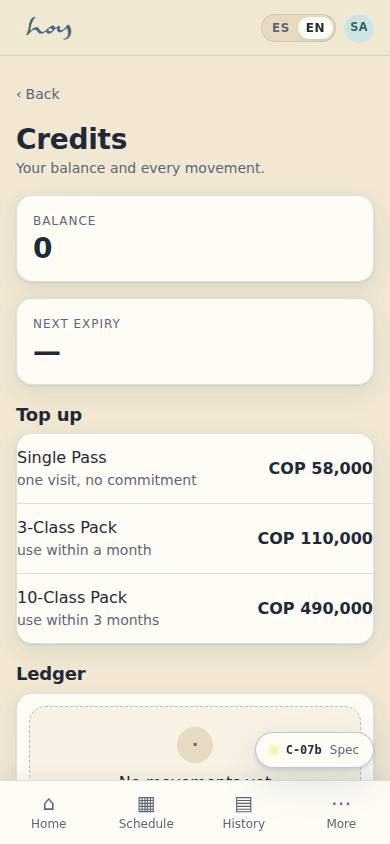
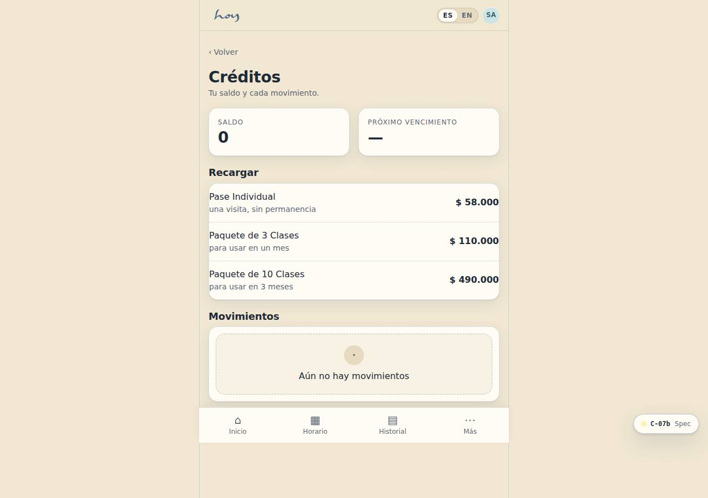
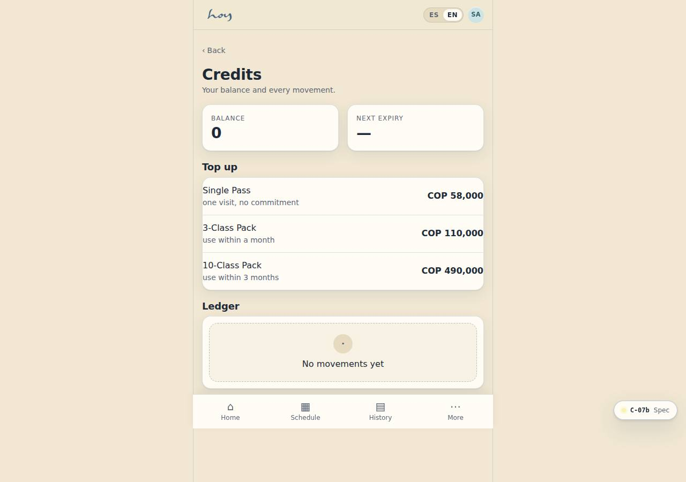

# C-07b — Credits & class packs

**Route** `/#/app/credits` · **Roles** public, customer, front_desk · **Surface** customer · **Spec** `spec.code === 'C-07b'` (see `/#/dev/specs`)

## Purpose
The way in for someone with no membership: four one-time options, stacked cheapest first, each one reservable on the spot. It is the other half of C-06 — whoever skips the plan lands here rather than at a dead end.

## Screenshots
| ES · mobile | EN · mobile |
| --- | --- |
|  |  |

| ES · desktop | EN · desktop |
| --- | --- |
|  |  |

## Sections (layout order — `useLayout(spec)`)
1. `BalanceHeader`
2. `LedgerList (earned / used / expired)`
3. `PackGrid (1 / 3 / 10)`
4. `BuyCTA`

## Data
| Table | Read / write | Notes |
| --- | --- | --- |
| `credits` | read / write | |
| `plans` | read | |
| `payments` | read / write | |
| `bookings` | read / write | |

## Logic and integrations
- Prices read from the value-model config; no figure is written on this screen.
- Trial class is one per person, verified by document or phone.
- Packs expire per their own rule — one month for 3, three months for 10.
- Every button enters the same single-screen checkout (C-04) with lazy registration.
- C-06's skip link points here, so the membership decision is never a dead end.
- Integrations: Wompi, Supabase Auth

## States
- Default (this screen)
- Trial already used: that row drops to a note
- Existing member: banner offers C-06 instead
- Loading: four skeleton rows

## Real vs mock
- Real: the page renders from the data layer (`useData()` / `useTable`) over the tables above; every write goes through the `DataProvider` so the Supabase provider replaces the mock unchanged.
- Mock / pending: Wompi, Supabase Auth are simulated or deferred; data is the browser-local `MockProvider` seed.
- Note: C-07b merged into C-07 in canvas v1.5; alias kept for the /app/credits stub. Content lives in C-07 + P-01.
- Note: Pack purchase from here credits the ledger without a booking (payments + credits rows).
- Note: Canvas v1.5 merged C-07b into C-07; the /app/credits route keeps the ledger view under the compatibility alias.

## Changelog
- `docs/changelog/0005-final-integration.md` — screenshots and this page doc (v0.3.0)

---
**Resumen (ES).** Créditos y paquetes. Saldo de créditos, vencimientos y el libro mayor de cada movimiento.
