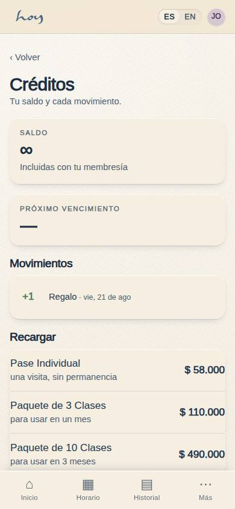
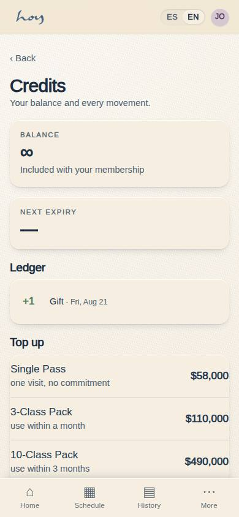
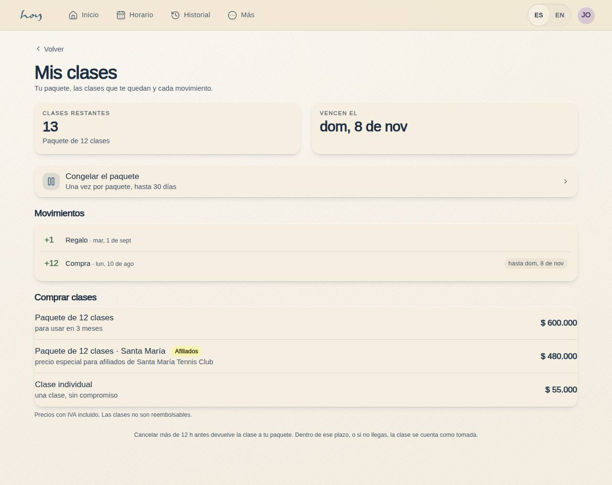
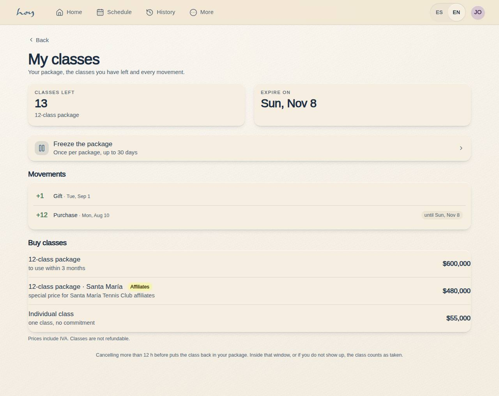
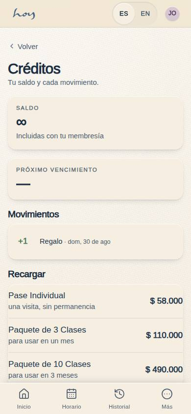

# C-07b — My classes (Mis clases)

**Route** `/#/app/classes` (`/#/app/credits` and `/#/app/membership` redirect here) · **Roles** public, customer, front_desk · **Surface** customer · **Spec** `spec.code === 'C-07b'` (see `/#/dev/specs`)

## Purpose
The person's classes: how many are left in the 12-class package, when they expire, the freeze (once per package, up to the M-08a days) and every movement — bought, booked, returned, expired. HOY sells classes, never credits (0051).

## Screenshots
| ES · mobile | EN · mobile |
| --- | --- |
|  |  |

| ES · desktop | EN · desktop |
| --- | --- |
|  |  |

## Sections (layout order — `useLayout(spec)`)
1. `FrozenNotice (if frozen)`
2. `BalanceTiles (classes left · expiry)`
3. `FreezeRow → FreezeDrawer`
4. `LedgerList (purchase / booking / return / expiry)`
5. `PackGrid (12 classes · individual class)`
6. `BuyDrawer`

## Data
| Table | Read / write | Notes |
| --- | --- | --- |
| `credits` | read / write | |
| `plans` | read | |
| `payments` | read / write | |
| `bookings` | read / write | |

## Logic and integrations
- Prices read from the value-model config; no figure is written on this screen.
- Trial class is one per person, verified by document or phone.
- Packs expire per their own rule — one month for 3, three months for 10.
- Every button enters the same single-screen checkout (C-04) with lazy registration.
- C-06's skip link points here, so the membership decision is never a dead end.
- Integrations: Wompi, Supabase Auth

## States
- Default (this screen)
- Trial already used: that row drops to a note
- Existing member: banner offers C-06 instead
- Loading: four skeleton rows

## Real vs mock
- Real: the page renders from the data layer (`useData()` / `useTable`) over the tables above; every write goes through the `DataProvider` so the Supabase provider replaces the mock unchanged.
- Mock / pending: Wompi, Supabase Auth are simulated or deferred; data is the browser-local `MockProvider` seed.
- Note: Pack purchase from here credits the ledger without a booking (payments + credits rows).
- Note: Canvas v1.5 merged C-07b into C-07; the /app/credits route keeps the ledger view under the compatibility alias.

## 0051 — the studio's verified content (2026-10-01)
**Mis clases** (`/app/classes`; `/app/credits` and `/app/membership` redirect here): classes left and when they
expire, the freeze (once per package, up to the M-08a days; the expiry moves by the same days; a preview shows the new
date), resume early (unused days come back off the expiry), every movement of the ledger, and buying the package or a
single class.
| Before (0.21.3) | After (0.22.0) |
| --- | --- |
|  |  |

## Changelog
- `docs/changelog/0051-website-verified-content.md` — Mis clases: classes left, expiry, freeze once, resume, every movement (was Créditos) (v0.22.0, 2026-10-01)
- `docs/changelog/0005-final-integration.md` — screenshots and this page doc (v0.3.0)

---
**Resumen (ES).** Mis clases. Las clases que quedan en el paquete de 12, cuándo vencen, el congelamiento (una vez, hasta 30 días) y cada movimiento. HOY vende clases, nunca créditos.
