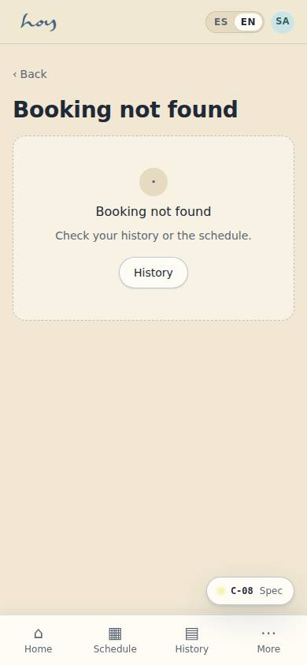
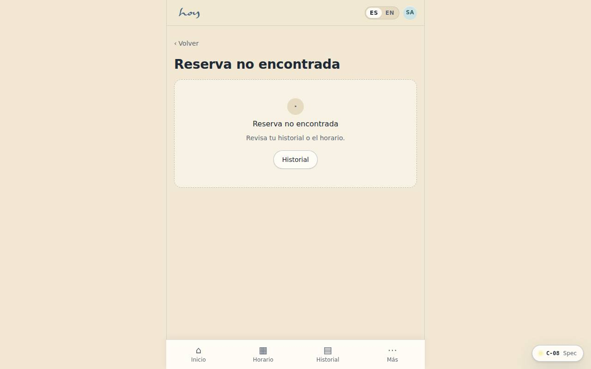
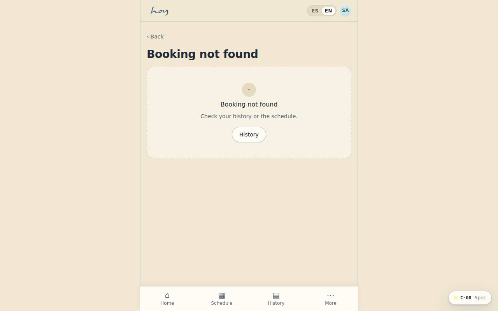

# C-08 — Booked class, countdown, cancel & reschedule

**Route** `/#/app/booking/:id` · **Roles** customer, front_desk, coordinator · **Surface** customer · **Spec** `spec.code === 'C-08'` (see `/#/dev/specs`)

## Purpose
Everything you can do to a reservation you already hold, including the countdown that makes the class feel imminent.

## Screenshots
| ES · mobile | EN · mobile |
| --- | --- |
|  |  |

| ES · desktop | EN · desktop |
| --- | --- |
|  |  |

## Sections (layout order — `useLayout(spec)`)
1. `CountdownRing`
2. `ClassSummary`
3. `PrepReminder`
4. `ActionRow (Change / Invite)`
5. `AddToCalendar`
6. `PolicyNote`

## Data
| Table | Read / write | Notes |
| --- | --- | --- |
| `bookings` | read / write | |
| `class_sessions` | read | |
| `modalities` | read | |
| `teachers` | read | |
| `rooms` | read | |
| `credits` | read / write | |
| `waitlist` | read / write | |

## Logic and integrations
- Free cancellation until T−2h (policy.cancelWindowHours); inside the window the credit is forfeited.
- Reschedule = cancel + rebook in one transaction, same entitlement, no fee outside the window.
- Studio-side cancellation refunds automatically (E-03 state inline).
- Countdown switches to 'Check in' inside T−60m.
- Integrations: WhatsApp, Wompi, Push notifications

## States
- Inside window: destructive confirm sheet
- Past class: read-only + rate CTA
- Cancelled by studio: banner + alternatives

## Real vs mock
- Real: the page renders from the data layer (`useData()` / `useTable`) over the tables above; every write goes through the `DataProvider` so the Supabase provider replaces the mock unchanged.
- Mock / pending: WhatsApp, Wompi, Push notifications are simulated or deferred; data is the browser-local `MockProvider` seed.
- Note: Add to calendar downloads an .ics; share uses the Web Share API with clipboard fallback.

## Changelog
- `docs/changelog/0005-final-integration.md` — screenshots and this page doc (v0.3.0)

---
**Resumen (ES).** Clase reservada, cuenta regresiva, cancelar y reprogramar. La clase reservada con cuenta regresiva, política de cancelación y acciones de cancelar o reprogramar.
