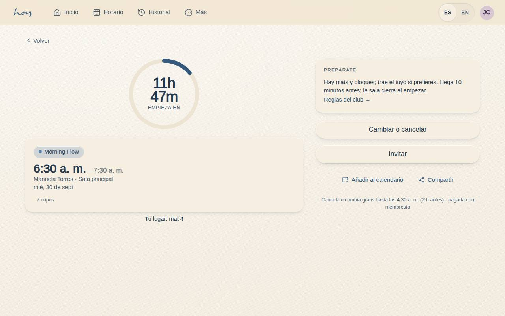
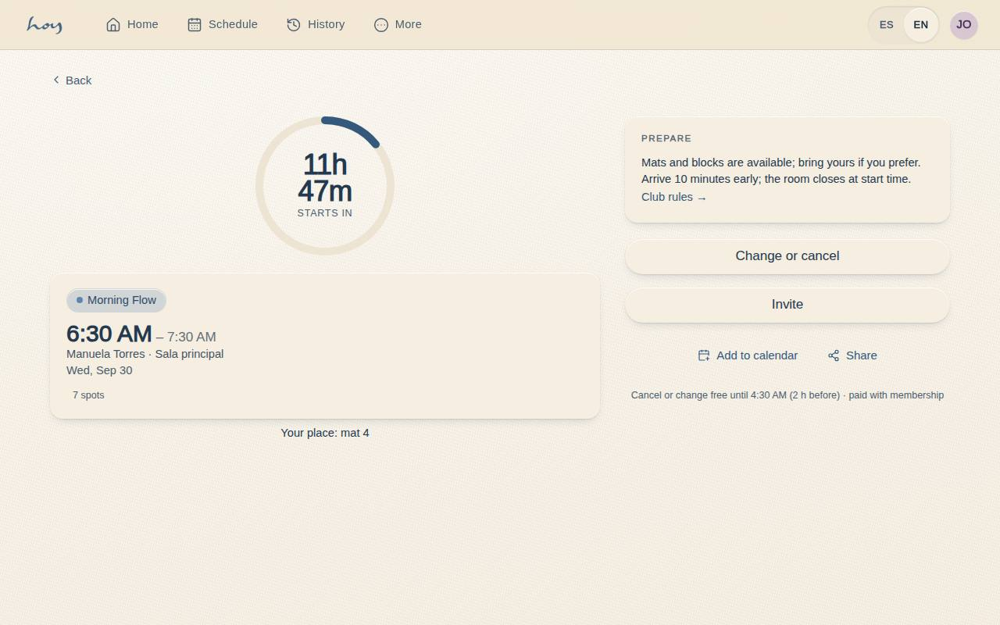
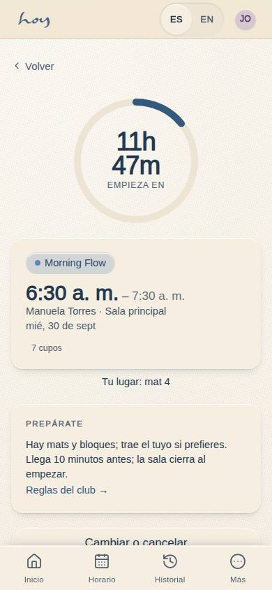

# C-08 — Booked class, countdown, cancel & reschedule

**Route** `/#/app/booking/:id` · **Roles** customer, front_desk, coordinator · **Surface** customer · **Spec** `spec.code === 'C-08'` (see `/#/dev/specs`)

## Purpose
Everything you can do to a reservation you already hold, including the countdown that makes the class feel imminent.

## Screenshots
| ES · mobile | EN · mobile |
| --- | --- |
|  |  |

| ES · desktop | EN · desktop |
| --- | --- |
|  |  |

## Sections (layout order — `useLayout(spec)`)
1. `CountdownRing`
2. `ClassSummary`
3. `PrepReminder`
4. `ActionRow (Change / Invite)`
5. `AddToCalendar`
6. `PolicyNote`

## Responsive layout (0025)
**Shell** `AppShell` (D-0006). Below 900 px: brand top bar, a content column of at most 560 px and the sticky bottom dock (Home · Schedule · History · More), exactly the phone layout. From 900 px (`useMinWidth('shell')`): a full-viewport page, the primary nav moves into the top bar (`NavBar variant="top"`), content sits in a centred `--w-app` container (75rem, growing with the `--ui` band at 1920 / 2560 / 3840) and the document scrolls. No phone bezel at any width; the bezel exists only in the hub's `DeviceFrame` simulator.

- **≥ 900 px** (`SplitSections`, `.cust-booked`): left column = `CountdownRing` + `ClassSummary`; right column = `PrepReminder`, `ActionRow`, `AddToCalendar`, `PolicyNote`.
- The C-08b change sheet (`/app/booking/:id/change`) is a centred dialog from 900 px.
- **< 900 px**: one column in the layout editor's order.

Verified 2026-09-28 at 390 · 1280 · 3840 px (ES, light) during the 0025 build; `PageSpec.checkedAt` = `[390, 1280, 3840]`. The full 360…3840 matrix is a follow-up.
The 1280 captures above predate 0025 and may still show the phone frame; the screenshot pass regenerates them.

## Actions (WebMCP)
| id | Intent (ES) | Params | Permission |
| --- | --- | --- | --- |
| `app.goHome` | Llévame al inicio de la app | — | — |
| `app.openSchedule` | Muéstrame el horario de clases | — | `classes.read` |

Declared in the page spec (`src/modules/customer/actions.ts` → `CUSTOMER_ACTIONS`), mounted with `useActions()`, listed at `window.__hoyos.actions` and run with `window.__hoyos.run(id, params)`. `permission` is advisory; see `docs/reference/surfaces.md`.

## Data
| Table | Read / write | Notes |
| --- | --- | --- |
| `bookings` | read / write | |
| `class_sessions` | read | |
| `modalities` | read | |
| `teachers` | read | |
| `rooms` | read | |
| `credits` | read / write | |
| `waitlist` | read / write | |

## Logic and integrations
- Free cancellation until T−2h (policy.cancelWindowHours); inside the window the credit is forfeited.
- Reschedule = cancel + rebook in one transaction, same entitlement, no fee outside the window.
- Studio-side cancellation refunds automatically (E-03 state inline).
- Countdown switches to 'Check in' inside T−60m.
- Integrations: WhatsApp, Wompi, Push notifications

## States
- Inside window: destructive confirm sheet
- Past class: read-only + rate CTA
- Cancelled by studio: banner + alternatives

## Real vs mock
- Real: the page renders from the data layer (`useData()` / `useTable`) over the tables above; every write goes through the `DataProvider` so the Supabase provider replaces the mock unchanged.
- Mock / pending: WhatsApp, Wompi, Push notifications are simulated or deferred; data is the browser-local `MockProvider` seed.
- Note: Add to calendar downloads an .ics; share uses the Web Share API with clipboard fallback.

## 0051 — the studio's verified content (2026-10-01)
Inside the last hour the countdown reads **"check-in en recepción"** and the note says check-in happens only at the
front desk. Cancellation copy speaks of the class going back to the package (12 h).
| Before (0.21.3) | After (0.22.0) |
| --- | --- |
|  |  |

## Changelog
- `docs/changelog/0051-website-verified-content.md` — "check-in en recepción": check-in happens only at the front desk (v0.22.0, 2026-10-01)
- `docs/changelog/0005-final-integration.md` — screenshots and this page doc (v0.3.0)
- `docs/changelog/0025-responsive-app-shell.md` — responsive `AppShell` / ≥ 900 px layout, WebMCP actions (v0.10.0, 2026-09-28)

---
**Resumen (ES).** Clase reservada, cuenta regresiva, cancelar y reprogramar. La clase reservada con cuenta regresiva, política de cancelación y acciones de cancelar o reprogramar.
