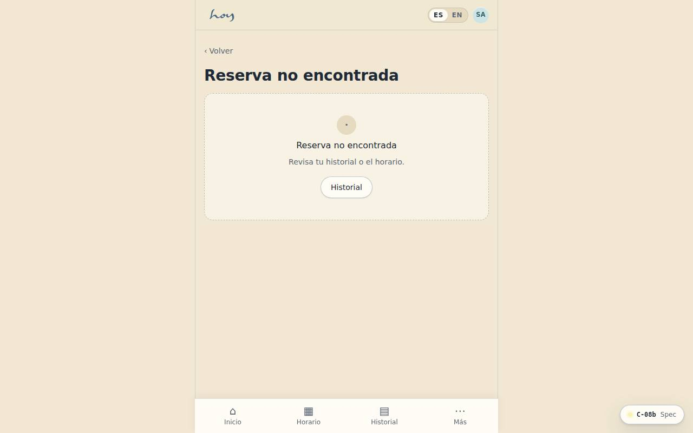
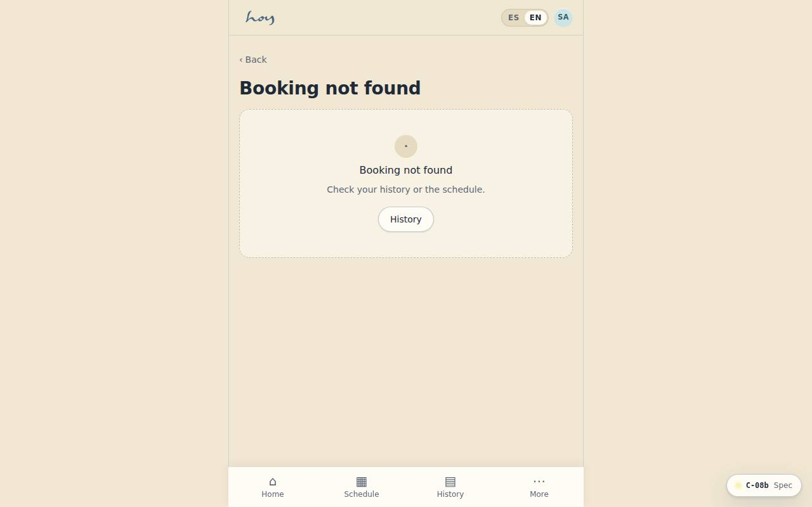

# C-08b — Cancel or reschedule sheet

**Route** `/#/app/booking/:id/change` · **Roles** — · **Surface** customer · **Spec** `spec.code === 'C-08b'` (see `/#/dev/specs`)

## Purpose
One button on the booked class opens one sheet, because a student who cannot make a class is taking a single decision with two outcomes. Moving is offered first — it keeps the credit and keeps the habit.

## Screenshots
| ES · mobile | EN · mobile |
| --- | --- |
|  |  |

| ES · desktop | EN · desktop |
| --- | --- |
|  |  |

## Sections (layout order — `useLayout(spec)`)
1. `Handle + title`
2. `PolicyLine (window from policy)`
3. `BookingSummary`
4. `MoveAction (primary)`
5. `CancelAction (destructive outline)`
6. `ReplacementList (same day, same movement)`
7. `KeepBooking (dismiss)`

## Data
| Table | Read / write | Notes |
| --- | --- | --- |
| `bookings` | read / write | |
| `class_sessions` | read | |
| `modalities` | read | |
| `credits` | read / write | |
| `waitlist` | read / write | |

## Logic and integrations
- Move = cancel + rebook in one transaction, same entitlement, no fee outside the window.
- Cancel returns the credit immediately when outside the window; inside it the credit is spent and the sheet says so before confirming.
- The window value is read from Admin → Settings (M-08), never hardcoded here.
- Replacements are same-day and matched on class_tags, then nearest time.
- The front desk can perform either action on the student's behalf from S-02, which writes to the audit log with the staff actor.
- Integrations: Supabase Realtime

## States
- Outside window (this sheet)
- Inside window: destructive confirm naming the forfeited credit
- No replacement available: waitlist offer
- Past class: sheet cannot open

## Real vs mock
- Real: the page renders from the data layer (`useData()` / `useTable`) over the tables above; every write goes through the `DataProvider` so the Supabase provider replaces the mock unchanged.
- Mock / pending: Supabase Realtime are simulated or deferred; data is the browser-local `MockProvider` seed.
- Note: Opens as a bottom Drawer over C-08 at /app/booking/:id/change.

## Changelog
- `docs/changelog/0005-final-integration.md` — screenshots and this page doc (v0.3.0)

---
**Resumen (ES).** Hoja de cancelar o reprogramar. Hoja inferior para cancelar o mover una reserva respetando la política.
