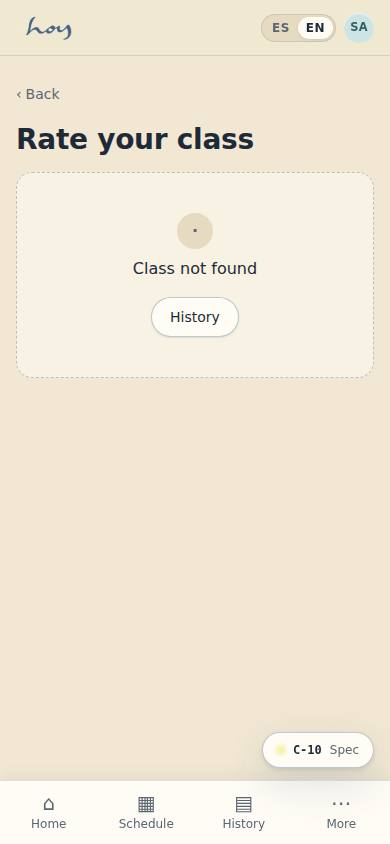
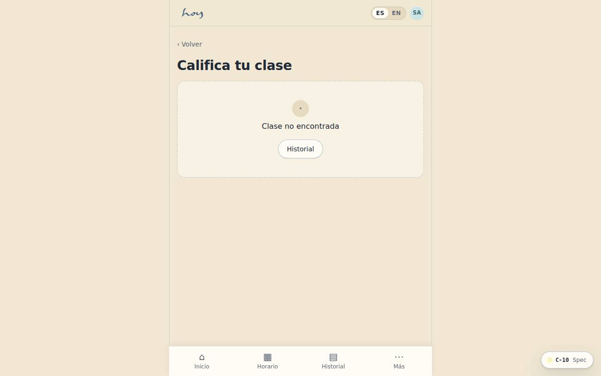
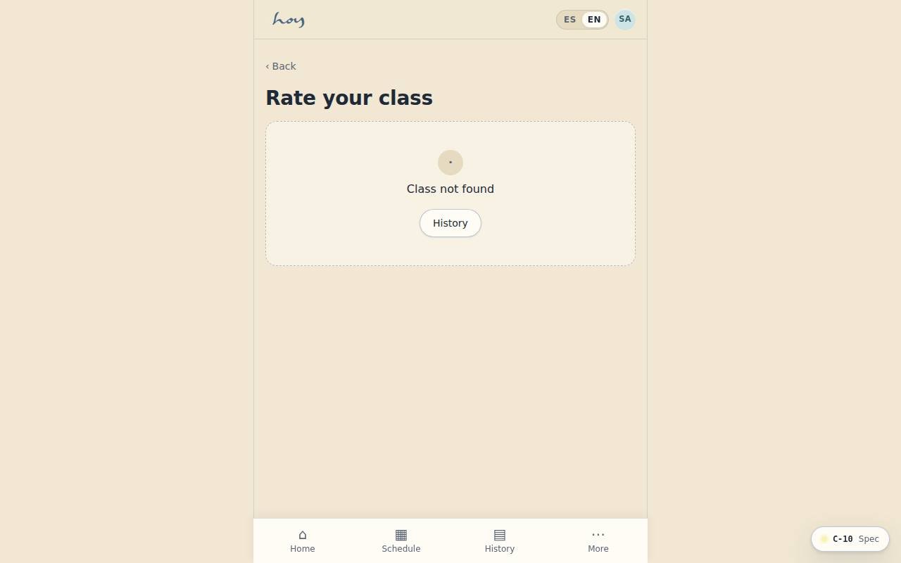

# C-10 — Rate your class

**Route** `/#/app/rate/:id` · **Roles** customer, teacher, coordinator, super_admin · **Surface** customer · **Spec** `spec.code === 'C-10'` (see `/#/dev/specs`)

## Purpose
Capture feedback while it is warm, in under five seconds, with a skip that costs nothing.

## Screenshots
| ES · mobile | EN · mobile |
| --- | --- |
|  |  |

| ES · desktop | EN · desktop |
| --- | --- |
|  |  |

## Sections (layout order — `useLayout(spec)`)
1. `ClassLine`
2. `RatingScale (1–5)`
3. `TagChips (good / fix)`
4. `OptionalNote`
5. `AnonymousToggle`
6. `Submit / Skip`

## Data
| Table | Read / write | Notes |
| --- | --- | --- |
| `bookings` | read / write | |
| `class_sessions` | read | |
| `teachers` | read | |

## Logic and integrations
- Prompted on the next open after attendance, once, then dismissed for good.
- Teachers see anonymous ratings in aggregate; named comments only when the student allows it.
- Ratings under 3 open an internal follow-up task for the coordinator.
- Public reviews are a separate, explicit ask via Settings.
- Integrations: none

## States
- Multiple pending: queue one at a time
- Submitted: thank-you with review link
- Error: keep local draft

## Real vs mock
- Real: the page renders from the data layer (`useData()` / `useTable`) over the tables above; every write goes through the `DataProvider` so the Supabase provider replaces the mock unchanged.
- Mock / pending: no external integrations; data is the browser-local `MockProvider` seed.
- Note: No reviews table yet: submit marks bookings.rated = true and keeps the rating locally (shared-change request).

## Changelog
- `docs/changelog/0005-final-integration.md` — screenshots and this page doc (v0.3.0)

---
**Resumen (ES).** Califica tu clase. Calificar la clase y al profesor en menos de 30 segundos; alimenta métricas y moderación.
