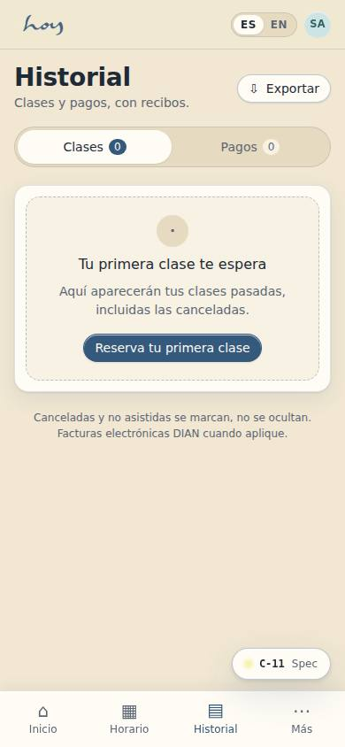
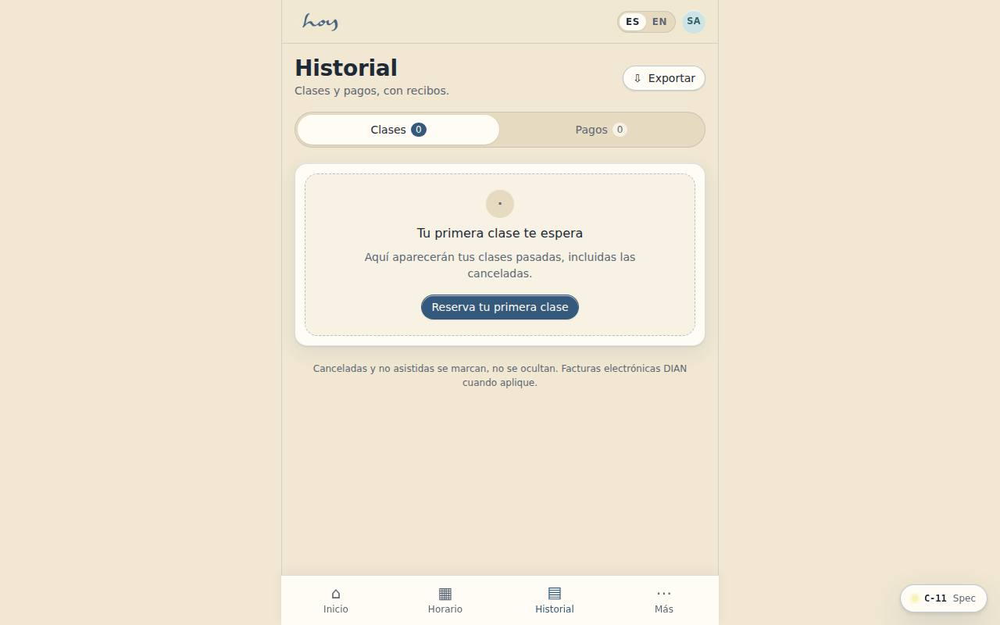
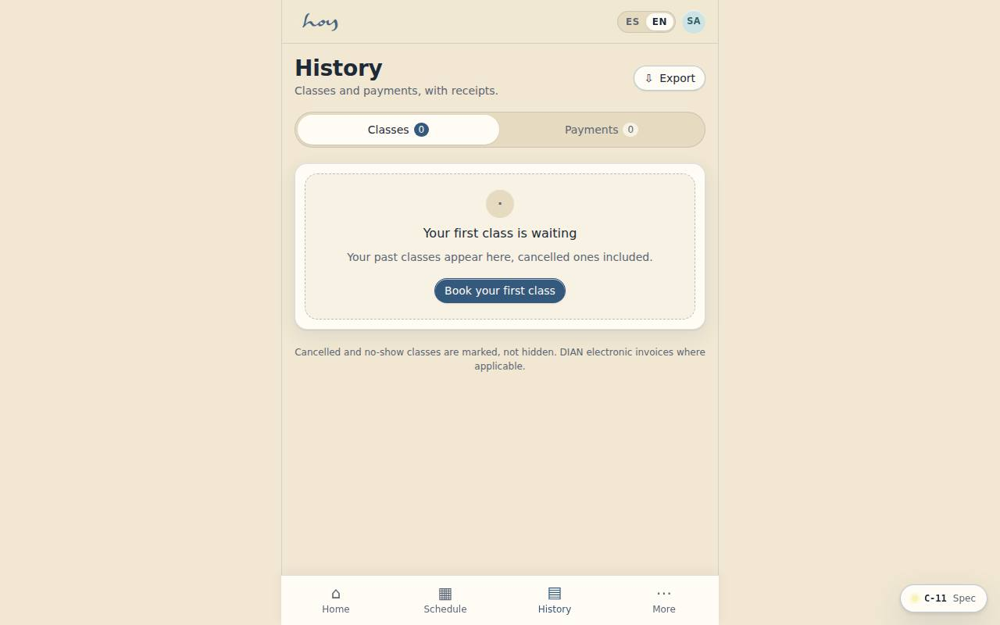

# C-11 — History & payments

**Route** `/#/app/history` · **Roles** customer, finance, front_desk, super_admin · **Surface** customer · **Spec** `spec.code === 'C-11'` (see `/#/dev/specs`)

## Purpose
One ledger for the relationship: classes attended and every peso paid, with receipts you can forward.

## Screenshots
| ES · mobile | EN · mobile |
| --- | --- |
|  |  |

| ES · desktop | EN · desktop |
| --- | --- |
|  |  |

## Sections (layout order — `useLayout(spec)`)
1. `TabSwitch (Classes / Payments)`
2. `ClassHistoryList`
3. `PaymentList → ReceiptSheet`
4. `ExportButton`

## Data
| Table | Read / write | Notes |
| --- | --- | --- |
| `bookings` | read / write | |
| `class_sessions` | read | |
| `modalities` | read | |
| `teachers` | read | |
| `payments` | read / write | |
| `invoices` | read / write | |
| `plans` | read | |

## Logic and integrations
- Receipts are DIAN electronic invoices where applicable, with NIT and IVA.
- Cancelled and no-show classes are marked, not hidden.
- Export produces a PDF summary for the selected range.
- Integrations: Wompi, Email, DIAN e-invoicing

## States
- Empty: 'Your first class is waiting'
- Loading: rows shimmer
- Error: retry

## Real vs mock
- Real: the page renders from the data layer (`useData()` / `useTable`) over the tables above; every write goes through the `DataProvider` so the Supabase provider replaces the mock unchanged.
- Mock / pending: Wompi, Email, DIAN e-invoicing are simulated or deferred; data is the browser-local `MockProvider` seed.
- Note: Export downloads a JSON summary; PDF via DIAN e-invoicing later.

## Changelog
- `docs/changelog/0005-final-integration.md` — screenshots and this page doc (v0.3.0)

---
**Resumen (ES).** Historial y pagos. Historial de clases, pagos, facturas y créditos, con filtros y exportación.
