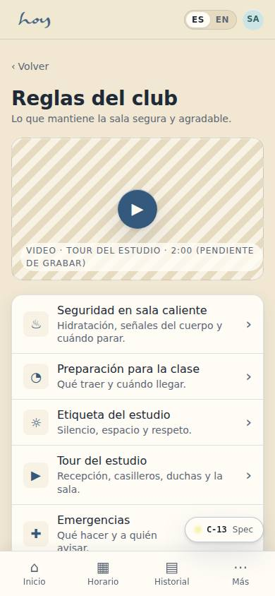
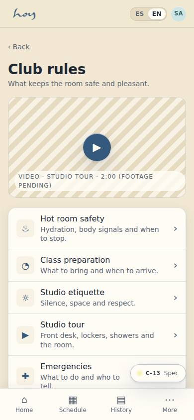
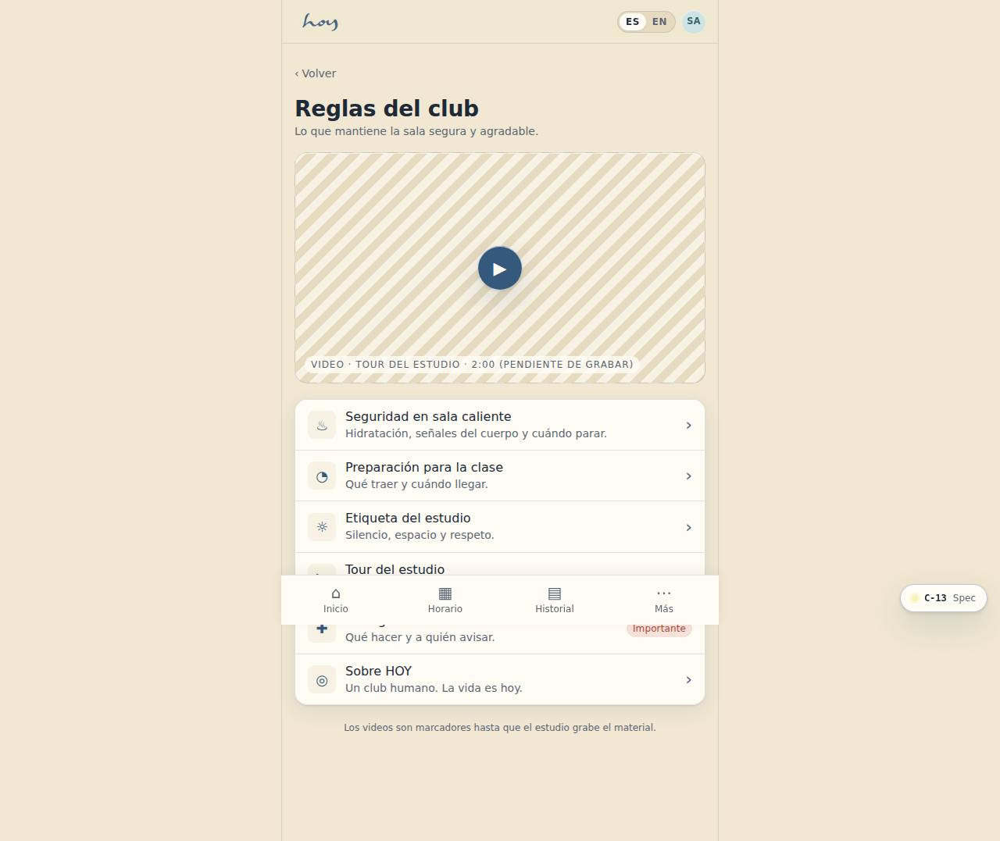
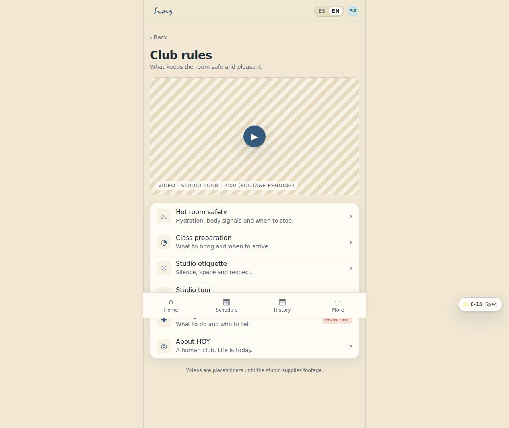

# C-13 — Club rules & best practices

**Route** `/#/app/rules` · **Roles** public, customer, coordinator, front_desk · **Surface** customer · **Spec** `spec.code === 'C-13'` (see `/#/dev/specs`)

## Purpose
The content library that keeps the room safe and pleasant: hot-room safety, class preparation, studio etiquette, the tour, emergencies, about HOY.

## Screenshots
| ES · mobile | EN · mobile |
| --- | --- |
|  |  |

| ES · desktop | EN · desktop |
| --- | --- |
|  |  |

## Sections (layout order — `useLayout(spec)`)
1. `VideoPlaceholder (studio tour)`
2. `CategoryList`
3. `ArticleView (Drawer)`
4. `RelatedLinks`

## Data
| Table | Read / write | Notes |
| --- | --- | --- |
| `legal_documents` | read | |

## Logic and integrations
- Same CMS entries serve app and website; each has an EN and ES version.
- First-class flow surfaces Class Preparation automatically.
- Video slots are placeholders until the studio supplies footage.
- Emergency article is never toggleable off.
- Integrations: Email

## States
- Video missing: textured placeholder with intended shot noted
- Untranslated: falls back to Spanish with a note

## Real vs mock
- Real: the page renders from the data layer (`useData()` / `useTable`) over the tables above; every write goes through the `DataProvider` so the Supabase provider replaces the mock unchanged.
- Mock / pending: Email are simulated or deferred; data is the browser-local `MockProvider` seed.
- Note: Articles live in src/modules/customer/content.ts until a content_articles table exists (shared-change request).

## Changelog
- `docs/changelog/0005-final-integration.md` — screenshots and this page doc (v0.3.0)

---
**Resumen (ES).** Reglas del club y buenas prácticas. Reglas del club y buenas prácticas en artículos cortos con lectura confirmada.
