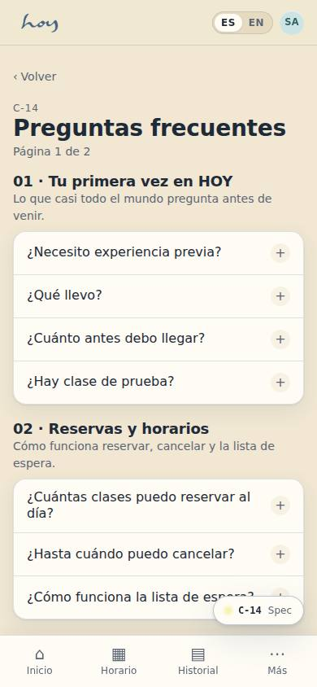
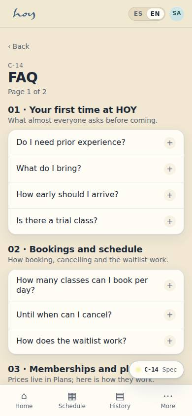
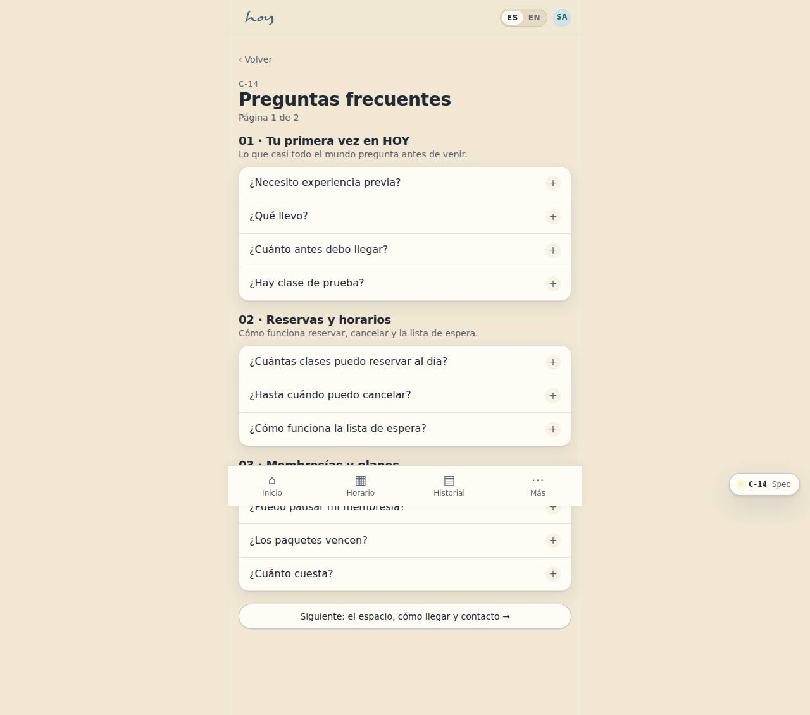
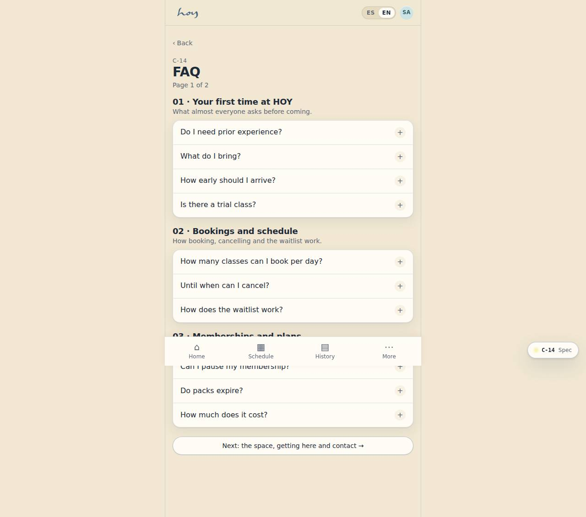

# C-14 — Preguntas frecuentes (1/2)

**Route** `/#/app/faq` · **Roles** public, customer, front_desk, coordinator · **Surface** customer · **Spec** `spec.code === 'C-14'` (see `/#/dev/specs`)

## Purpose
Page 1 of the public answer sheet, split across two pages so the accordion never becomes a scroll of thirty open questions. It is the last stop before someone writes to the front desk, so it carries the same answers the concierge would give.

## Screenshots
| ES · mobile | EN · mobile |
| --- | --- |
|  |  |

| ES · desktop | EN · desktop |
| --- | --- |
|  |  |

## Sections (layout order — `useLayout(spec)`)
1. `Header (page 1 of 2)`
2. `Section 01 · Tu primera vez en HOY`
3. `Section 02 · Reservas y horarios`
4. `Section 03 · Membresías y planes`
5. `NextPageLink → C-15`

## Data
| Table | Read / write | Notes |
| --- | --- | --- |
| — | | |

## Logic and integrations
- Questions are collapsed by default; only one opens at a time within a section.
- Entries live in the CMS beside Club Rules, so the same answer serves app and website.
- Anything about prices or plans links to #planes rather than repeating a figure.
- Section 06 always ends with a route to a human — the FAQ never dead-ends.
- Integrations: Supabase Realtime

## States
- Collapsed (default)
- One expanded
- No match in search: offers the concierge
- Untranslated entry: falls back to Spanish

## Real vs mock
- Real: the page renders from the data layer (`useData()` / `useTable`) over the tables above; every write goes through the `DataProvider` so the Supabase provider replaces the mock unchanged.
- Mock / pending: Supabase Realtime are simulated or deferred; data is the browser-local `MockProvider` seed.
- Note: /app/faq. Entries live in content.ts until a faq_entries table exists; anything about prices links to /app/plans.

## Changelog
- `docs/changelog/0005-final-integration.md` — screenshots and this page doc (v0.3.0)

---
**Resumen (ES).** Preguntas frecuentes (1/2). Página 1 de las preguntas frecuentes: primera vez, reservas y planes; la última parada antes de escribir a recepción.
