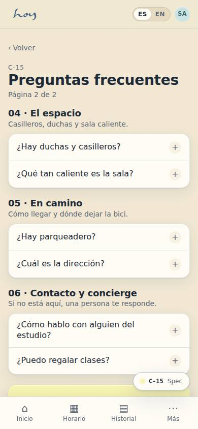
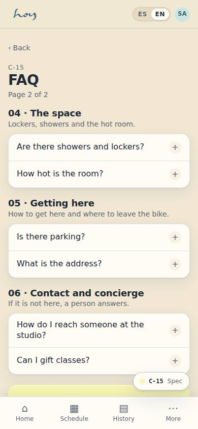
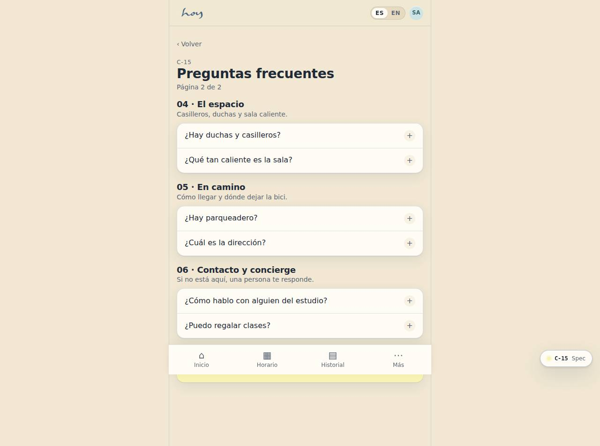
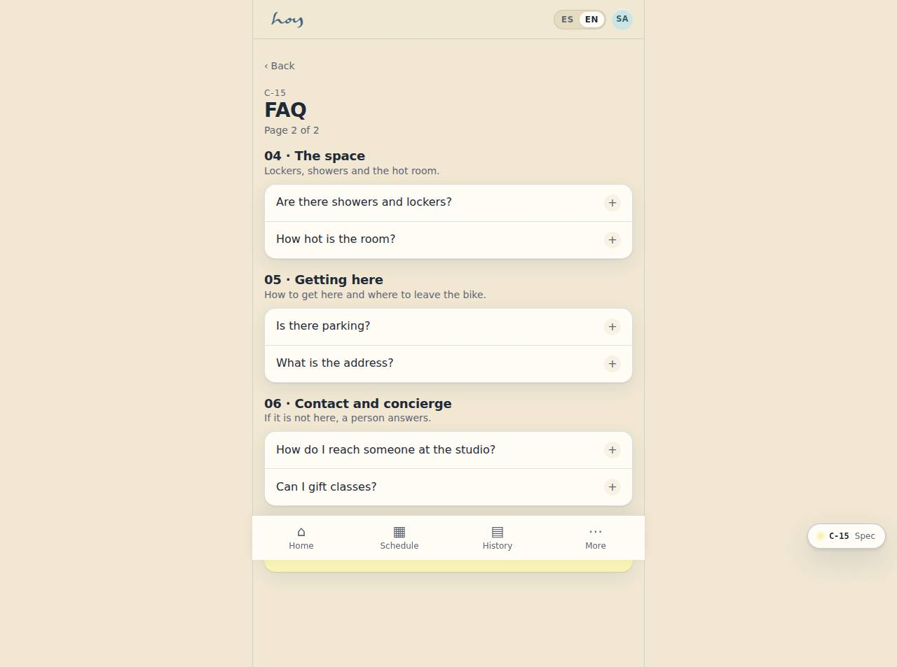

# C-15 — Preguntas frecuentes (2/2)

**Route** `/#/app/faq/2` · **Roles** public, customer, front_desk, coordinator · **Surface** customer · **Spec** `spec.code === 'C-15'` (see `/#/dev/specs`)

## Purpose
Page 2 of the public answer sheet: the space, getting there, and contact — it ends with a route to a human, so the FAQ never dead-ends.

## Screenshots
| ES · mobile | EN · mobile |
| --- | --- |
|  |  |

| ES · desktop | EN · desktop |
| --- | --- |
|  |  |

## Sections (layout order — `useLayout(spec)`)
1. `Header (page 2 of 2) + back to C-14`
2. `Section 04 · El espacio`
3. `Section 05 · En camino`
4. `Section 06 · Contacto y concierge`
5. `ConciergeRow → WhatsApp`

## Data
| Table | Read / write | Notes |
| --- | --- | --- |
| — | | |

## Logic and integrations
- Same accordion rules as C-14: collapsed by default, one open per section.
- Address, hours and contact are read from studio settings (M-08), never typed here.
- Section 06 always ends with a route to a human — WhatsApp first, email as fallback.
- Anything about prices or plans links to #planes rather than repeating a figure.
- Integrations: WhatsApp, Email

## States
- Collapsed (default)
- One expanded
- Untranslated entry: falls back to Spanish
- Studio closed today: hours row shows next opening

## Real vs mock
- Real: the page renders from the data layer (`useData()` / `useTable`) over the tables above; every write goes through the `DataProvider` so the Supabase provider replaces the mock unchanged.
- Mock / pending: WhatsApp, Email are simulated or deferred; data is the browser-local `MockProvider` seed.
- Note: /app/faq/2. Section 06 always ends with a route to a human.

## Changelog
- `docs/changelog/0005-final-integration.md` — screenshots and this page doc (v0.3.0)

---
**Resumen (ES).** Preguntas frecuentes (2/2). Página 2 de las preguntas frecuentes: el espacio, cómo llegar y contacto; termina con una persona, nunca en un callejón sin salida.
