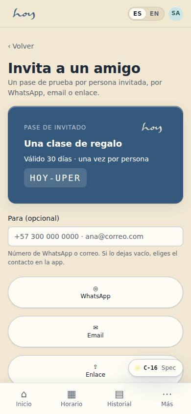
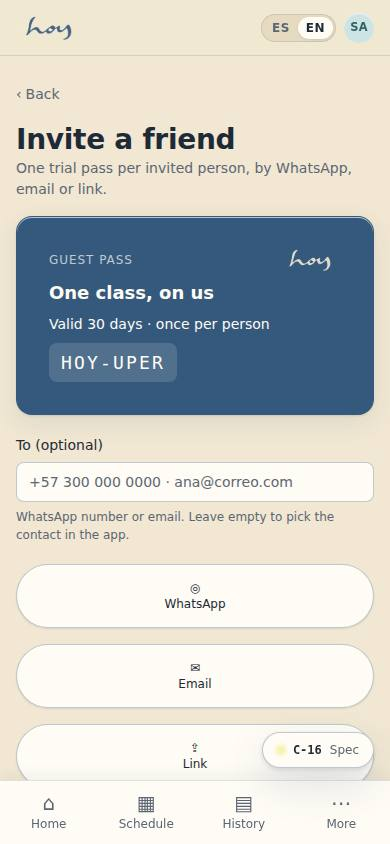
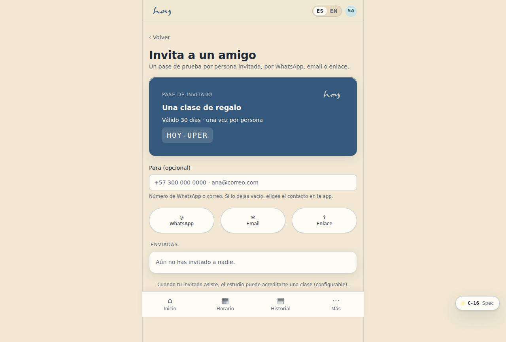
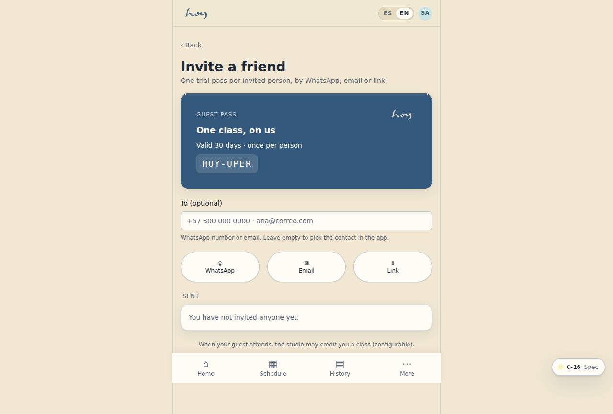

# C-16 — Invite a guest

**Route** `/#/app/invite` · **Roles** customer, front_desk, coordinator · **Surface** customer · **Spec** `spec.code === 'C-16'` (see `/#/dev/specs`)

## Purpose
Make word of mouth mechanical: send a pass by WhatsApp, email or link, from a class or from its own page.

## Screenshots
| ES · mobile | EN · mobile |
| --- | --- |
|  |  |

| ES · desktop | EN · desktop |
| --- | --- |
|  |  |

## Sections (layout order — `useLayout(spec)`)
1. `ContextCard (class or general)`
2. `ChannelRow (WhatsApp / Email / Link)`
3. `PassPreview`
4. `SentList (status)`
5. `RewardNote`

## Data
| Table | Read / write | Notes |
| --- | --- | --- |
| `class_sessions` | read | |
| `profiles` | read / write | |

## Logic and integrations
- One free trial pass per invited person, validated by phone or document.
- Invites expire after 30 days; status tracked as sent, opened, booked, attended.
- Referral reward credited to the inviter when the guest attends (configurable).
- Invite entry points: class detail, booked class, home quick action, dedicated page.
- Integrations: WhatsApp, Email

## States
- Empty: channel row only
- Pass used: row collapses to a result
- Limit hit: explains the cap

## Real vs mock
- Real: the page renders from the data layer (`useData()` / `useTable`) over the tables above; every write goes through the `DataProvider` so the Supabase provider replaces the mock unchanged.
- Mock / pending: WhatsApp, Email are simulated or deferred; data is the browser-local `MockProvider` seed.
- Note: No invites table yet: sent invites are kept per user in localStorage (shared-change request). WhatsApp/email open outbound links.

## Changelog
- `docs/changelog/0005-final-integration.md` — screenshots and this page doc (v0.3.0)

---
**Resumen (ES).** Invita a un amigo. Invitar a un amigo con pase de invitado o referido y ver la atribución.
